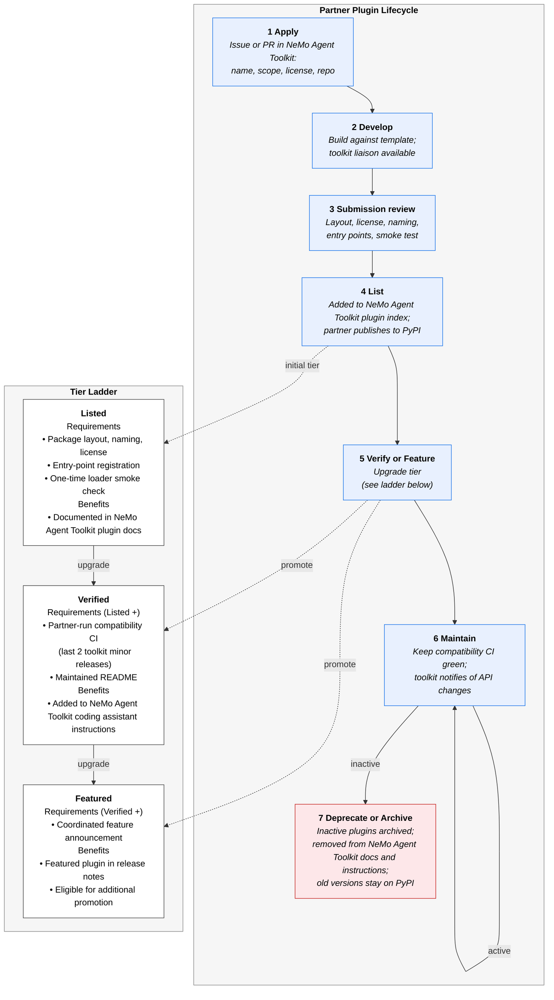

<!--
SPDX-FileCopyrightText: Copyright (c) 2026, NVIDIA CORPORATION & AFFILIATES. All rights reserved.
SPDX-License-Identifier: Apache-2.0

Licensed under the Apache License, Version 2.0 (the "License");
you may not use this file except in compliance with the License.
You may obtain a copy of the License at

http://www.apache.org/licenses/LICENSE-2.0

Unless required by applicable law or agreed to in writing, software
distributed under the License is distributed on an "AS IS" BASIS,
WITHOUT WARRANTIES OR CONDITIONS OF ANY KIND, either express or implied.
See the License for the specific language governing permissions and
limitations under the License.
-->

# Third-Party Plugin Packages

NVIDIA NeMo Agent Toolkit supports plugin packages that are developed, released, and maintained outside of the main
NeMo Agent Toolkit repository. Third-party plugin packages use the same runtime discovery, configuration, and
observability paths as first-party packages. After a package is installed in the same Python environment as
`nvidia-nat-core`, the toolkit discovers it through Python entry points.

This guide describes the recommended model for partner-owned plugin packages. For the stable Python import surface, see
the [Public Plugin API](./plugin-api.md). For general plugin discovery and supported plugin types, see the
[Plugin System](./plugins.md).

## Ownership and Scope

Third-party plugin packages are provider-owned repositories. The provider owns the integration code, public package,
release process, compatibility testing, and user support for provider-specific behavior. The NeMo Agent Toolkit project
owns the stable plugin-authoring API, first-party package behavior, and issues in `nvidia-nat-core` that surface through
third-party packages.

This model is the default for new partner integrations where the provider is best positioned to track its own API
roadmap, service semantics, and release cadence. It works for function groups, tools, LLM clients, embedder clients,
retriever clients, telemetry exporters, memory backends, object stores, authentication providers, custom `nat` CLI
sub-commands, and specialized front ends.

Provider-specific behavior belongs in the provider repository. For example, a web search plugin can return the fields
and response shape exposed by the provider SDK. Do not introduce a shared web-search result schema unless the toolkit
defines that schema as a stable public API.

## Naming Convention

Use one provider token consistently across the repository, distribution, import package, entry point, registered
component `_type`, and function group namespace. The provider token should be short, lowercase, and stable.

| Surface | Convention | Tavily example |
| --- | --- | --- |
| GitHub owner | Provider-owned account or organization | `tavily-ai` |
| GitHub repository | `NeMo-Agent-Toolkit-<provider>` | `NeMo-Agent-Toolkit-tavily` |
| Python distribution | `nemo-agent-toolkit-<provider>` | `nemo-agent-toolkit-tavily` |
| Python import package | `nat.plugins.<provider>` | `nat.plugins.tavily` |
| Component entry point name | `nat_<provider>` | `nat_tavily` |
| Registered function group `_type` | `<provider>` | `tavily` |
| Function group tool names | `<instance_name>__<function_name>` | `tavily__search` |

Function groups use a double underscore between the configured group instance name and each function name. This is the
current runtime convention in `FunctionGroup.SEPARATOR` and keeps tool names compatible with frameworks that reject or
reinterpret periods. For example, this configuration:

```yaml
function_groups:
  tavily:
    _type: tavily
```

exposes tools such as `tavily__search`, `tavily__extract`, and `tavily__research` when the plugin adds functions named
`search`, `extract`, and `research`.

## Repository Layout

Use a PEP 420 namespace package layout so the provider package can share the `nat` namespace with other NeMo Agent
Toolkit distributions:

```text
NeMo-Agent-Toolkit-tavily/
|-- pyproject.toml
|-- README.md
|-- LICENSE
|-- src/
|   `-- nat/
|       `-- plugins/
|           `-- tavily/
|               |-- __init__.py
|               |-- register.py
|               `-- tools.py
`-- tests/
    `-- test_tools.py
```

Do not add `__init__.py` files in the shared `nat` or `nat.plugins` namespace directories. The provider-owned package
directory, such as `tavily`, should contain an `__init__.py`.

The entry point target should import a registration module. That module should import the provider modules that define
registration decorators so the decorators run when the toolkit loads the entry point.

```python
# Registration module
from . import tools

__all__ = ["tools"]
```

## Package Metadata

The package should declare the shared namespace package, a bounded dependency on `nvidia-nat-core`, provider SDK
dependencies, optional test dependencies, repository metadata, and the component entry point.


<!-- path-check-skip-begin -->
```toml
[build-system]
requires = ["hatchling"]
build-backend = "hatchling.build"

[tool.hatch.build.targets.wheel]
packages = ["src/nat"]

[project]
name = "nemo-agent-toolkit-tavily"
version = "0.1.0"
requires-python = ">=3.11,<3.14"
description = "Tavily integration for NVIDIA NeMo Agent Toolkit"
readme = "README.md"
license = { text = "Apache-2.0" }
dependencies = [
  "nvidia-nat-core>=1.8",
  "tavily-python>=0.7.0,<1.0.0",
]

[project.optional-dependencies]
test = [
  "pytest>=8.0",
  "pytest-asyncio>=0.24",
  "nvidia-nat-test>=1.8",
]

[project.urls]
documentation = "https://docs.nvidia.com/nemo/agent-toolkit/latest/"
source = "https://github.com/tavily-ai/NeMo-Agent-Toolkit-tavily"

[project.entry-points."nat.plugins"]
nat_tavily = "nat.plugins.tavily.register"
```
<!-- path-check-skip-end -->

The `nvidia-nat-core` and `nvidia-nat-test` examples intentionally omit an upper bound so compatible future NeMo Agent Toolkit releases can satisfy the dependency; third-party packages should validate compatibility in CI against supported toolkit releases.

New external component packages should use the `nat.plugins` entry point group. The runtime also loads
`nat.components` for backward compatibility with existing packages, but `nat.components` is compatibility-only for new
third-party packages.

Other extension points use separate entry point groups:

| Entry point group | Use |
| --- | --- |
| `nat.plugins` | Component plugins such as functions, function groups, model clients, retrievers, embedders, telemetry exporters, memory backends, object stores, middleware, and authentication providers. |
| `nat.cli` | Custom `nat` CLI sub-commands. |
| `nat.front_ends` | Specialized front-end implementations. Front-end registration is not part of the stable `nat.plugin_api` facade. |

## Public API Surface

Third-party packages should import stable plugin-authoring symbols from `nat.plugin_api`.

```python
from nat.plugin_api import Builder
from nat.plugin_api import FunctionGroup
from nat.plugin_api import FunctionGroupBaseConfig
from nat.plugin_api import SerializableSecretStr
from nat.plugin_api import register_function_group
```

Avoid importing implementation modules such as `nat.cli.register_workflow`, `nat.builder.workflow_builder`, or
`nat.builder.function_info` unless another subsystem guide explicitly documents that module as the extension surface.
Symbols exported from `nat.plugin_api` are the public contract for external plugin packages.

## Function Group Implementation

Use `register_function_group` when one provider exposes multiple related tools. A function group lets the integration
share configuration, credentials, clients, timeouts, and other resources while exposing individual tools through the
`instance_name__function_name` convention.

```python
from pydantic import Field

from nat.plugin_api import Builder
from nat.plugin_api import FunctionGroup
from nat.plugin_api import FunctionGroupBaseConfig
from nat.plugin_api import SerializableSecretStr
from nat.plugin_api import register_function_group


class TavilyToolsGroupConfig(FunctionGroupBaseConfig, name="tavily"):
    """Tavily tools group."""

    api_key: SerializableSecretStr = Field(
        default_factory=lambda: SerializableSecretStr(""),
        description="Tavily API key. Falls back to the TAVILY_API_KEY environment variable.",
    )


@register_function_group(config_type=TavilyToolsGroupConfig)
async def tavily_tools(config: TavilyToolsGroupConfig, _builder: Builder):
    client = build_async_client(config.api_key)
    group = FunctionGroup(config=config)

    async def search(query: str) -> dict:
        return await client.search(query=query)

    async def extract(urls: list[str]) -> dict:
        return await client.extract(urls=urls)

    group.add_function("search", search, description=search.__doc__)
    group.add_function("extract", extract, description=extract.__doc__)

    yield group
```

Use `register_function` instead when the integration exposes a single tool or workflow. Prefer provider SDKs or direct
HTTP clients over framework-specific wrappers when the tool can be expressed in a framework-agnostic way. Use
framework-specific registration only when the integration cannot be represented as a framework-agnostic toolkit tool.

## README Requirements

Each provider repository should include a README that is complete enough for users and reviewers to install, configure,
test, and route bugs without reading the implementation.

At minimum, include:

- Installation commands for `uv` and `pip`.
- A minimal workflow configuration.
- Configuration fields, defaults, and credential setup.
- The registered `_type` values and generated tool names.
- Supported NeMo Agent Toolkit versions.
- Local test commands.
- Bug routing for provider-owned integration bugs versus `nvidia-nat-core` bugs.
- License information.

A minimal workflow example should be runnable from the repository root:

```yaml
function_groups:
  tavily:
    _type: tavily

llms:
  my_llm:
    _type: litellm
    model_name: anthropic/claude-sonnet-4-6

workflow:
  _type: react_agent
  llm_name: my_llm
  tool_names:
    - tavily
```

```bash
export TAVILY_API_KEY=tvly-...
export ANTHROPIC_API_KEY=...

uv run nat run --config_file config.yml --input "What changed in the latest release?"
```

## Testing and Compatibility

At minimum, third-party plugin packages should include:

- Unit tests for provider-specific logic.
- A loader smoke test that imports or installs the package, loads the entry point, and verifies that the registered
  component can be discovered.
- Tool or function-group tests through `nvidia-nat-test` where possible.
- At least one representative end-to-end test that uses a mock, stub, or local test service.
- Compatibility CI against the supported NeMo Agent Toolkit versions for the plugin tier.

Provider integrations that require live credentials should mark those tests as integration tests and skip them when the
required environment variables are not set.

Use a lower bound that matches the first NeMo Agent Toolkit release containing the `nat.plugin_api` symbols your package
uses. Keep the upper bound below the next major version until the package has been tested with that major version.

## Installation and Discovery

Users install a third-party plugin package into the same Python environment as `nvidia-nat-core`:

```bash
uv add nemo-agent-toolkit-tavily
```

or:

```bash
pip install nemo-agent-toolkit-tavily
```

After installation, the toolkit discovers the package with `importlib.metadata.entry_points()`. Users do not need to
edit a toolkit configuration file to load the package itself. They only reference the registered component `_type`
values in workflow configuration.

Use `nat info components` to confirm that a package is installed and discoverable:

```bash
uv run nat info components
```

## Development Workflow

Use `uv` for local development when possible. This matches the primary NeMo Agent Toolkit development toolchain and
keeps lock files compatible with the Toolkit CI patterns.

```bash
git clone https://github.com/tavily-ai/NeMo-Agent-Toolkit-tavily.git
cd NeMo-Agent-Toolkit-tavily
uv sync --extra test
uv run pytest tests/ -v
```

## Submission Review

Open an issue or pull request in the NeMo Agent Toolkit repository before requesting documentation listing. Include the
provider name, package scope, license, repository URL, package name, entry point, registered `_type` values, and support
contacts.

The review checks:

- Repository and package names follow the naming convention.
- Package metadata uses `nat.plugins` for new component plugins.
- Source uses the shared `nat.plugins.<provider>` namespace package layout.
- Public imports come from `nat.plugin_api`.
- README covers installation, configuration, workflow examples, tests, and bug routing.
- License is Apache-2.0 or another approved permissive license.
- A smoke test proves the entry point can load and the registered component is discoverable.

## Partner Plugin Lifecycle



## Listing and Promotion Tiers

The NeMo Agent Toolkit documentation may list third-party plugin packages that follow these guidelines.

| Tier | Requirements | Benefits |
| --- | --- | --- |
| Listed | Package layout, naming, license review, entry point registration, and one-time loader smoke check. | Listed in NeMo Agent Toolkit plugin documentation. |
| Verified | Listed requirements plus partner-run compatibility CI for the last two toolkit minor releases and a maintained README. | Eligible for NeMo Agent Toolkit coding assistant instructions. |
| Featured | Verified requirements plus a coordinated feature announcement. | Eligible for release-note placement and additional promotion. |

Inactive packages may be removed from NeMo Agent Toolkit documentation and coding assistant instructions. Previously
published package versions remain in the partner's package repository.

## Support Boundaries

NVIDIA may provide design review, compatibility guidance, public API stability commitments, and documentation links for
approved third-party plugins.

NVIDIA does not run partner CI, publish partner packages, accept liability for partner code, or guarantee feature parity
between third-party providers. Bugs in provider-owned integration code should be filed in the provider repository. Bugs
in `nvidia-nat-core` should be filed in the NeMo Agent Toolkit repository.

## Submission Checklist

Before requesting inclusion in NeMo Agent Toolkit documentation, verify that the package has:

- A repository and package name that follow the naming convention.
- A PEP 420 namespace package under `nat.plugins.<provider>`.
- No `__init__.py` files in shared namespace package directories.
- A `nat.plugins` entry point for new component plugins.
- Imports from `nat.plugin_api` for public plugin-authoring APIs.
- A compatible `nvidia-nat-core` dependency range.
- An Apache-2.0 or approved permissive license.
- A README with install, configuration, workflow, testing, and bug routing instructions.
- Tests, including a loader smoke test.
- Compatibility CI for the requested listing tier.
