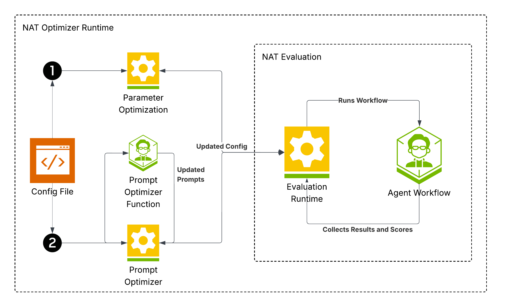

<!--
SPDX-FileCopyrightText: Copyright (c) 2025, NVIDIA CORPORATION & AFFILIATES. All rights reserved.
SPDX-License-Identifier: Apache-2.0

Licensed under the Apache License, Version 2.0 (the "License");
you may not use this file except in compliance with the License.
You may obtain a copy of the License at

http://www.apache.org/licenses/LICENSE-2.0

Unless required by applicable law or agreed to in writing, software
distributed under the License is distributed on an "AS IS" BASIS,
WITHOUT WARRANTIES OR CONDITIONS OF ANY KIND, either express or implied.
See the License for the specific language governing permissions and
limitations under the License.
-->
# NVIDIA NeMo Agent toolkit Optimizer Guide

Welcome to the NeMo Agent toolkit Optimizer guide. This document provides a comprehensive overview of how to use the NeMo Agent toolkit Optimizer to tune your NeMo Agent toolkit workflows.

## Introduction

The NeMo Agent toolkit Optimizer is a powerful tool for automated hyperparameter tuning and prompt engineering for your NeMo Agent toolkit workflows. It allows you to define a search space for your workflow's parameters and then intelligently searches for the best combination of parameters based on the evaluation metrics you specify.

This guide will walk you through:
- Configuring the optimizer.
- Making your workflow `parameters.optimizable`.
- Running the optimizer from the command line.
- Understanding the output of the optimizer.

## How it Works

The NeMo Agent toolkit Optimizer uses a combination of techniques to find the best parameters for your workflow:

- Numerical hyperparameter optimization uses [Optuna](https://optuna.org/).
- Prompt optimization uses a genetic algorithm (GA) that evolves a population of prompt candidates over multiple generations using LLM-powered mutation and optional recombination.



The optimization process follows the steps outlined in the diagram above:

1.  **Configuration Loading**: The optimizer starts by reading the `optimizer` section of your workflow configuration file. It uses this to understand your optimization objectives, which parameters are tunable, and the overall optimization strategy.

2.  **Study Initialization**: An [Optuna study](https://optuna.readthedocs.io/en/stable/reference/study.html) is created to manage the optimization process. This study keeps track of all the trials, their parameters, and their resulting scores.

3.  **Optimization Loops**:
    - Numerical parameters: loop for `n_trials_numeric` trials (Optuna).
    - Prompt parameters: loop for `ga_generations` generations (Genetic Algorithm).

4.  **Parameter Suggestion**: In each numeric trial, Optuna's sampler suggests a new set of hyperparameters from the `SearchSpace` you defined with `OptimizableField`. For prompt optimization, a population of prompts is evolved each generation using LLM-powered mutation and optional recombination guided by the `prompt_purpose`. No trajectory feedback is used.

5.  **Workflow Execution**: The NeMo Agent toolkit workflow is executed using the suggested parameters for that trial. This is repeated `reps_per_param_set` times to ensure the results are statistically stable.

6.  **Evaluation**: The output of each workflow run is passed to the evaluators defined in the `eval_metrics` configuration. Each evaluator calculates a score for a specific objective (such as correctness, latency, or creativity).

7.  **Recording Results**:
    - Numeric trials: scores are combined per `multi_objective_combination_mode` and recorded in the Optuna study.
    - Prompt GA: each individual's metrics are normalized per generation and `scalarized` per `multi_objective_combination_mode`; the best individuals are checkpointed each generation.

8.  **Analysis and Output**: Once all trials are complete, the optimizer analyzes the study to find the best-performing trial. It then generates the output files, including `best_params.json` and the various plots, to help you understand the results.

Now, let's dive into how to configure the optimizer.

## Optimizer Configuration

The optimizer is configured through an `optimizer` section in your workflow's YAML configuration file. This configuration is mapped to the `OptimizerConfig` and `OptimizerMetric` Pydantic models.

Here is an example of an `optimizer` section in a YAML configuration file:

```yaml
optimizer:
  output_path: "optimizer_results"

  # Numeric (Optuna)
  numeric:
    enabled: true
    n_trials: 50

  # Prompt (Genetic Algorithm)
  prompt:
    enabled: true
    prompt_population_init_function: "prompt_optimizer"
    prompt_recombination_function: "prompt_recombiner"  # optional
    ga_population_size: 16
    ga_generations: 8
    ga_offspring_size: 12        # optional; defaults to pop_size - elitism
    ga_crossover_rate: 0.7
    ga_mutation_rate: 0.2
    ga_elitism: 2
    ga_selection_method: "tournament"  # or "roulette"
    ga_tournament_size: 3
    ga_parallel_evaluations: 8
    ga_diversity_lambda: 0.0

  # Evaluation
  reps_per_param_set: 5
  eval_metrics:
    latency:
      evaluator_name: "latency"
      direction: "minimize"
      weight: 0.2
    correctness:
      evaluator_name: "correctness"
      direction: "maximize"
      weight: 0.8
```

### `OptimizerConfig`

This is the main configuration object for the optimizer.

-   `output_path: Path | None`: The directory where optimization results will be saved, for example, `optimizer_results/`. Defaults to `None`.
-   `eval_metrics: dict[str, OptimizerMetric] | None`: A dictionary of evaluation metrics to optimize. The keys are custom names for the metrics, and the values are `OptimizerMetric` objects.
-   `numeric.enabled: bool`: Enable numeric optimization (Optuna). Defaults to `true`.
-   `numeric.n_trials: int`: Number of numeric trials. Defaults to `20`.
-   `prompt.enabled: bool`: Enable GA-based prompt optimization. Defaults to `false`.
-   `prompt.ga_population_size: int`: Population size for GA prompt optimization. Larger populations increase diversity but cost more per generation. Defaults to `10`.
-   `prompt.ga_generations: int`: Number of generations for GA prompt optimization. Replaces `n_trials_prompt`. Defaults to `5`.
-   `prompt.ga_offspring_size: int | null`: Number of offspring produced per generation. If `null`, defaults to `ga_population_size - ga_elitism`.
-   `prompt.ga_crossover_rate: float`: Probability of recombination between two parents for each prompt parameter. Defaults to `0.7`.
-   `prompt.ga_mutation_rate: float`: Probability of mutating a child's prompt parameter using the LLM optimizer. Defaults to `0.1`.
-   `prompt.ga_elitism: int`: Number of elite individuals copied unchanged to the next generation. Defaults to `1`.
-   `prompt.ga_selection_method: str`: Parent selection scheme. `tournament` (default) or `roulette`.
-   `prompt.ga_tournament_size: int`: Tournament size when `ga_selection_method` is `tournament`. Defaults to `3`.
-   `prompt.ga_parallel_evaluations: int`: Maximum number of concurrent evaluations. Controls async concurrency. Defaults to `8`.
-   `prompt.ga_diversity_lambda: float`: Diversity penalty strength to discourage duplicate prompt sets. `0.0` disables it. Defaults to `0.0`.
-   `prompt.prompt_population_init_function: str | null`: Function name used to mutate base prompts to seed the initial population and perform mutations.
-   `prompt.prompt_recombination_function: str | null`: Optional function name used to recombine two parent prompts into a child prompt.
-   `reps_per_param_set: int`: The number of times to run the workflow for each set of parameters to get a more stable evaluation. This is important for noisy evaluations where the result might vary even with the same parameters. Defaults to `3`.
-   `target: float | None`: If set, the optimization will stop when the combined score for a trial reaches this value. This is useful if you have a specific performance target and want to save time. The score is normalized between 0 and 1. Defaults to `None`.
-   `multi_objective_combination_mode: str`: How to combine multiple objective scores into a single scalar. Supported: `harmonic`, `sum`, `chebyshev`. Defaults to `harmonic`.

### `OptimizerMetric`

This model defines a single metric to be used in the optimization.

-   `evaluator_name: str`: The name of the evaluator to use for this metric. This should correspond to a registered evaluator in the system.
-   `direction: str`: The direction of optimization. Must be either `maximize` or `minimize`.
-   `weight: float`: The weight of this metric in the multi-objective optimization. The weights will be normalized. Defaults to `1.0`.

## Optimizable Fields

To make a parameter in your workflow.optimizable, you need to use the `OptimizableField` function instead of Pydantic's standard `Field`. This allows you to attach search space metadata to the field. You may omit the `space` argument to mark a field as.optimizable and supply its search space later in the configuration file.

### `SearchSpace`

The `SearchSpace` Pydantic model is used to define the range or set of possible values for a hyperparameter.

-   `values: Sequence[T] | None`: Categorical values for a discreet search space. You can either set `values` or `low` and `high`. 
-   `low: T | None`: The lower bound for a numerical parameter, or a sequence of categorical values.
-   `high: T | None`: The upper bound for a numerical parameter.
-   `log: bool`: Whether to use a logarithmic scale for numerical parameters. Defaults to `False`.
-   `step: float`: The step size for numerical parameters.
-   `is_prompt: bool`: Indicates that this field is a prompt to be optimized. Defaults to `False`.
-   `prompt: str`: The base prompt to be optimized.
-   `prompt_purpose: str`: A description of what the prompt is for, used to guide the LLM-based prompt optimizer.

### `OptimizableField`

This function is a drop-in replacement for `pydantic.Field` that optionally takes a `space` argument.

Here's how you can define.optimizable fields in your workflow's data models:

```python
from pydantic import BaseModel

from nat.data_models.function import FunctionBaseConfig
from nat.data_models.optimizable import OptimizableField, SearchSpace, OptimizableMixin

class SomeImageAgentConfig(FunctionBaseConfig, OptimizableMixin, name="some_image_agent_config"):
    quality: int = OptimizableField(
        default=90,
        space=SearchSpace(low=75, high=100)
    )
    sharpening: float = OptimizableField(
        default=0.5,
        space=SearchSpace(low=0.0, high=1.0)
    )
    model_name: str = OptimizableField(
        default="gpt-3.5-turbo",
        space=SearchSpace(low=["gpt-3.5-turbo", "gpt-4", "claude-2"]),
        description="The name of the model to use."
    )
    # Option A: Start from a prompt different from the default (set prompt in space)
    system_prompt_a: str = OptimizableField(
        default="You are a helpful assistant.",
        space=SearchSpace(
            is_prompt=True,
            prompt="You are a concise and safety-aware assistant.",
            prompt_purpose="To guide the behavior of the chatbot."
        ),
        description="The system prompt for the LLM."
    )

    # Option B: Start from the field's default prompt (omit prompt in space)
    system_prompt_b: str = OptimizableField(
        default="You are a helpful assistant.",
        space=SearchSpace(
            is_prompt=True,
            # prompt is intentionally omitted; defaults to the field's default
            prompt_purpose="To guide the behavior of the chatbot."
        ),
        description="The system prompt for the LLM."
    )

    # Option C: Mark as.optimizable but provide search space in config
    temperature: float = OptimizableField(0.0)
```

In this example:
- `quality` (int) and `sharpening` (float) are continuous parameters.
- `model_name` is a categorical parameter, and the optimizer will choose from the provided list of models.
- `system_prompt_a` demonstrates setting a different starting prompt in the `SearchSpace`.
- `system_prompt_b` demonstrates omitting `SearchSpace.prompt`, which uses the field's default as the base prompt.
    - `temperature` shows how to mark a field as.optimizable without specifying a search space in code; the search space must then be provided in the workflow configuration.

Behavior for prompt-optimized fields:
- If `space.is_prompt` is `true` and `space.prompt` is `None`, the optimizer will use the `OptimizableField`'s `default` as the base prompt.
- If both `space.prompt` and the field `default` are `None`, an error is raised. Provide at least one.
- If `space` is omitted entirely, a corresponding search space **must** be supplied in the configuration's `search_space` mapping; otherwise a runtime error is raised when walking.optimizable fields.

## Enabling Optimization of Fields in the Configuration File
Once `OptimizableField`s have been created in your workflow's data models, you need to enable optimization for these fields in your workflow configuration file.
This can be enabled using the `optimizable_params` field of your configuration file.
    
For example:
```yaml

llms:
  nim_llm:
    _type: nim
    model_name: meta/llama-3.1-70b-instruct
    temperature: 0.0
   optimizable_params:
      - temperature
      - top_p
      - max_tokens
```

**NOTE:** Ensure your configuration object inherits from `OptimizableMixin` to enable the `optimizable_params` field.

### Overriding Search Spaces in Configuration Files

You can override the search space for any.optimizable parameter directly in your workflow configuration by adding a `search_space` mapping alongside `optimizable_params`:

```yaml
llms:
  nim_llm:
    _type: nim
    model_name: meta/llama-3.1-70b-instruct
    temperature: 0.0
    optimizable_params: [temperature, top_p]
    search_space:
      temperature:
        low: 0.2
        high: 0.8
        step: 0.2
      top_p:
        low: 0.5
        high: 1.0
        step: 0.1
```

The `search_space` entries are parsed into `SearchSpace` objects and override any defaults defined in the data models.
If a field is marked as.optimizable but lacks a `search_space` in both the data model and this mapping, the optimizer will raise an error when collecting.optimizable fields.

## Default Optimizable LLM Parameters

Many of the LLM providers in the NeMo Agent Toolkit come with pre-configured.optimizable parameters. This means you can start tuning common hyperparameters like `temperature` and `top_p` without any extra configuration.

Here is a matrix of the `default.optimizable` parameters for some of the built-in LLM providers:

| Parameter     | Provider | Default Value | Search Space                       |
|:--------------|:---------|:--------------|:-----------------------------------|
| `temperature` | `openai` | `0.0`         | `low=0.1`, `high=0.8`, `step=0.2`  |
|               | `nim`    | `0.0`         | `low=0.1`, `high=0.8`, `step=0.2`  |
| `top_p`       | `openai` | `1.0`         | `low=0.5`, `high=1.0`, `step=0.1`  |
|               | `nim`    | `1.0`         | `low=0.5`, `high=1.0`, `step=0.1`  |
| `max_tokens`  | `nim`    | `300`         | `low=128`, `high=2176`, `step=512` |

To use these defaults, you just need to enable numeric optimization in your `config.yml`. The optimizer will automatically find these `OptimizableField`s in the LLM configuration and start tuning them. You can always override these defaults by defining your own `OptimizableField` on the LLM configuration in your workflow.

## Prompt Optimization with Genetic Algorithm (GA)

This section explains how the GA evolves prompt parameters when `do_prompt_optimization` is enabled.

### Workflow

1. Seed an initial population:
   - The first individual uses your original prompts.
   - The remaining `ga_population_size - 1` individuals are created by applying `prompt_population_init_function` to each prompt parameter with its `prompt_purpose`.
2. Evaluate all individuals with your configured `eval_metrics` and `reps_per_param_set`. Metrics are averaged per evaluator.
3. Normalize metrics per generation so that higher is always better, respecting each metric's `direction`.
4. `Scalarize` normalized scores per `multi_objective_combination_mode` to compute a fitness value. Optionally subtract a diversity penalty if `ga_diversity_lambda > 0`.
5. Create the next generation:
   - Elitism: carry over the top `ga_elitism` individuals.
   - Selection: choose parents using `ga_selection_method` (`tournament` with `ga_tournament_size`, or `roulette`).
   - Crossover: with probability `ga_crossover_rate`, recombine two parent prompts for a parameter using `prompt_recombination_function` (if provided), otherwise pick from a parent.
   - Mutation: with probability `ga_mutation_rate`, apply `prompt_population_init_function` to mutate the child's parameter.
   - Repeat until the new population reaches `ga_population_size` (or `ga_offspring_size` offspring plus elites).
6. Repeat steps 2–5 for `ga_generations` generations.

All LLM calls and evaluations are executed asynchronously with a concurrency limit of `ga_parallel_evaluations`.

### Tuning Guidance

- Population and generations (`ga_population_size`, `ga_generations`): increase to explore more of the search space at higher cost.
- Crossover (`ga_crossover_rate`) and mutation (`ga_mutation_rate`): higher mutation increases exploration; higher crossover helps combine good parts of prompts.
- Elitism (`ga_elitism`): preserves top performers; too high can reduce diversity.
- Selection (`ga_selection_method`, `ga_tournament_size`): tournament is robust; larger tournaments increase selection pressure.
- Diversity (`ga_diversity_lambda`): penalizes duplicate prompt sets to encourage variety.
- Concurrency (`ga_parallel_evaluations`): tune based on your environment to balance throughput and rate limits.

### Outputs

During GA prompt optimization, the optimizer saves:

- `optimized_prompts_gen<N>.json`: Best prompt set after generation N.
- `optimized_prompts.json`: Final best prompt set after all generations.
- `ga_history_prompts.csv`: Per-individual fitness and metric history across generations.

Numeric optimization outputs (Optuna) remain unchanged and can be used alongside GA outputs.

## Running the Optimizer

Once you have your optimizer configuration and optimizable fields set up, you can run the optimizer from the command line using the `nat optimize` command.

### CLI Command

```bash
nat optimize --config_file <path_to_config>
```

### Options

-   `--config_file`: (Required) Path to the JSON or YAML configuration file for your workflow, for example, `config.yaml`. This file should contain the `optimizer` section as described above.
-   `--dataset`: (Optional) Path to a JSON file containing the dataset for evaluation, such as `eval_dataset.json`. This will override any dataset path specified in the config file. The dataset should be a list of dictionaries, where each dictionary represents a data point and includes the necessary inputs for your workflow and the ground truth for evaluation.
-   `--result_json_path`: A `JSONPath` expression to extract the result from the workflow's output. Defaults to `$`.
-   `--endpoint`: If you are running your workflow as a service, you can provide the endpoint URL. For example, `http://localhost:8000/generate`.
-   `--endpoint_timeout`: The timeout in seconds for requests to the endpoint. Defaults to `300`.

Example:
```bash
nat optimize --config_file <path to configuraiton file>
```

This command will start the optimization process. You will see logs in your terminal showing the progress of the optimization, including the parameters being tested and the scores for each trial.

## Understanding the Output

When the optimizer finishes, it will save the results in the directory specified by the `output_path` in your `OptimizerConfig`. This directory will contain several files:

-   `optimized_config.yml`: Tuned configuration derived from the selected trial.
-   `trials_dataframe_params.csv`: Full Optuna trials `dataframe` (`values`, `params`, `timings`, `rep_scores`).
-   `pareto_front_2d.png`: 2D Pareto front (when 2 metrics).
-   `pareto_parallel_coordinates.png`: Parallel coordinates plot.
-   `pareto_pairwise_matrix.png`: Pairwise metric matrix.

By examining these output files, you can understand the results of the optimization, choose the best parameters for your needs (for example, picking a point on the Pareto front that represents your desired trade-off), and gain insights into your workflow's behavior.
