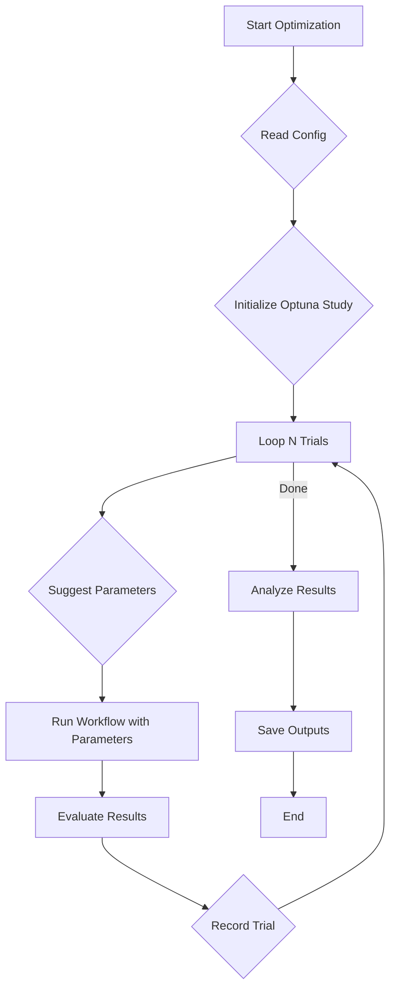

# AIQ Optimizer Guide

Welcome to the AIQ Optimizer guide. This document provides a comprehensive overview of how to use the AIQ Optimizer to tune your AIQ workflows.

## Introduction

The AIQ Optimizer is a powerful tool for automated hyperparameter tuning and prompt engineering for your AIQ workflows. It allows you to define a search space for your workflow's parameters and then intelligently searches for the best combination of parameters based on the evaluation metrics you specify.

This guide will walk you through:
- Configuring the optimizer.
- Making your workflow parameters optimizable.
- Running the optimizer from the command line.
- Understanding the output of the optimizer.

## How it Works

The AIQ Optimizer uses a combination of techniques to find the best parameters for your workflow. At its core, it uses [Optuna](https://optuna.org/) for numerical hyperparameter optimization and can leverage large language models (LLMs) for prompt optimization.



The optimization process follows the steps outlined in the diagram above:

1.  **Configuration Loading**: The optimizer starts by reading the `optimizer` section of your workflow configuration file. It uses this to understand your optimization objectives, which parameters are tunable, and the overall optimization strategy.

2.  **Study Initialization**: An [Optuna study](https://optuna.readthedocs.io/en/stable/reference/study.html) is created to manage the optimization process. This study keeps track of all the trials, their parameters, and their resulting scores.

3.  **Optimization Loop**: The optimizer then enters a loop that runs for the number of trials specified in `n_trials_numeric` and/or `n_trials_prompt`.

4.  **Parameter Suggestion**: In each trial, Optuna's sampler suggests a new set of hyperparameters from the `SearchSpace` you defined with `OptimizableField`. For prompt optimization, a new prompt is generated based on the `prompt_purpose` and feedback from previous trials.

5.  **Workflow Execution**: The AIQ workflow is executed using the suggested parameters for that trial. This is repeated `reps_per_param_set` times to ensure the results are statistically stable.

6.  **Evaluation**: The output of each workflow run is passed to the evaluators defined in the `eval_metrics` configuration. Each evaluator calculates a score for a specific objective (such as correctness, latency, or creativity).

7.  **Trial Recording**: The scores from the evaluators are combined into a single score for the trial, based on the `multi_objective_combination_mode`. This score, along with the parameters, is recorded in the Optuna study. Optuna uses this information to make better parameter suggestions in subsequent trials.

8.  **Analysis and Output**: Once all trials are complete, the optimizer analyzes the study to find the best-performing trial. It then generates the output files, including `best_params.json` and the various plots, to help you understand the results.

Now, let's dive into how to configure the optimizer.

## Optimizer Configuration

The optimizer is configured through an `optimizer` section in your workflow's YAML/JSON configuration file. This configuration is mapped to the `OptimizerConfig` and `OptimizerMetric` Pydantic models.

Here is an example of an `optimizer` section in a YAML configuration file:

```yaml
optimizer:
  output_path: "optimizer_results"
  n_trials_numeric: 50
  reps_per_param_set: 5
  do_numeric_optimization: true
  do_prompt_optimization: false
  eval_metrics:
    latency:
      evaluator_name: "latency"
      direction: "minimize"
      weight: 0.2
    correctness:
      evaluator_name: "correctness"
      direction: "maximize"
      weight: 0.8
```

### `OptimizerConfig`

This is the main configuration object for the optimizer.

-   `output_path: Path | None`: The directory where optimization results will be saved, for example, `optimizer_results/`. Defaults to `None`.
-   `eval_metrics: dict[str, OptimizerMetric] | None`: A dictionary of evaluation metrics to optimize. The keys are custom names for the metrics, and the values are `OptimizerMetric` objects.
-   `n_trials_numeric: int`: The number of trials for numeric optimization. A larger number of trials increases the chance of finding a better optimum but takes longer to run. Defaults to `20`.
-   `n_trials_prompt: int`: The number of trials for prompt optimization. Prompt optimization is often more expensive, so you might use fewer trials than for numeric optimization. Defaults to `20`.
-   `reps_per_param_set: int`: The number of times to run the workflow for each set of parameters to get a more stable evaluation. This is important for noisy evaluations where the result might vary even with the same parameters. Defaults to `3`.
-   `target: float | None`: If set, the optimization will stop when the combined score for a trial reaches this value. This is useful if you have a specific performance target and want to save time. The score is normalized between 0 and 1. Defaults to `None`.
-   `do_prompt_optimization: bool`: A flag to enable or disable prompt optimization. Use this when you want the optimizer to experiment with different phrasings of your prompts to improve performance. Defaults to `False`.
-   `do_numeric_optimization: bool`: A flag to enable or disable numeric parameter optimization. This is the standard hyperparameter tuning for values like `temperature` or other numerical settings. Defaults to `True`.
-   `prompt_evaluation_function: str | None`: The name of the function to use for evaluating generated prompts. This is required if `do_prompt_optimization` is `True`. This evaluator should be designed to score the quality of the prompt itself.
-   `trajectory_eval_metric_name: str | None`: The name of the trajectory evaluation metric to use for prompt optimization. This metric is used to generate feedback for the prompt generator. Required if `do_prompt_optimization` is `True`.
-   `num_feedback: int`: The number of feedback examples to use for prompt optimization. The optimizer will use the `num_feedback` best-performing and `num_feedback` worst-performing examples from previous trials to generate new prompt candidates. Defaults to `3`.
-   `multi_objective_combination_mode: str`: How to combine multiple objective scores into a single one. Currently, only `harmonic` mean is supported, which is a good way to balance multiple objectives. It tends to favor solutions where all objectives are reasonably good, rather than solutions where one objective is excellent and others are poor. Defaults to `harmonic`.

### `OptimizerMetric`

This model defines a single metric to be used in the optimization.

-   `evaluator_name: str`: The name of the evaluator to use for this metric. This should correspond to a registered evaluator in the system.
-   `direction: str`: The direction of optimization. Must be either `maximize` or `minimize`.
-   `weight: float`: The weight of this metric in the multi-objective optimization. The weights will be normalized. Defaults to `1.0`.

## Optimizable Fields

To make a parameter in your workflow optimizable, you need to use the `OptimizableField` function instead of Pydantic's standard `Field`. This allows you to attach search space metadata to the field.

### `SearchSpace`

The `SearchSpace` dataclass is used to define the range or set of possible values for a hyperparameter.

-   `low: T | Sequence[T] | None`: The lower bound for a numerical parameter, or a sequence of categorical values.
-   `high: T | None`: The upper bound for a numerical parameter. If `high` is `None`, the parameter is treated as categorical.
-   `log: bool`: Whether to use a logarithmic scale for numerical parameters. Defaults to `False`.
-   `step: float`: The step size for numerical parameters.
-   `is_prompt: bool`: Indicates that this field is a prompt to be optimized. Defaults to `False`.
-   `prompt: str`: The base prompt to be optimized.
-   `prompt_purpose: str`: A description of what the prompt is for, used to guide the LLM-based prompt optimizer.

### `OptimizableField`

This function is a drop-in replacement for `pydantic.Field` that takes an additional `space` argument.

Here's how you can define optimizable fields in your workflow's data models:

```python
from pydantic import BaseModel
from aiq.data_models.optimizable import OptimizableField, SearchSpace

class MyLLMConfig(BaseModel):
    temperature: float = OptimizableField(
        default=0.5,
        space=SearchSpace(low=0.0, high=1.0),
        description="The temperature for the LLM."
    )
    model_name: str = OptimizableField(
        default="gpt-3.5-turbo",
        space=SearchSpace(low=["gpt-3.5-turbo", "gpt-4", "claude-2"]),
        description="The name of the model to use."
    )
    system_prompt: str = OptimizableField(
        default="You are a helpful assistant.",
        space=SearchSpace(
            is_prompt=True,
            prompt="You are a helpful assistant.",
            prompt_purpose="To guide the behavior of the chatbot."
        ),
        description="The system prompt for the LLM."
    )
```

In this example:
- `temperature` is a continuous float parameter that will be sampled between `0.0` and `1.0`.
- `model_name` is a categorical parameter, and the optimizer will choose from the provided list of models.
- `system_prompt` is a prompt parameter that can be optimized using an LLM if `do_prompt_optimization` is enabled.

## Running the Optimizer

Once you have your optimizer configuration and optimizable fields set up, you can run the optimizer from the command line using the `aiq optimizer` command.

### CLI Command

```bash
aiq optimizer --config_file <path_to_config> --dataset <path_to_dataset>
```

### Options

-   `--config_file`: (Required) Path to the JSON or YAML configuration file for your workflow, for example, `my_workflow/config.yaml`. This file should contain the `optimizer` section as described above.
-   `--dataset`: (Optional) Path to a JSON file containing the dataset for evaluation, such as `my_workflow/eval_dataset.json`. This will override any dataset path specified in the config file. The dataset should be a list of dictionaries, where each dictionary represents a data point and includes the necessary inputs for your workflow and the ground truth for evaluation.
-   `--result_json_path`: A JSONPath expression to extract the result from the workflow's output. Defaults to `$`.
-   `--endpoint`: If you are running your workflow as a service, you can provide the endpoint URL. For example, `http://localhost:8000/generate`.
-   `--endpoint_timeout`: The timeout in seconds for requests to the endpoint. Defaults to `300`.

Example:
```bash
aiq optimizer --config_file my_workflow/config.yaml --dataset my_workflow/eval_dataset.json
```

This command will start the optimization process. You will see logs in your terminal showing the progress of the optimization, including the parameters being tested and the scores for each trial.

## Understanding the Output

When the optimizer finishes, it will save the results in the directory specified by the `output_path` in your `OptimizerConfig`. This directory will contain several files:

-   `best_params.json`: A JSON file containing the best set of parameters found during the optimization based on the combined score. While these are the "best" according to the weighted harmonic mean, you might choose other parameters based on the Pareto front.
-   `optimization_results.json`: A JSON file containing detailed results for each trial, including the parameters, the values of each objective, and the combined score.
-   `study.db`: A SQLite database file that contains the complete Optuna study. You can use this file for further analysis with Optuna's command-line tool or visualization library.
-   `pareto_front.png`: This plot is one of the most important outputs for multi-objective optimization. It shows the set of "non-dominated" solutions. A solution is non-dominated if there is no other solution that is better in at least one objective and no worse in any other. Each point on this plot represents a different trade-off between your objectives (for example, high correctness with high latency vs. medium correctness with low latency). You can use this plot to select a parameter set that meets your specific needs, which may be different from the single "best" set in `best_params.json`.
-   `optimization_history.png`: This plot shows the evolution of the combined score over the course of the optimization. You can use it to see if the optimizer is converging on a good solution. If the score is still improving significantly at the end of the run, you might consider increasing the number of trials.
-   `param_importances.png`: This plot, generated using Optuna's feature importance analysis, shows which of your optimizable parameters had the most significant impact on the optimization objectives. This is useful for understanding your model better and can help you focus future tuning efforts on the most impactful parameters.

By examining these output files, you can understand the results of the optimization, choose the best parameters for your needs (for example, picking a point on the Pareto front that represents your desired trade-off), and gain insights into your workflow's behavior.

## Advanced Topics

This section covers more advanced usage of the AIQ Optimizer, including creating custom evaluators and performing deeper analysis of the results.

### Creating a Custom Evaluator

While AIQ provides several built-in evaluators, you may need to create your own to measure performance specific to your use case. To create a custom evaluator, you need to:

1.  **Define the Evaluator Class**: Create a Python class that inherits from `aiq.eval.Evaluator` and implements the `evaluate` method.
2.  **Register the Evaluator**: Use the `@register_evaluator` decorator to make your evaluator available to the AIQ Toolkit.

Here is an example of a custom evaluator that checks if the output contains a specific keyword:

```python
from aiq.eval import Evaluator, register_evaluator, EvaluationResult

@register_evaluator("keyword_match")
class KeywordMatchEvaluator(Evaluator):
    def __init__(self, keyword: str):
        self.keyword = keyword

    async def evaluate(self, *, result: str, **kwargs) -> EvaluationResult:
        score = 1.0 if self.keyword in result else 0.0
        return EvaluationResult(
            score=score,
            metric_name="keyword_match_score",
            explanation=f"Checked for the presence of '{self.keyword}'."
        )
```

You can then use this evaluator in your `config.yaml`:

```yaml
evaluators:
  - name: "my_keyword_evaluator"
    type: "keyword_match"
    args:
      keyword: "expected_word"

optimizer:
  # ...
  eval_metrics:
    keyword_check:
      evaluator_name: "my_keyword_evaluator"
      direction: "maximize"
```

### Deeper Analysis with Optuna

The `study.db` file is a standard SQLite database that can be analyzed with Optuna's visualization tools. This allows you to generate more detailed plots and analyses than the ones provided by default.

First, make sure you have `optuna-dashboard` installed:
```bash
pip install optuna-dashboard
```

Then, you can launch the dashboard with your study file:
```bash
optuna-dashboard sqlite:///path/to/your/optimizer_results/study.db
```

This will open a web interface where you can explore the optimization history, parameter relationships, parallel coordinate plots, and more, giving you a much deeper understanding of the optimization process.

## Full Example

Let's walk through a full example of optimizing a simple insult generator workflow. The goal is to generate a creative insult, and we want to optimize for creativity and minimize latency.

### 1. Project Structure

```
insult_workflow/
├── main.py
├── config.yaml
└── eval_dataset.json
```

### 2. Workflow Code (`main.py`)

Here, we define a simple workflow with an LLM. We make the `temperature` and `system_prompt` optimizable.

```python
from pydantic import BaseModel
from aiq import step
from aiq.data_models.optimizable import OptimizableField, SearchSpace
from aiq.llm import LLM
from aiq.llm.providers.openai import OpenAIConfig

class InsultWorkflow(BaseModel):
    llm_config: OpenAIConfig = OpenAIConfig(
        temperature=OptimizableField(
            default=0.7,
            space=SearchSpace(low=0.2, high=1.0)
        ),
        prompt=OptimizableField(
            default="You are an insult comic. Generate a creative insult for the given topic.",
            space=SearchSpace(
                is_prompt=True,
                prompt="You are an insult comic. Generate a creative insult for the given topic.",
                prompt_purpose="To make the insults as creative and funny as possible."
            )
        )
    )

    @step
    async def run(self, topic: str) -> dict:
        llm = LLM(self.llm_config)
        response = await llm.run({"topic": topic})
        return {"insult": response.output}
```

### 3. Configuration (`config.yaml`)

In the config file, we set up the optimizer. We want to maximize "creativity" and minimize "latency".

```yaml
version: 1.0
workflow:
  main: insult_workflow.InsultWorkflow
optimizer:
  output_path: "insult_optimizer_results"
  n_trials_numeric: 20
  n_trials_prompt: 5
  do_numeric_optimization: true
  do_prompt_optimization: true
  prompt_evaluation_function: "creativity_evaluator"
  trajectory_eval_metric_name: "creativity"
  eval_metrics:
    creativity:
      evaluator_name: "creativity_evaluator"
      direction: "maximize"
      weight: 0.9
    latency:
      evaluator_name: "latency"
      direction: "minimize"
      weight: 0.1
evaluators:
  - name: "creativity_evaluator"
    type: "llm_based"
    llm_config:
      model: "gpt-4"
      prompt: "On a scale of 1-10, how creative is this insult: {insult}"
```

### 4. Evaluation Dataset (`eval_dataset.json`)

A simple dataset with topics for the insult generator.

```json
[
    {"topic": "a politician"},
    {"topic": "a social media influencer"},
    {"topic": "a reality TV star"}
]
```

### 5. Running the Optimizer

Finally, we run the optimizer from the command line.

```bash
aiq optimizer --config_file insult_workflow/config.yaml --dataset insult_workflow/eval_dataset.json
```

After the optimizer runs, you can inspect the `insult_optimizer_results` directory to find the best parameters and prompts, along with the analysis plots.

## Conclusion

The AIQ Optimizer is a versatile tool to automate the tuning of your workflows. By defining optimizable fields and configuring your objectives, you can systematically find the best parameters for your specific use case, saving time and improving the performance of your AIQ applications. Happy optimizing! 