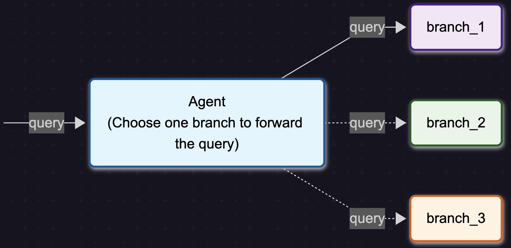

<!--
SPDX-FileCopyrightText: Copyright (c) 2025, NVIDIA CORPORATION & AFFILIATES. All rights reserved.
SPDX-License-Identifier: Apache-2.0

Licensed under the Apache License, Version 2.0 (the "License");
you may not use this file except in compliance with the License.
You may obtain a copy of the License at

http://www.apache.org/licenses/LICENSE-2.0

Unless required by applicable law or agreed to in writing, software
distributed under the License is distributed on an "AS IS" BASIS,
WITHOUT WARRANTIES OR CONDITIONS OF ANY KIND, either express or implied.
See the License for the specific language governing permissions and
limitations under the License.
-->

# Router Agent

The Router Agent is an intelligent routing system that analyzes incoming requests and directs them to the most appropriate branch (agent, function, or tool) based on the request content. Unlike other agents that may use multiple tools in sequence, the Router Agent uses a single-pass architecture to select exactly one branch that best handles the request, making it ideal for scenarios where different types of requests need specialized handling.

The Router Agent's implementation uses a two-node graph structure: a Router Node that analyzes the request and selects the appropriate branch, and a Branch Node that executes the selected branch and returns the result.

---

## Features
- **Single-Pass Architecture**: Uses an efficient two-node graph structure with Router Node (analyzes request and selects branch) and Branch Node (executes the selected branch)
- **Intelligent Request Routing**: Analyzes user input and selects exactly one branch that best handles the request
- **Pre-built Tools**: Leverages core library agents and tools
- **Custom Plugin System**: Developers can bring in new tools using plugins
- **Configurable Branches**: Support for routing to any combination of functions, tools, or agents
- **Easy Fine-tuning**: Single-pass approach makes it easy to customize routing logic through prompt modification
- **Customizable Prompts**: Modify system and user prompts for specific routing needs
- **Agentic Workflows**: Fully configurable via YAML for flexibility and productivity
- **Ease of Use**: Simplifies developer experience and deployment

---

## Requirements
The Router Agent requires the `nvidia-nat[langchain]` plugin to be installed.

After you've performed a source code checkout, install this with the following command:

```bash
uv pip install -e '.[langchain]'
```

## Configuration

The Router Agent may be utilized as a workflow or a function.

### Example `config.yml`
In your YAML file, to use the Router Agent (`router_agent`) as a workflow:
```yaml
workflow:
  _type: router_agent
  branches: [fruit_advisor, city_advisor, literature_advisor]
  llm_name: nim_llm
  detailed_logs: true
```

In your YAML file, to use the Router Agent as a function:
```yaml
functions:
  fruit_advisor:
    _type: fruit_advisor
    description: "Provides recommendations for fruits based on user preferences"
  city_advisor:
    _type: city_advisor
    description: "Suggests cities to visit based on user interests"
  router_agent:
    _type: router_agent
    branches: [fruit_advisor, city_advisor]
    llm_name: agent_llm
    description: "Routes user requests to the most appropriate advisor"
    max_router_retries: 3
```

### Configurable Options

#### Required Options

* `branches`: A list of available tools, functions, or agents that the router can direct requests to. These branches must be configured in the YAML file.

* `llm_name`: The language model used for request analysis and routing decisions. The LLM must be configured in the YAML file.

#### Optional Options

* `description`: Defaults to "Router Agent Workflow". When the Router Agent is configured as a function, this config option allows control of the tool description (for example, when used as a tool within another agent).

* `system_prompt`: Optional. Custom system prompt to use with the agent. Allows override of the default routing instructions.

* `user_prompt`: Optional. Custom user prompt template to use with the agent. Must include variables for input and available branches.

* `max_router_retries`: Defaults to 3. Maximum number of retries if the router agent fails to choose a valid branch.

* `detailed_logs`: Defaults to False. Enable detailed logging to see the routing decisions and branch responses.

* `log_response_max_chars`: Defaults to 1000. Maximum number of characters to display in logs when logging branch responses.

---

## Step-by-Step Breakdown of a Router Agent

The Router Agent follows a streamlined two-phase process:

1. **Routing Phase** – The Router Node analyzes the user request and selects the most appropriate branch based on branch descriptions and request content.
2. **Execution Phase** – The Branch Node executes the selected branch with the original input and returns the result.

### Example Walkthrough

Imagine a Router Agent configured with three advisors needs to handle:

> "I want a yellow fruit"

#### Routing Phase
1. **Request Analysis**: The Router Node receives the input "I want a yellow fruit"
2. **Branch Evaluation**: The agent evaluates available branches:
   - `fruit_advisor`: "Provides recommendations for fruits based on user preferences"
   - `city_advisor`: "Suggests cities to visit based on user interests"
   - `literature_advisor`: "Recommends books and literary works"
3. **Branch Selection**: Based on the request content, the Router Node selects `fruit_advisor` as the most appropriate branch

#### Execution Phase
1. **Branch Execution**: The Branch Node calls the `fruit_advisor` function with the original input
2. **Response Generation**: The `fruit_advisor` processes the request and returns "banana"
3. **Result Return**: The Router Agent returns the final result: "banana"

Since the Router Agent uses a single-pass architecture, it efficiently routes requests without multiple reasoning steps, making it ideal for scenarios where you need to direct different types of requests to specialized handlers.

---

## Graph Structure

The Router Agent uses a single-pass graph architecture that efficiently analyzes requests and routes them to appropriate branches:

<div align="center">

</div>

The graph consists of two main components:

1. **Router Node**: Analyzes the incoming request and selects the most appropriate branch based on:
   - Request content analysis
   - Branch descriptions and capabilities
   - Configured routing logic

2. **Branch Node**: Executes the selected branch with the original input and returns the result

This architecture ensures efficient routing with minimal overhead while maintaining flexibility in branch selection.

---

## Use Cases

The Router Agent is particularly well-suited for:

* **Multi-domain Applications**: Route requests to different specialized agents based on topic (such as technical support, sales, or general inquiries)
* **Workflow Orchestration**: Direct different types of tasks to appropriate processing pipelines
* **API Gateway Pattern**: Route API requests to different backend services based on request characteristics
* **Content Classification**: Automatically categorize and route content to appropriate handlers
* **Customer Service**: Direct customer inquiries to specialized support agents based on issue type

---

## Limitations

The following are the limitations of Router Agents:

* **Single Branch Selection**: The Router Agent selects only one branch per request and does not perform multi-step routing or branch combination.

* **No Inter-branch Communication**: Branches operate independently and cannot communicate with each other within a single request.

* **Static Branch Configuration**: Available branches must be predefined in the configuration and cannot be dynamically added during runtime.

* **Routing Accuracy Dependency**: The effectiveness of routing depends on the quality of branch descriptions and the LLM's ability to understand request intent.

* **No Fallback Chaining**: If the selected branch fails or returns an unsatisfactory result, the Router Agent does not automatically try alternative branches.
