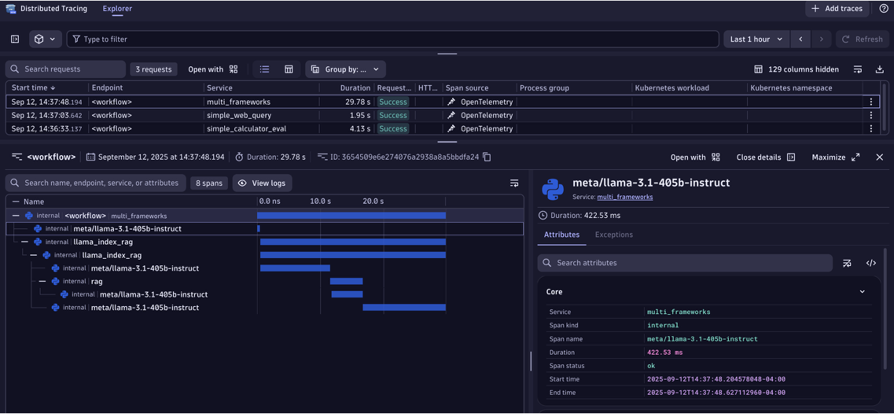

# Observing a Workflow with Dynatrace

This guide shows how to stream OpenTelemetry (OTel) traces from your NeMo Agent toolkit workflows to the [OpenTelemetry Protocol (OTLP) ingest API](https://docs.dynatrace.com/docs/discover-dynatrace/references/dynatrace-api/environment-api/opentelemetry), which in turn provides the ability to have full visibility into the performance of AI/LLM models and agent interactions​. 

In this guide, you will learn how to:
* Deploy a [Dynatrace OpenTelemetry Collector](https://docs.dynatrace.com/docs/ingest-from/opentelemetry/collector) with a configuration that exports traces into Dynatrace
* Configure your workflow (YAML) or Python script to send traces to the OTel collector.
* Run the workflow and view traces within Dynatrace

## Step 1: Dynatrace Account

You will need access to your Dynatrace environment.  If you don’t have one you can simply [signup to get started](https://www.dynatrace.com/signup/)

## Step 2: Dynatrace API Token

Dynatrace APIs use token based authentication. To generate an access token:
1. Go to Access tokens.
1. Select Generate new token.
1. Enter a name for your token.
1. Select these [required scopes for the OTLP API](https://docs.dynatrace.com/docs/shortlink/otel-getstarted-otlpexport#authentication-export-to-activegate):
    * `openTelemetryTrace.ingest`
    * `metrics.ingest`
    * `Logs.ingest`
1. Select Generate token.
1. Copy the generated token to the clipboard. Store the token in a password manager for future use and for the configuration below.

## Step 3: Configure OTel Collector

Configure an OTel Collector configuration file using an `otlphttp` exporter to the Dynatrace OTLP API as shown in the example below. Refer to the [Dynatrace documentation](https://docs.dynatrace.com/docs/shortlink/otel-collector-config) as required.

```yaml
receivers:
  otlp:
    protocols:
      grpc:
        endpoint: 0.0.0.0:4317
      http:
        endpoint: 0.0.0.0:4318
processors:
  cumulativetodelta:
exporters:
  otlphttp:
    endpoint: "https://<YOUR-DYNATRACE-ENVIRONMENT>.live.dynatrace.com/api/v2/otlp"
    headers:
      Authorization: "Api-Token <YOUR-DYNATRACE-TOKEN>"
service:
  pipelines:
    traces:
      receivers: [otlp]
      processors: []
      exporters: [otlphttp]
    metrics:
      receivers: [otlp]
      processors: [cumulativetodelta]
      exporters: [otlphttp]
    logs:
      receivers: [otlp]
      processors: []
      exporters: [otlphttp]
```

## Step 4: Install and run your configured OTel Collector

There are many ways to deploy an [OTel Collector](https://docs.dynatrace.com/docs/ingest-from/opentelemetry/collector/deployment) but for this example, an OTel Collector is created using Docker with the configuration from the previous step into a file named `otelcollectorconfig.yaml` with the [Dynatrace distribution of the OpenTelemetry Collector](https://docs.dynatrace.com/docs/ingest-from/opentelemetry/collector).  

```bash
docker run -d -v $(pwd)/otelcollectorconfig.yaml:/etc/otelcol/config.yaml \ 
-p 4318:4318 \ 
dynatrace/dynatrace-otel-collector:0.34.0 
```

Once running, the collector endpoint is: `http://localhost:4318`. 

## Step 5: Install the NeMo Agent toolkit OpenTelemetry Subpackages

```bash
# Install all optional telemetry extras
uv pip install -e '.[telemetry]'

# Install specific telemetry extras
uv pip install -e '.[opentelemetry]'
```

## Step 6: Modify NeMo Agent toolkit Workflow Configuration

Update your workflow configuration file to include the telemetry settings.

Example configuration:
```yaml
general:
  telemetry:
    tracing:
      otelcollector:
        _type: otelcollector
        # The endpoint where you have deployed the otel collector
        endpoint: http://0.0.0.0:4318/v1/traces
        project: your_project_name
```

## Step 7: Run the workflow

As workflows run, spans are sent to the OTel Collector which in turn exports them based on the exporter you configured to Dynatrace. 

In the example below, the [Simple LangSmith-Documentation Agent workflow](https://github.com/NVIDIA/NeMo-Agent-Toolkit/tree/release/1.2/examples/getting_started/simple_web_query) was used.

```bash
uv pip install -e examples/getting_started/simple_web_query
nat run --config_file examples/getting_started/simple_web_query/configs/config.yml --input "What is LangSmith?" 
```

## Step 8: View spans

View the exported traces within the [Dynatrace Distributed Tracing App](https://docs.dynatrace.com/docs/analyze-explore-automate/distributed-tracing/distributed-tracing-app) as shown below.


<div align="left">
  
</div>