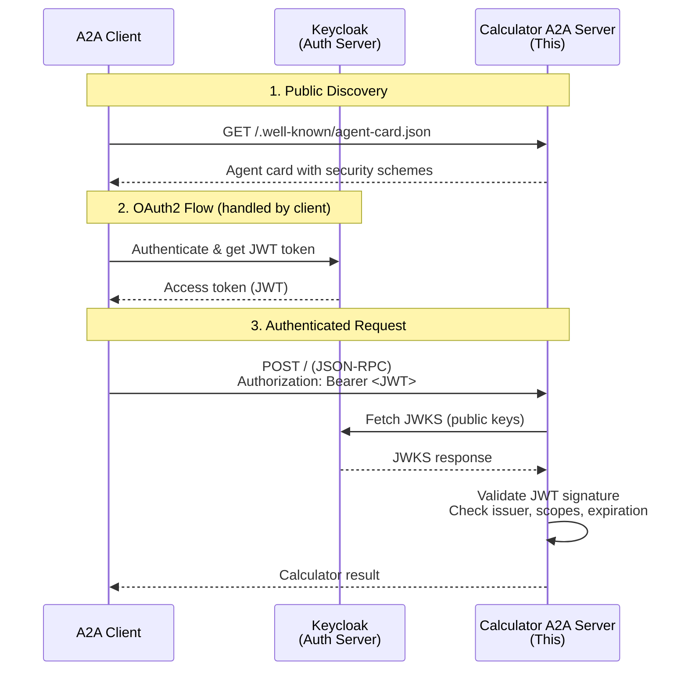

<!-- SPDX-FileCopyrightText: Copyright (c) 2025, NVIDIA CORPORATION & AFFILIATES. All rights reserved.
SPDX-License-Identifier: Apache-2.0

Licensed under the Apache License, Version 2.0 (the "License");
you may not use this file except in compliance with the License.
You may obtain a copy of the License at

http://www.apache.org/licenses/LICENSE-2.0

Unless required by applicable law or agreed to in writing, software
distributed under the License is distributed on an "AS IS" BASIS,
WITHOUT WARRANTIES OR CONDITIONS OF ANY KIND, either express or implied.
See the License for the specific language governing permissions and
limitations under the License.
-->

# OAuth2-Protected Calculator A2A Server

This example demonstrates an A2A server protected with OAuth2 authentication. It wraps the simple calculator workflow with OAuth2 token validation, requiring valid JWT tokens for all agent execution requests.

## Overview

**Type:** A2A Server (Resource Server)

**Authentication:** OAuth2 with JWT validation

**Skills:** Basic arithmetic operations (add, subtract, multiply, divide, compare) and current datetime

## Features

- **JWT Token Validation:** Validates access tokens using JWKS from authorization server
- **Scope Enforcement:** Requires `calculator_a2a:execute` scope (configurable)
- **Public Agent Card:** Agent card is publicly accessible without authentication
- **Protected Operations:** All calculator operations require valid authentication

## Quick Start

### Installation

```bash
# Install the calculator example
uv pip install -e examples/A2A/calculator_a2a
```

### Start the Protected Server

```bash
nat a2a serve --config_file examples/A2A/calculator_a2a/configs/config-protected-oauth2.yml
```

The server will start on `http://localhost:10000` with OAuth2 protection enabled.

## Configuration

The server is configured via `configs/config-protected-oauth2.yml`:

- **OAuth2 Issuer:** Authorization server URL
- **JWKS URI:** Endpoint for JWT signature verification
- **Required Scopes:** Scopes that must be present in access tokens
- **Audience:** Expected token audience (optional)

For detailed configuration options, see the config file.

## End-to-End Testing

This calculator server is designed to be used with an OAuth2-protected client. For a complete end-to-end example including:

- OAuth2 authorization server setup (Keycloak)
- Client configuration and authentication
- Token acquisition and management
- Complete testing workflow

**See:** `examples/A2A/math_assistant_a2a/oauth2-keycloak-setup.md`

## Architecture

This server implements the resource server role in OAuth2:



1. Client discovers agent card (public)
2. Client authenticates with authorization server
3. Client calls calculator with JWT token
4. Calculator validates JWT signature and claims

## Security

**Token Validation:**
- JWT signature verification using JWKS public keys
- Issuer validation
- Expiration check
- Scope validation (if configured)
- Audience validation (if configured)

**Public Endpoints:**
- `/.well-known/agent-card.json` - Agent card discovery (no auth required)

**Protected Endpoints:**
- All other endpoints require valid Bearer token

## References

- [OAuth2 Protected A2A Setup Guide](../math_assistant_a2a/oauth2-keycloak-setup.md)
- [NAT A2A Client Documentation](../../../docs/source/build-workflows/a2a-client.md)
- [NAT A2A Server Documentation](../../../docs/source/run-workflows/a2a-server.md)
- [A2A Protocol Specification](https://a2a.org/)
