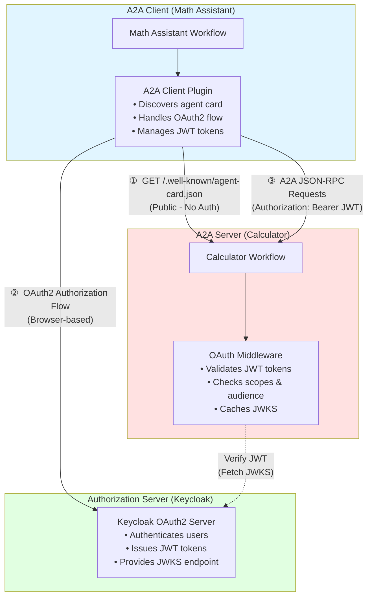
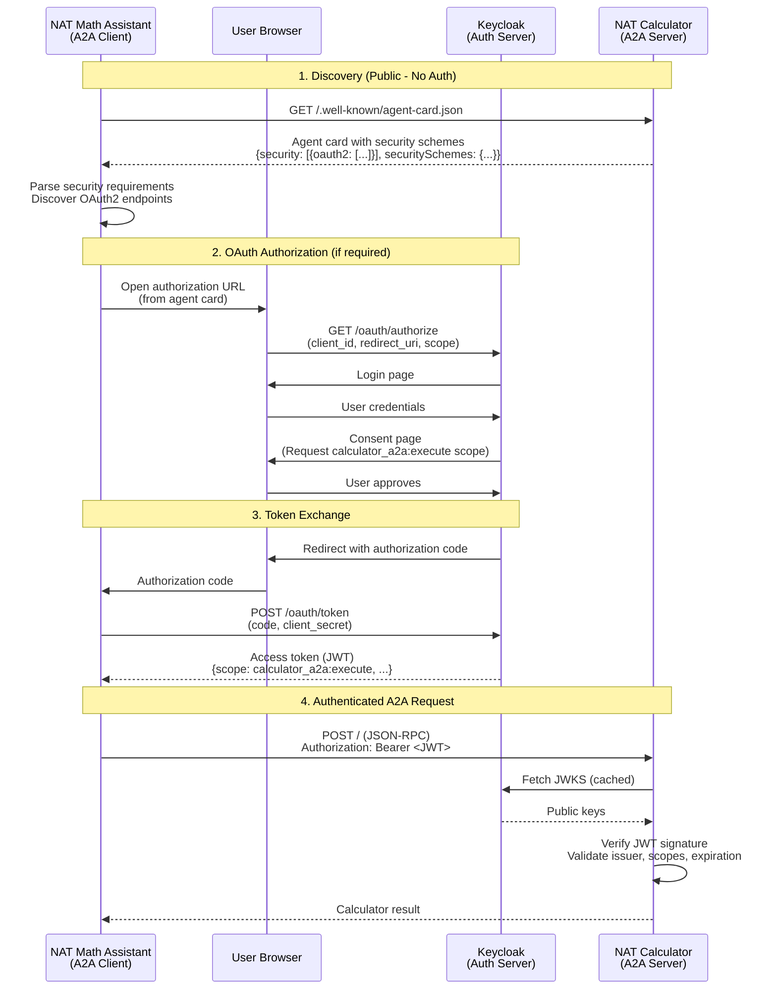

<!-- SPDX-FileCopyrightText: Copyright (c) 2025, NVIDIA CORPORATION & AFFILIATES. All rights reserved.
SPDX-License-Identifier: Apache-2.0

Licensed under the Apache License, Version 2.0 (the "License");
you may not use this file except in compliance with the License.
You may obtain a copy of the License at

http://www.apache.org/licenses/LICENSE-2.0

Unless required by applicable law or agreed to in writing, software
distributed under the License is distributed on an "AS IS" BASIS,
WITHOUT WARRANTIES OR CONDITIONS OF ANY KIND, either express or implied.
See the License for the specific language governing permissions and
limitations under the License.
-->

# Keycloak OAuth2 Setup Guide for NAT A2A

This guide walks through setting up Keycloak as an OAuth2 authorization server for testing OAuth2-protected A2A servers in NAT.

## What You'll Build

- **Protected A2A Server**: Calculator service that requires OAuth2 authentication
- **A2A Client**: Math assistant that authenticates and calls the calculator
- **OAuth2 Flow**: Complete authorization code flow with JWT validation
- **Custom Scopes**: Resource-specific permissions (for example, `calculator_a2a:execute`)

This example is designed for **development and testing**. See [Production Considerations](#production-considerations) for deployment guidance.

## Architecture Overview

This example consists of three main components:



**Components Overview:**

1. **NAT Math Assistant (Client)**
   - NAT workflow that needs calculator operations
   - Uses A2A client plugin to connect to calculator
   - Handles user authentication flow via browser

2. **NAT Calculator A2A Server (Resource Server)**
   - Protected A2A server requiring authentication
   - Publishes agent card with security requirements
   - Validates JWT tokens before processing requests

3. **Keycloak (Authorization Server)**
   - Test Keycloak OAuth2 server for testing OAuth2-protected A2A servers in NAT.
   - Authenticates users and manages consent
   - Provides JWKS endpoint for token verification


## A2A OAuth2 Flow

This example demonstrates the A2A protocol with OAuth 2.1 Authorization Code Flow:



**Key Steps:**
1. **Agent card discovery** - Client fetches public metadata to discover authentication requirements
2. **Dynamic authentication** - Client initiates OAuth flow based on agent card security schemes
3. **Token acquisition** - User authenticates via browser, client obtains JWT token
4. **Authenticated communication** - Client includes token in A2A requests, server validates JWT

## Prerequisites

- Docker installed and running
- NAT development environment set up
- No services running on port 8080

## Step 1: Start Keycloak

```bash
# Start Keycloak
docker run -d --name keycloak \
  -p 127.0.0.1:8080:8080 \
  -e KC_BOOTSTRAP_ADMIN_USERNAME=admin \
  -e KC_BOOTSTRAP_ADMIN_PASSWORD=admin \
  quay.io/keycloak/keycloak:latest start-dev
```

**Wait for Keycloak to start** (about 30-60 seconds). Check logs:

```bash
docker logs -f keycloak
```

Look for: `Listening on: http://0.0.0.0:8080`

**Access Keycloak:** Open `http://localhost:8080` in your browser

## Step 2: Configure Keycloak Realm and Scopes

1. **Log in to Keycloak Admin Console:**
   - Username: `admin`
   - Password: `admin`

2. **Verify you're in the `master` realm** (top-left dropdown)

3. **Create the `calculator_a2a:execute` scope (for the calculator agent):**
   - Go to **Client scopes** (left sidebar)
   - Click **Create client scope**
   - Fill in:
     - **Name**: `calculator_a2a:execute`
     - **Description**: `Permission to execute calculator operations`
     - **Type**: `Optional`
     - **Protocol**: `openid-connect`
   - Click **Save**

4. **Add scope to token :**

   Keycloak won't include custom scopes in JWT tokens by default. You must configure a mapper to include the scope in the token.

   - Still in the `calculator_a2a:execute` client scope, go to the **Mappers** tab
   - Click **Add mapper** → **By configuration**
   - Select **Hardcoded claim**
   - Configure the mapper:
     - **Name**: `add-calculator-scope`
     - **Token Claim Name**: `scope`
     - **Claim value**: `calculator_a2a:execute`
     - **Claim JSON Type**: `String`
     - **Add to ID token**: `Off`
     - **Add to access token**: `On` ✅
     - **Add to userinfo**: `Off`
   - Click **Save**

   This ensures `calculator_a2a:execute` appears in the token's `scope` claim.

5. **Verify OpenID Discovery endpoint:**
   ```bash
   curl http://localhost:8080/realms/master/.well-known/openid-configuration | python3 -m json.tool
   ```

   You should see:
   - `authorization_endpoint`
   - `token_endpoint`
   - `jwks_uri`
   - `registration_endpoint` (for DCR)

## Step 3: Register Math Assistant Client

You have two options:

### Option A: Manual Client Registration (Recommended for Testing)

1. In Keycloak Admin Console, go to **Clients** (left sidebar)
2. Click **Create client**
3. **General Settings:**
   - **Client ID**: `math-assistant-client`
   - **Client type**: `OpenID Connect`
   - Click **Next**

4. **Capability config:**
   - **Client authentication**: `On` (confidential client)
   - **Authorization**: `Off`
   - **Authentication flow:**
     - ✓ Standard flow (authorization code)
     - ✓ Direct access grants
   - Click **Next**

5. **Login settings:**
   - **Valid redirect URIs**: `http://localhost:8000/auth/redirect`
   - **Web origins**: `http://localhost:8000`
   - Click **Save**

6. **Get client credentials:**
   - Go to **Credentials** tab
   - Copy the **Client secret**
   - Note the **Client ID**: `math-assistant-client`

7. **Configure client scopes (make it default):**
   - Go to **Client scopes** tab
   - Click **Add client scope**
   - Select `calculator_a2a:execute`
   - Choose **Default** (not Optional) ✅
   - Click **Add**

   **Why Default?** Default scopes are automatically included in every token request. Optional scopes must be explicitly requested and may not be granted.

### Option B: Dynamic Client Registration (DCR)

NAT's OAuth2 provider can use DCR if Keycloak is configured to allow it. By default, Keycloak restricts anonymous DCR. To enable it:

1. Go to **Realm settings** > **Client registration**
2. Click **Client registration policies** tab
3. Configure anonymous access or trusted hosts

**Note:** For testing, manual registration (Option A) is simpler.

## Step 4: Set Environment Variables

After registering the client:

```bash
# Set these in your terminal where you'll run the NAT client
export CALCULATOR_CLIENT_ID="math-assistant-client"
export CALCULATOR_CLIENT_SECRET="<paste-client-secret-from-keycloak>"

# Verify they're set
echo "Client ID: ${CALCULATOR_CLIENT_ID}"
echo "Client Secret: ${CALCULATOR_CLIENT_SECRET:0:10}..."
```

## Step 5: Start the Protected Calculator Server

```bash
# Terminal 1
nat a2a serve --config_file examples/A2A/calculator_a2a/configs/config-protected-oauth2.yml
```

You should see:
```
[INFO] OAuth2 token validation enabled for A2A server
[INFO] Starting A2A server 'Protected Calculator' at http://localhost:10000
```

## Step 6: Run the Math Assistant Client

```bash
# Terminal 2
# Make sure environment variables are set
export CALCULATOR_CLIENT_ID="math-assistant-client"
export CALCULATOR_CLIENT_SECRET="<your-client-secret>"

nat run --config_file examples/A2A/math_assistant_a2a/configs/config-a2a-auth-calc.yml \
  --input "Is the product of 2 * 4 greater than the current hour of the day?"
```

**What should happen:**

1. **Browser opens** with Keycloak login page
2. **Log in** with any user (or create one)
3. **Consent page** shows requesting `calculator_a2a:execute` scope - click **Yes**
4. **Browser redirects** back to `localhost:8000/auth/redirect`
5. **Workflow continues** and calls the calculator
6. **Response returned** successfully


## Cleanup

To stop and remove Keycloak:

```bash
docker stop keycloak
docker rm keycloak
```

To restart with clean state:

```bash
docker rm -f keycloak
# Then run the start command again
```

## Verification and Testing

### Verify JWKS Endpoint Works

```bash
curl http://localhost:8080/realms/master/protocol/openid-connect/certs | python3 -m json.tool
```

You should see public keys in JSON format (RSA keys used to verify JWT signatures).

### Step 2: Verify Token Has Correct Scopes

Before running the full workflow, verify that tokens include the custom scope:

1. In Keycloak Admin Console, go to **Clients** → `math-assistant-client`
2. Click the **Client scopes** tab
3. Click **Evaluate** (top of page)
4. Select a user (for example, `admin`)
5. Click **Generated access token**
6. Search for `"scope":` in the token JSON
7. **Verify it includes:** `calculator_a2a:execute`

**Example of correct token scope:**
```json
{
  "scope": "email profile calculator_a2a:execute",
  ...
}
```

**If the scope is missing**, return to Step 2.4 and verify the mapper is configured correctly.

### Check Token Contents

After a successful OAuth flow, you can decode the JWT token at [jwt.io](https://jwt.io) to see:
- `iss`: Should be `http://localhost:8080/realms/master`
- `aud`: Should include your server URL
- `scope` or `scp`: Should include `calculator_a2a:execute`
- `exp`: Expiration timestamp
- `sub`: User subject/ID

## Troubleshooting

### "Token is not active" Error

**Cause:** Token validation failing on the resource server.

**Check:**
1. JWKS URI is correct and accessible
2. Token `iss` matches the `issuer_url` in server config
3. Token `aud` matches the `audience` in server config (if set)
4. Token hasn't expired
5. Clock skew isn't too large between client/server

### "invalid_client" Error

**Cause:** Client credentials are wrong or client isn't registered.

**Fix:**
1. Verify client exists in Keycloak
2. Check `CALCULATOR_CLIENT_ID` and `CALCULATOR_CLIENT_SECRET` are set correctly
3. Make sure redirect URI matches exactly

### "invalid_scope" Error During Authorization

**Cause:** Requested scope not allowed for client.

**Fix:**
1. Go to Keycloak → Clients → `math-assistant-client` → Client scopes
2. Make sure `calculator_a2a:execute` is added as a default or optional scope
3. Verify the scope exists in **Client scopes** (left sidebar)

### Token Missing `calculator_a2a:execute` Scope

**Symptoms:**
- Token validation succeeds but server rejects with "missing required scopes"
- Token has `"scope": "email profile"` but not `calculator_a2a:execute`

**Cause:** Scope mapper not configured correctly.

**Fix:**
1. Go to **Client scopes** → `calculator_a2a:execute` → **Mappers** tab
2. Verify mapper exists with:
   - Token Claim Name: `scope`
   - Claim value: `calculator_a2a:execute`
   - Add to access token: `On` ✅
3. Go to **Clients** → `math-assistant-client` → **Client scopes** tab
4. Ensure `calculator_a2a:execute` is in **Assigned default client scopes** (not just optional)
5. Use **Evaluate** tab to test token generation
6. Clear cached tokens and re-authenticate to get a fresh token

### Audience Mismatch

**Symptoms:**
- Error: "JWT audience does not contain required audience"
- Token has `"aud": ["master-realm", "account"]` but server expects server URL

**Temporary Fix:**
Comment out audience validation in `config-protected-oauth2.yml`:
```yaml
# audience: http://localhost:10000
```

**Proper Fix:**
Add an Audience mapper to `calculator_a2a:execute` client scope:
1. Go to **Client scopes** → `calculator_a2a:execute` → **Mappers**
2. Add mapper → **Audience**
3. Configure:
   - Included Custom Audience: `http://localhost:10000`
   - Add to access token: `On`

### Browser Doesn't Open

**Cause:** NAT can't detect or open the browser.

**Workaround:**
1. Look for the authorization URL in the console output
2. Copy and paste it into your browser manually

## Key Components

1. **Authorization Server (Keycloak)**: Issues and validates tokens, manages user authentication
2. **Client (Math Assistant)**: Requests tokens on behalf of users, includes tokens in API calls
3. **Resource Server (Calculator)**: Validates tokens and protects API endpoints
4. **Scopes**: Define permissions (for example, `calculator_a2a:execute`)
5. **JWT**: Self-contained token with claims (issuer, audience, scopes, expiration)
6. **JWKS**: Public keys used to verify JWT signatures without calling auth server

## Production Considerations

This setup is for **development and testing only**. For production:

### Security

1. **Use HTTPS Everywhere**
   - Keycloak must use TLS
   - All redirect URIs must be HTTPS
   - A2A servers must use HTTPS

2. **Secure Credentials**
   - Store client secrets in a secrets manager (Vault, AWS Secrets Manager, etc.)
   - Never commit secrets to version control
   - Use environment variables only for development
   - Rotate client secrets regularly

3. **Token Configuration**
   - Set short access token lifetime (5-15 minutes)
   - Enable refresh tokens for long-running sessions
   - Configure appropriate token expiration policies
   - Implement token revocation

4. **Realm Configuration**
   - Don't use the `master` realm for applications
   - Create dedicated realms per environment (dev, staging, prod)
   - Configure proper user management and authentication policies

### Deployment

1. **Keycloak in Production**
   - Use clustered deployment for high availability
   - Configure database backend (PostgreSQL, MySQL)
   - Set up proper logging and monitoring
   - Follow [Keycloak production guide](https://www.keycloak.org/server/configuration-production)

2. **Network Configuration**
   - Use proper DNS names (not `localhost`)
   - Configure firewalls and security groups
   - Set up load balancers
   - Implement rate limiting

3. **Monitoring**
   - Track OAuth flows and failures
   - Monitor token usage and expiration
   - Alert on authentication failures
   - Log security events

### Compliance

1. **Data Protection**
   - Implement proper consent management
   - Handle user data according to GDPR/CCPA
   - Secure token storage
   - Implement proper audit logging

2. **Best Practices**
   - Follow OAuth 2.1 security best practices
   - Use PKCE for all clients
   - Implement proper CORS policies
   - Validate all inputs and tokens

## References

- [Keycloak Documentation](https://www.keycloak.org/documentation)
