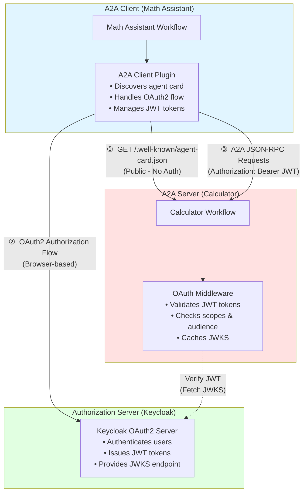
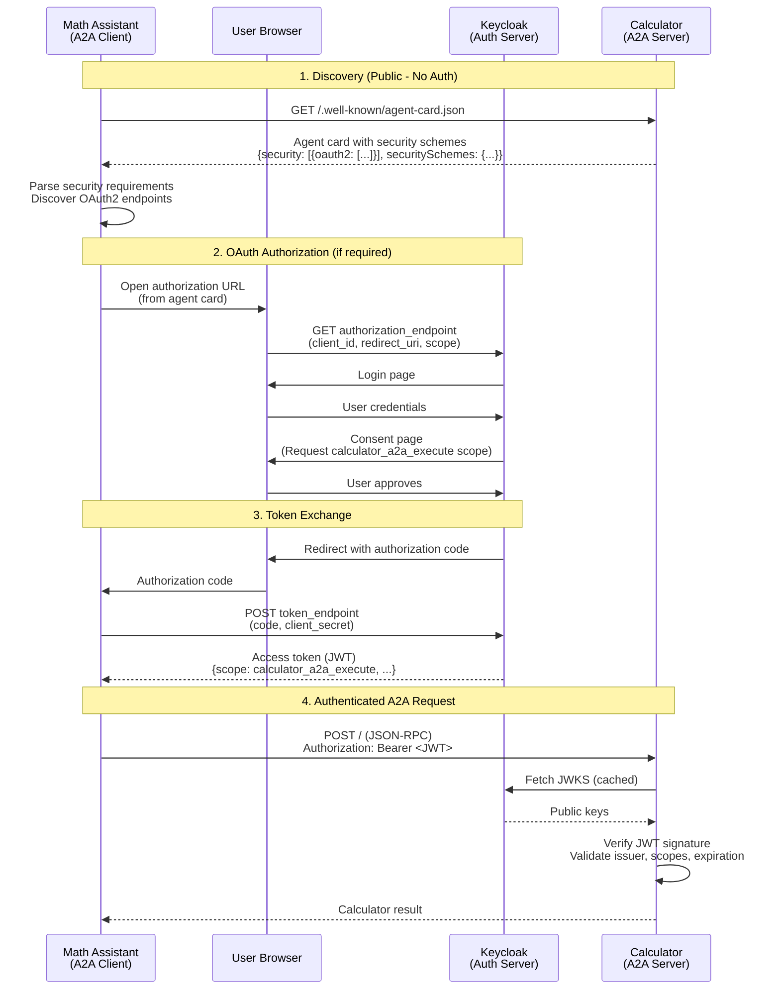

<!-- SPDX-FileCopyrightText: Copyright (c) 2025-2026, NVIDIA CORPORATION & AFFILIATES. All rights reserved.
SPDX-License-Identifier: Apache-2.0

Licensed under the Apache License, Version 2.0 (the "License");
you may not use this file except in compliance with the License.
You may obtain a copy of the License at

http://www.apache.org/licenses/LICENSE-2.0

Unless required by applicable law or agreed to in writing, software
distributed under the License is distributed on an "AS IS" BASIS,
WITHOUT WARRANTIES OR CONDITIONS OF ANY KIND, either express or implied.
See the License for the specific language governing permissions and
limitations under the License.
-->

# OAuth2-Protected Math Assistant A2A Example

This example demonstrates a complete end-to-end OAuth2-protected A2A setup with:
- **Protected A2A Server**: Calculator service requiring OAuth2 authentication
- **OAuth2 A2A Client**: Math assistant with per-user OAuth2 credentials
- **Authorization Server**: Keycloak setup for testing OAuth2-protected A2A communication

## Overview

This example combines two components to show OAuth2-protected agent-to-agent communication:

**Server Side (Calculator A2A)**
- **Type**: A2A Server (Resource Server)
- **Authentication**: OAuth2 with JWT validation
- **Skills**: Basic arithmetic operations (add, subtract, multiply, divide, compare) and current datetime

**Client Side (Math Assistant)**
- **Type**: Per-user A2A client workflow
- **Authentication**: OAuth2 authorization code flow with per-user isolation
- **Skills**: Connects to calculator server, local time operations, logic evaluator

## Key Features

- **JWT Token Validation**: Validates access tokens using JWKS from authorization server
- **Scope Enforcement**: Requires `calculator_a2a_execute` scope (configurable)
- **Per-User A2A Client**: Each user gets isolated A2A client connections with separate authentication
- **Public Agent Card**: Agent card is publicly accessible without authentication
- **Protected Operations**: All calculator operations require valid authentication
- **Multi-User Support**: Each user gets their own OAuth2 flow and authentication tokens
- **Hybrid Tool Architecture**: Combines remote A2A tools with local MCP and custom functions

This example is designed for **development and testing**. See [Production Considerations](#production-considerations) for deployment guidance.

## Architecture Overview

This example consists of three main components:



**Components:**

1. **Math Assistant (Client)**
   - Per-user workflow using `per_user_react_agent`
   - Each user gets isolated A2A client instance with separate OAuth2 credentials
   - Uses A2A client plugin to connect to calculator
   - Handles user authentication flow through browser

2. **Calculator A2A Server (Resource Server)**
   - Protected A2A server requiring authentication
   - Publishes agent card with security requirements
   - Validates JWT tokens before processing requests

3. **Keycloak (Authorization Server)**
   - Test OAuth2 server for OAuth2-protected A2A servers in NeMo Agent toolkit
   - Authenticates users and manages consent
   - Provides JWKS endpoint for token verification

**Per-User Architecture:** Each user identified by `nat-session` cookie gets their own:
- A2A client connection with isolated state
- OAuth2 authentication flow and tokens
- Independent calculator session

## OAuth2 Flow

This example demonstrates the A2A protocol with OAuth 2.1 Authorization Code Flow:



**Key Steps (Per User Session):**
1. **Agent card discovery** - Client fetches public metadata to discover authentication requirements
2. **Dynamic authentication** - Client initiates OAuth flow based on agent card security schemes
3. **Token acquisition** - User authenticates through browser, client obtains JWT token
4. **Authenticated communication** - Client includes token in A2A requests, server validates JWT

## Prerequisites

- Docker installed and running
- NeMo Agent toolkit development environment set up
- No services running on ports 8080 or 10000
- NVIDIA API key

## Installation

From the root directory of the NeMo Agent toolkit library, install this example:

```bash
uv pip install -e examples/A2A/math_assistant_a2a_protected
```

Set your NVIDIA API key:

```bash
export NVIDIA_API_KEY=<YOUR_API_KEY>
```

## Setup Instructions

### Step 1: Start Keycloak

```bash
# Start Keycloak
docker run -d --name keycloak \
  -p 127.0.0.1:8080:8080 \
  -e KC_BOOTSTRAP_ADMIN_USERNAME=admin \
  -e KC_BOOTSTRAP_ADMIN_PASSWORD=admin \
  quay.io/keycloak/keycloak:latest start-dev
```

**Wait for Keycloak to start** (about 30-60 seconds). Check logs:

```bash
docker logs -f keycloak
```

Look for: `Listening on: http://0.0.0.0:8080`

**Access Keycloak:** Open `http://localhost:8080` in your browser

### Step 2: Configure Keycloak Realm and Scopes

1. **Log in to Keycloak Admin Console:**
   - Username: `admin`
   - Password: `admin`

2. **Verify you're in the `master` realm** (top-left dropdown)

3. **Create the `calculator_a2a_execute` scope (for the calculator agent):**
   - Go to *Client scopes* (left sidebar)
   - Click *Create client scope*
   - Fill in:
     - **Name**: `calculator_a2a_execute`
     - **Description**: `Permission to execute calculator operations`
     - **Type**: `Optional`
     - **Protocol**: `openid-connect`
     - **Include in token scope**: `On` ✅
   - Click *Save*

4. **Add audience mapper to the scope:**

   You need to add an audience mapper to ensure the calculator URL is included in tokens.

   **Audience Mapper** (adds calculator URL to audience claim)

   - Click *Add mapper* > *By configuration*
   - Select *Audience* mapper type
   - Configure the mapper:
     - **Name**: `calculator-audience`
     - **Included Client Audience**: Leave blank
     - **Included Custom Audience**: `http://localhost:10000`
     - **Add to ID token**: `Off`
     - **Add to access token**: `On` ✅
     - **Add to token introspection**: `On` ✅ (if available in your Keycloak version)
   - Click *Save*

   This mapper ensures `http://localhost:10000` is included in the token's `aud` claim (required for JWT validation).

5. **Verify OpenID Discovery endpoint:**
   ```bash
   curl http://localhost:8080/realms/master/.well-known/openid-configuration | python3 -m json.tool
   ```

   You should see the OAuth2 and OpenID Connect endpoints:
   - `authorization_endpoint`: `http://localhost:8080/realms/master/protocol/openid-connect/auth`
   - `token_endpoint`: `http://localhost:8080/realms/master/protocol/openid-connect/token`
   - `jwks_uri`: `http://localhost:8080/realms/master/protocol/openid-connect/certs`
   - `introspection_endpoint`: `http://localhost:8080/realms/master/protocol/openid-connect/token/introspect`

   **Note:** These endpoints use Keycloak's standard paths (`/protocol/openid-connect/*`), not generic `/oauth/*` paths. The NeMo Agent toolkit A2A client discovers these URLs automatically from the discovery endpoint.

### Step 3: Register Math Assistant Client

You have two options:

#### Option A: Manual Client Registration (Recommended for Testing)

1. In Keycloak Admin Console, go to *Clients* (left sidebar)
2. Click *Create client*
3. **General Settings:**
   - **Client ID**: `math-assistant-client`
   - **Client type**: `OpenID Connect`
   - Click *Next*

4. **Capability config:**
   - **Client authentication**: `On` (confidential client)
   - **Authorization**: `Off`
   - **Authentication flow:**
     - ✓ Standard flow (authorization code)
     - ✓ Direct access grants
   - Click *Next*

5. **Login settings:**
   - **Valid redirect URIs**: `http://localhost:8000/auth/redirect`
   - **Web origins**: `http://localhost:8000`
   - Click *Save*

6. **Get client credentials:**
   - Go to *Credentials* tab
   - Copy the *Client secret*
   - Note the *Client ID*: `math-assistant-client`

7. **Configure client scopes:**
   - Go to *Client scopes* tab
   - Click *Add client scope*
   - Select `calculator_a2a_execute`
   - Choose *Optional*
   - Click *Add*

#### Option B: Dynamic Client Registration (DCR)

The NeMo Agent toolkit OAuth2 provider can use DCR if Keycloak is configured to allow it. See [Keycloak documentation](https://www.keycloak.org/securing-apps/client-registration) for details.

**Note:** For testing, manual registration (Option A) is simpler.

### Step 4: Set Environment Variables

After registering the client:

```bash
# Set these in your terminal where you'll run the client
export CALCULATOR_CLIENT_ID="math-assistant-client"
export CALCULATOR_CLIENT_SECRET="<paste-client-secret-from-keycloak>"

# Verify they're set
echo "Client ID: ${CALCULATOR_CLIENT_ID}"
echo "Client Secret: ${CALCULATOR_CLIENT_SECRET:0:10}..."
```

### Step 5: Start the Protected Calculator Server

```bash
# Terminal 1
nat a2a serve --config_file examples/A2A/math_assistant_a2a_protected/configs/config-server.yml
```

You should see:
```text
[INFO] OAuth2 token validation enabled for A2A server
[INFO] Starting A2A server 'Protected Calculator' at http://localhost:10000
```

### Step 6: Run the Math Assistant Client

```bash
# Terminal 2
# Make sure environment variables are set
export CALCULATOR_CLIENT_ID="math-assistant-client"
export CALCULATOR_CLIENT_SECRET="<your-client-secret>"

nat run --config_file examples/A2A/math_assistant_a2a_protected/configs/config-client.yml \
  --input "Is the product of 2 and 4 greater than the current hour of the day?"
```

**What should happen:**

1. **Browser opens** with Keycloak login page
2. **Log in** with any user (or create one)
3. **Consent page** may show requesting `calculator_a2a_execute` (depending on realm consent settings)
4. **Browser redirects** back to `localhost:8000/auth/redirect`
5. **Workflow continues** and calls the calculator
6. **Response returned** successfully

Sample output:
```text
Workflow Result:
['No, the product of 2 and 4 is not greater than the current hour of the day.']
--------------------------------------------------
```

### Step 7: Test Multi-User OAuth2 (Optional)

The per-user architecture allows each user to have their own OAuth2 authentication. Test this with `nat serve`:

1. Start the math assistant as a server:
```bash
# Terminal 2: Start the math assistant as a server
nat serve --config_file examples/A2A/math_assistant_a2a_protected/configs/config-client.yml
```

2. Start the UI by following the instructions in the [Launching the UI](../../../docs/source/run-workflows/launching-ui.md) documentation.

3. Connect to the UI at `http://localhost:3000`

4. Enable WebSocket mode in the UI by toggling the WebSocket button on the top right corner of the UI.

:::important
Per-user workflows are not supported in HTTP mode. You must use WebSocket mode to test multi-user support.
:::

5. Send a message to the agent by typing in the chat input:
```text
Is the sum of 5 and 3 greater than the current hour of the day?
```

6. The workflow will be instantiated for the user on the first message. The user will be authenticated and the workflow will be executed.

```text
Workflow Result:
['Yes, the sum of 5 and 3 is greater than the current hour of the day.']
--------------------------------------------------
```

**Expected behavior:**
- Each new user session triggers its own OAuth2 authorization flow
- Different users authenticate independently with their own Keycloak credentials
- Each user maintains separate JWT tokens and workflow instances

## Configuration Details

### Server Configuration (`config-server.yml`)

The calculator server is configured with OAuth2 resource server protection:

- **OAuth2 Issuer**: Authorization server URL
- **JWKS URI**: Endpoint for JWT signature verification
- **Required Scopes**: `calculator_a2a_execute`
- **Audience**: `http://localhost:10000`

The agent card automatically includes OAuth2 security schemes, and all requests except `/.well-known/agent-card.json` require authentication.

### Client Configuration (`config-client.yml`)

The math assistant client is configured with:

**Authentication:**
- OAuth2 authorization code flow
- Per-user credentials from environment variables
- Keycloak endpoints for token management

**Tool Composition:**

1. **A2A Client Tools** (`calculator_a2a`) - **Per-User**:
   - Connects to protected calculator server
   - Each user gets isolated connection and authentication
   - Provides: `add`, `subtract`, `multiply`, `divide`, `compare` functions

2. **MCP Client Tools** (`mcp_time`) - **Shared**:
   - Local MCP server for time operations
   - Provides: `get_current_time_mcp` function

3. **Logic Evaluator** (`logic_evaluator`) - **Shared**:
   - Simple local utility for logical operations
   - Provides: `if_then_else` and `evaluate_condition` functions

## Security

**Token Validation:**
- JWT signature verification using JWKS public keys
- Issuer validation
- Expiration check
- Scope validation (`calculator_a2a_execute` required)
- Audience validation (`http://localhost:10000`)

**Public Endpoints:**
- `/.well-known/agent-card.json` - Agent card discovery (no auth required)

**Protected Endpoints:**
- All other endpoints require valid Bearer token

## Additional Examples

For comprehensive examples demonstrating different capabilities (basic calculations, time-integrated math, multi-step problems), see [`data/sample_queries.json`](data/sample_queries.json).

## Troubleshooting

### Connection Issues

**Keycloak Not Running:**
```bash
# Check Keycloak logs
docker logs keycloak
```

**Calculator Server Not Running:**
```bash
# Check if the calculator server is running
curl http://localhost:10000/.well-known/agent-card.json | jq
```

**Port Conflicts:**
- Ensure port 8080 is available for Keycloak
- Ensure port 10000 is available for the calculator server
- Check for other services using these ports

### Authentication Issues

**Missing Environment Variables:**
```bash
# Verify environment variables are set
echo "Client ID: ${CALCULATOR_CLIENT_ID}"
echo "Client Secret: ${CALCULATOR_CLIENT_SECRET:0:10}..."
```

**Browser Not Opening:**
- Check firewall settings
- Ensure redirect URI matches Keycloak configuration
- Try manually opening the authorization URL

### Performance Issues

**Timeouts:**
- Increase `task_timeout` in config if calculations take longer
- Check network connectivity to Keycloak and calculator server

## Cleanup

To stop and remove Keycloak:

```bash
docker stop keycloak
docker rm keycloak
```

To restart with clean state:

```bash
docker rm -f keycloak
# Then run the start command again
```

## Production Considerations

This setup is for **development and testing only**. For production:

### Security

1. **Use HTTPS Everywhere**
   - Keycloak must use TLS
   - All redirect URIs must be HTTPS
   - A2A servers must use HTTPS

2. **Secure Credentials**
   - Store client secrets in a secrets manager (Vault, AWS Secrets Manager, and so on)
   - Never commit secrets to version control
   - Use environment variables only for development
   - Rotate client secrets regularly

3. **Token Configuration**
   - Set short access token lifetime (5-15 minutes)
   - Enable refresh tokens for long-running sessions
   - Configure appropriate token expiration policies
   - Implement token revocation

4. **Realm Configuration**
   - Don't use the `master` realm for applications
   - Create dedicated realms per environment (dev, staging, prod)
   - Configure proper user management and authentication policies

### Per-User OAuth2 Considerations

1. **Session Management**
   - Configure appropriate `per_user_workflow_timeout` for token lifetime
   - Consider refresh token strategies for long-running user sessions
   - Implement proper session cleanup to avoid memory leaks

2. **Token Storage**
   - Each user's OAuth2 tokens are stored in memory per session
   - Tokens are automatically cleaned up when user sessions expire
   - Consider persistent token storage for production deployments

3. **Concurrent Users**
   - Each user maintains independent OAuth2 credentials
   - Monitor memory usage with many concurrent users
   - Plan capacity based on expected concurrent user load

## Related Examples

- [Math Assistant A2A](../math_assistant_a2a/) - Unprotected A2A client example
- [Currency Agent A2A](../currency_agent_a2a/) - External A2A service integration

## References

- [A2A Authentication Documentation](../../../docs/source/components/auth/a2a-auth.md)
- [A2A Client Documentation](../../../docs/source/build-workflows/a2a-client.md)
- [A2A Server Documentation](../../../docs/source/run-workflows/a2a-server.md)
- [Keycloak Documentation](https://www.keycloak.org/documentation)
