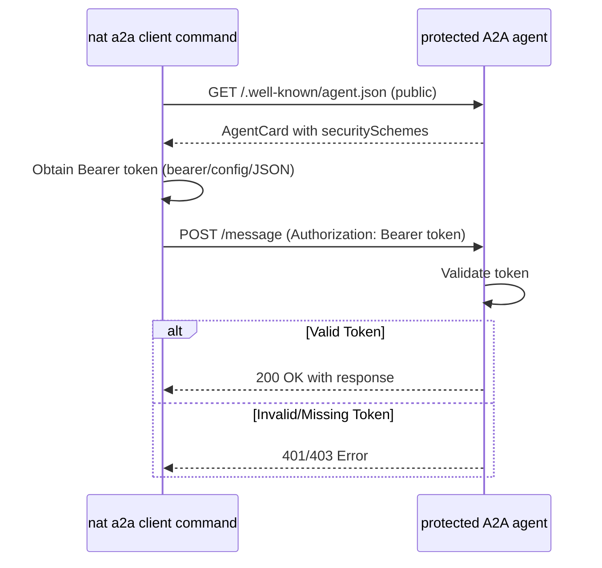

# Simple Protected A2A Server - Testing Authentication

This example demonstrates a minimal protected A2A server for testing NeMo Agent toolkit CLI authentication. It uses simple Bearer token validation to test all three NAT CLI authentication methods.

## Overview

This server provides simple Bearer token authentication for the NAT a2a client call command.

## Installation

Install the example:

```bash
uv pip install -e examples/A2A/simple_auth_a2a
```

## Quick Start

### Start the Protected Server

```bash
export SIMPLE_PROTECTED_SERVER_HOST=localhost
export SIMPLE_PROTECTED_SERVER_PORT=10001
export TEST_BEARER_TOKEN=test-token-12345

python examples/A2A/simple_auth_a2a/src/nat_simple_auth_a2a/scripts/simple_protected_server.py
```

The server will start on `http://${SIMPLE_PROTECTED_SERVER_HOST}:${SIMPLE_PROTECTED_SERVER_PORT}` and print test commands.

### Discover the Agent Card
The agent card is public and can be discovered without authentication.
```bash
nat a2a client discover --url http://${SIMPLE_PROTECTED_SERVER_HOST}:${SIMPLE_PROTECTED_SERVER_PORT}
```

### Test NAT CLI Authentication

#### Test 1: No Authentication (Should FAIL with 401)

```bash
nat a2a client call --url http://${SIMPLE_PROTECTED_SERVER_HOST}:${SIMPLE_PROTECTED_SERVER_PORT} --message "Hello"
```

**Expected:** `401 Unauthorized: Missing Authorization header`

#### Test 2: Invalid Token (Should FAIL with 403)

```bash
nat a2a client call --url http://${SIMPLE_PROTECTED_SERVER_HOST}:${SIMPLE_PROTECTED_SERVER_PORT} \
  --message "Hello" \
  --bearer-token "wrong-token"
```

**Expected:** `403 Forbidden: Invalid Bearer token`

#### Test 3: Valid Bearer Token (Should SUCCEED)

```bash
nat a2a client call --url http://${SIMPLE_PROTECTED_SERVER_HOST}:${SIMPLE_PROTECTED_SERVER_PORT} \
  --message "Hello" \
  --bearer-token $TEST_BEARER_TOKEN
```

**Expected:** `✅ Authentication successful! You said: Hello`

#### Test 4: Token from Environment Variable

```bash
nat a2a client call --url http://${SIMPLE_PROTECTED_SERVER_HOST}:${SIMPLE_PROTECTED_SERVER_PORT} \
  --message "Hello" \
  --bearer-token-env TEST_BEARER_TOKEN
```

#### Test 5: Config-Based Authentication

```bash
nat a2a client call --url http://${SIMPLE_PROTECTED_SERVER_HOST}:${SIMPLE_PROTECTED_SERVER_PORT} \
  --message "Hello" \
  --auth-config examples/A2A/simple_auth_a2a/configs/auth_only.yml \
  --auth-provider test_bearer
```

#### Test 6: Inline JSON Authentication

```bash
nat a2a client call --url http://${SIMPLE_PROTECTED_SERVER_HOST}:${SIMPLE_PROTECTED_SERVER_PORT} \
  --message "Hello" \
  --auth-json '{"_type": "api_key", "raw_key": "test-token-12345", "auth_scheme": "BEARER"}'
```

## Architecture

### Agent Card Security Configuration

The server uses the `bearer_auth` security scheme:

```json
{
  "securitySchemes": {
    "bearer_auth": {
      "type": "http",
      "scheme": "bearer"
    }
  }
}
```

### Authentication Flow



## Configuration

### Environment Variables

| Variable | Default | Description |
|----------|---------|-------------|
| `TEST_BEARER_TOKEN` | `test-token-12345` | Valid bearer token for testing |
| `SIMPLE_PROTECTED_SERVER_HOST` | `localhost` | Server host |
| `SIMPLE_PROTECTED_SERVER_PORT` | `8000` | Server port |


## References

- [A2A Protocol Specification](https://a2a-protocol.org/latest/specification/)
- [NAT Authentication Documentation](../../../docs/source/reference/api-authentication.md)
