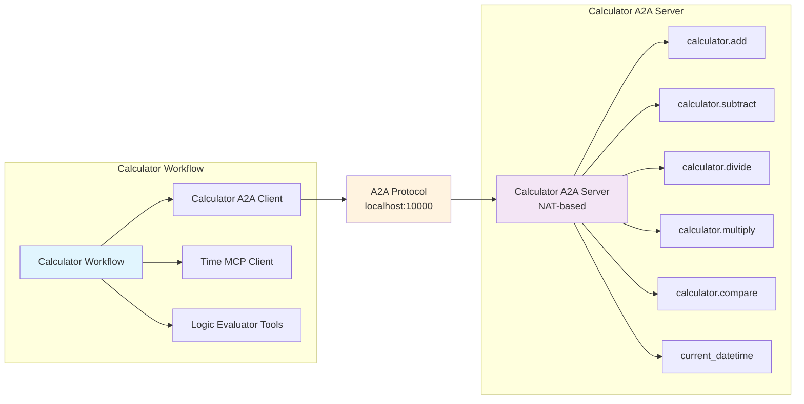

<!-- SPDX-FileCopyrightText: Copyright (c) 2025, NVIDIA CORPORATION & AFFILIATES. All rights reserved.
SPDX-License-Identifier: Apache-2.0

Licensed under the Apache License, Version 2.0 (the "License");
you may not use this file except in compliance with the License.
You may obtain a copy of the License at

http://www.apache.org/licenses/LICENSE-2.0

Unless required by applicable law or agreed to in writing, software
distributed under the License is distributed on an "AS IS" BASIS,
WITHOUT WARRANTIES OR CONDITIONS OF ANY KIND, either express or implied.
See the License for the specific language governing permissions and
limitations under the License.
-->

# A2A Calculator Client Example

This example demonstrates a simple A2A client that connects to a NAT-based calculator server while integrating with local tools, showcasing end-to-end NAT-to-NAT A2A communication with hybrid tool composition.

## Key Features

- **A2A Protocol Integration**: Connects to a remote NAT calculator workflow via A2A protocol
- **Hybrid Tool Architecture**: Combines remote A2A tools with local MCP and custom functions

## Architecture Overview



## Installation and Setup

### Prerequisites

Follow the instructions in the [Install Guide](../../../../docs/source/quick-start/installing.md#install-from-source) to create the development environment and install NeMo Agent toolkit.

### Install Dependencies

From the root directory of the NeMo Agent toolkit library, install this example:

```bash
uv pip install -e examples/A2A/simple_calculator_a2a
```

### Set Up API Keys

Set your NVIDIA API key as an environment variable:

```bash
export NVIDIA_API_KEY=<YOUR_API_KEY>
```

## Usage

### Start the Calculator A2A Server

First, start the calculator server that this client will connect to:

```bash
# Terminal 1: Start the A2A calculator server
nat a2a serve --config_file examples/getting_started/simple_calculator/configs/config.yml --port 10000
```

### Run the Calculator Client

In a separate terminal, run the client workflow:

```bash
# Terminal 2: Run the calculator client
nat run --config_file examples/A2A/simple_calculator_a2a/configs/config.yml \
  --input "Is the product of 2 and 4 greater than the current hour of the day?"
```

### Additional Examples

For comprehensive examples demonstrating different capabilities (basic calculations, time-integrated math, multi-step problems), see [`data/sample_queries.json`](data/sample_queries.json).

## Configuration Details

### Tool Composition

The configuration demonstrates three types of tool integration:

1. **A2A Client Tools** (`calculator_a2a`):
   - Connects to remote calculator server
   - Provides: `add`, `subtract`, `multiply`, `divide`, `compare` functions
   - Timeout: 60 seconds
   - Skill descriptions included for better agent understanding

2. **MCP Client Tools** (`mcp_time`):
   - Local MCP server for time operations
   - Provides: `get_current_time_mcp` function
   - Configured for Pacific timezone

3. **Logic Evaluator** (`logic_evaluator`):
   - Local utility for logical operations
   - Provides: `if_then_else` and `evaluate_condition` functions

## Troubleshooting

### Connection Issues

**Server Not Running**:
```bash
nat a2a client discover --url http://localhost:10000
```

## Related Examples

- [Currency Agent A2A](../currency_agent_a2a/) - External A2A service integration example
