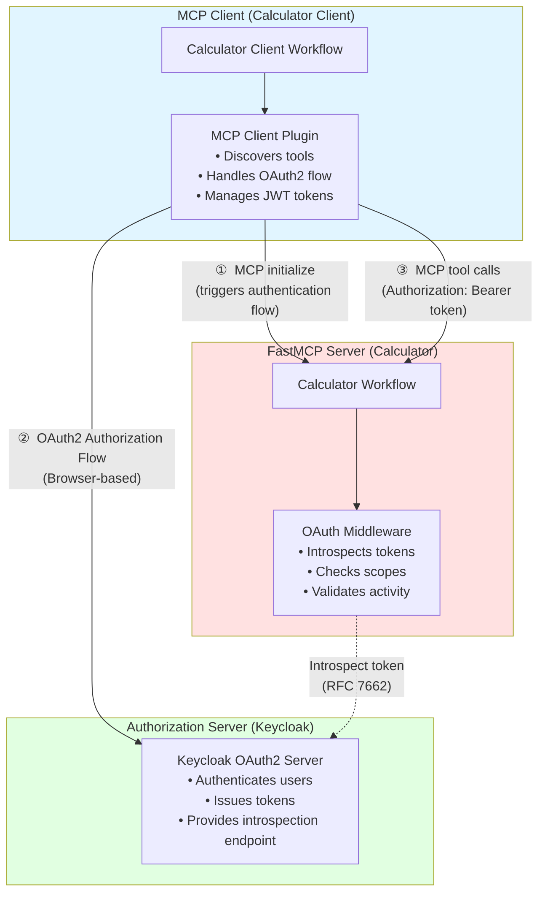

<!--
SPDX-FileCopyrightText: Copyright (c) 2026, NVIDIA CORPORATION & AFFILIATES. All rights reserved.
SPDX-License-Identifier: Apache-2.0

Licensed under the Apache License, Version 2.0 (the "License");
you may not use this file except in compliance with the License.
You may obtain a copy of the License at

http://www.apache.org/licenses/LICENSE-2.0

Unless required by applicable law or agreed to in writing, software
distributed under the License is distributed on an "AS IS" BASIS,
WITHOUT WARRANTIES OR CONDITIONS OF ANY KIND, either express or implied.
See the License for the specific language governing permissions and
limitations under the License.
-->

# Simple Calculator FastMCP - Protected

This example demonstrates how to set up an OAuth2-protected NVIDIA NeMo Agent Toolkit FastMCP server. This complements the unprotected [Simple Calculator FastMCP](../simple_calculator_fastmcp/) example to demonstrate both authenticated and unauthenticated FastMCP server setups.

This example uses **per-user mode**, enabling complete per-user isolation while accessing the same protected calculator tools.

## Architecture Overview

This example consists of three main components:



## Prerequisites

- NVIDIA NeMo Agent Toolkit installed (see [Installation Guide](../../../docs/source/get-started/installation.md))
- Keycloak server running locally (see setup instructions below)
- Basic understanding of OAuth2 and token introspection

## Setup Instructions

### Step 1: Start Keycloak

```bash
# Start Keycloak
docker run -d --name keycloak \
  -p 127.0.0.1:8080:8080 \
  -e KC_BOOTSTRAP_ADMIN_USERNAME=admin \
  -e KC_BOOTSTRAP_ADMIN_PASSWORD=admin \
  quay.io/keycloak/keycloak:latest start-dev
```

Wait for Keycloak to start (about 30-60 seconds). Check logs:

```bash
docker logs -f keycloak
```

Look for: `Listening on: http://0.0.0.0:8080`

**Access Keycloak:** Open `http://localhost:8080` in your browser

### Step 2: Configure Keycloak Realm and Scopes

1. **Log in to Keycloak Admin Console:**
   - Username: `admin`
   - Password: `admin`

2. **Verify you are in the `master` realm** (top-left dropdown)

3. **Create the `calculator_mcp_execute` scope (for the calculator):**
   - Go to **Client scopes** (left sidebar)
   - Click **Create client scope**
   - Fill in:
     - **Name**: `calculator_mcp_execute`
     - **Description**: `Permission to execute calculator operations`
     - **Type**: `Optional`
     - **Protocol**: `openid-connect`
     - **Include in token scope**: `On`
   - Click **Save**

4. **Verify OpenID discovery endpoint:**
   ```bash
   curl http://localhost:8080/realms/master/.well-known/openid-configuration | python3 -m json.tool
   ```

   You should see the OAuth2 endpoints, including:
   - `authorization_endpoint`: `http://localhost:8080/realms/master/protocol/openid-connect/auth`
   - `token_endpoint`: `http://localhost:8080/realms/master/protocol/openid-connect/token`
   - `introspection_endpoint`: `http://localhost:8080/realms/master/protocol/openid-connect/token/introspect`

### Step 3: Register MCP Client

You can register the client manually or use the dynamic client registration feature. For testing, manual registration is used.

1. In Keycloak Admin Console, go to **Clients** (left sidebar)
2. Click **Create client**
3. **General settings:**
   - **Client ID**: `nat-mcp-client`
   - **Client type**: `OpenID Connect`
   - Click **Next**

4. **Capability config:**
   - **Client authentication**: `On` (confidential client)
   - **Authorization**: `Off`
   - **Authentication flow:**
     - Standard flow (authorization code)
     - Direct access grants
   - Click **Next**

5. **Login settings:**
   - **Valid redirect URIs**: `http://localhost:8000/auth/redirect`
   - **Web origins**: `http://localhost:8000`
   - Click **Save**

6. **Add client scope if not already added:**
   - Go to **Client scopes** tab
   - Click **Add client scope**
   - Select `calculator_mcp_execute`
   - Choose **Optional**
   - Click **Add**

7. **Set Consent required**:
   - Go to **Settings** tab
   - Toggle **Consent required** to `On` (scroll down to the bottom of the page to see the setting)
   - Click **Save**

8. **Get client credentials:**
   - Go to **Credentials** tab
   - Copy the **Client secret**
   - Note the **Client ID**: `nat-mcp-client`

### Step 4: Register Resource Server for Introspection

FastMCP uses OAuth2 token introspection for this example. Register a resource server client so the FastMCP server can authenticate to Keycloak when introspecting tokens.

1. In Keycloak Admin Console, go to **Clients**
2. Click **Create client**
3. **General settings:**
   - **Client ID**: `nat-mcp-resource-server`
   - **Client type**: `OpenID Connect`
   - Click **Next**

4. **Capability config:**
   - **Client authentication**: `On` (confidential client)
   - **Authorization**: `Off`
   - **Authentication flow:**
     - Direct access grants
   - Click **Next**

5. **Get resource server credentials:**
   - Go to **Credentials** tab
   - Copy the **Client secret**
   - Note the **Client ID**: `nat-mcp-resource-server`

### Step 5: Start the Protected FastMCP Server

```bash
# Terminal 1
export CALCULATOR_RESOURCE_CLIENT_ID="nat-mcp-resource-server"
export CALCULATOR_RESOURCE_CLIENT_SECRET="<your-resource-client-secret>"

nat fastmcp server run --config_file examples/MCP/simple_calculator_fastmcp_protected/configs/config-server.yml
```

### Step 6: Run the MCP Calculator Client

Set the client ID and client secret from Step 3 in the environment variables:
```bash
# Terminal 2
export CALCULATOR_CLIENT_ID="nat-mcp-client"
export CALCULATOR_CLIENT_SECRET="<your-client-secret>"

nat run --config_file examples/MCP/simple_calculator_fastmcp_protected/configs/config-client.yml \
  --input "Is the product of 2 and 3 greater than the current hour of the day?"
```

**What should happen:**

1. **Browser opens** with Keycloak login page
2. **Log in** with any user (or create one)
3. **Consent page** appears requesting `calculator_mcp_execute` scope
4. **Browser redirects** back to `localhost:8000/auth/redirect`
5. **Workflow continues** and calls the calculator
6. **Response returned** successfully

## Cleanup

To stop and remove Keycloak:

```bash
docker stop keycloak
docker rm keycloak
```

To restart with clean state:

```bash
docker rm -f keycloak
# Then run the start command again
```

## Configuration Files

### Server Configuration (`configs/config-server.yml`)

This configures the protected FastMCP server frontend with OAuth2 resource server authentication:

```yaml
general:
  front_end:
    _type: fastmcp
    name: "Protected Calculator FastMCP"
    port: 9902
    server_auth:
      introspection_endpoint: http://localhost:8080/realms/master/protocol/openid-connect/token/introspect
      client_id: ${CALCULATOR_RESOURCE_CLIENT_ID:-"nat-mcp-resource-server"}
      client_secret: ${CALCULATOR_RESOURCE_CLIENT_SECRET}
      scopes: [calculator_mcp_execute]
```

### Client Configuration (`configs/config-client.yml`)

This configures an MCP client to connect to the protected FastMCP server in per-user mode:

```yaml
function_groups:
  mcp_calculator_protected:
    _type: per_user_mcp_client
    server:
      transport: streamable-http
      url: http://localhost:9902/mcp
      auth_provider: mcp_oauth2_calculator

authentication:
  mcp_oauth2_calculator:
    _type: mcp_oauth2
    server_url: http://localhost:9902/mcp
    redirect_uri: http://localhost:8000/auth/redirect
    client_id: ${CALCULATOR_CLIENT_ID:-"nat-mcp-client"}
    client_secret: ${CALCULATOR_CLIENT_SECRET}
    scopes: [calculator_mcp_execute]

workflow:
  _type: per_user_react_agent
  tool_names: [mcp_calculator_protected]
```

## Related Examples

- [Simple Calculator FastMCP](../simple_calculator_fastmcp/): Unprotected FastMCP calculator example
- [Simple Calculator MCP - Protected](../simple_calculator_mcp_protected/): Protected MCP calculator example

## References

- [MCP Authentication](../../../docs/source/components/auth/mcp-auth/index.md) - Learn about configuring MCP authentication
- [Per-User Workflows](../../../docs/source/extend/custom-components/custom-functions/per-user-functions.md) - Learn about using per-user workflows
*** End Patch
