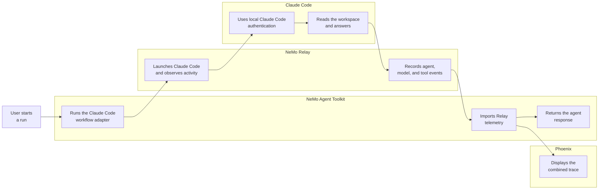
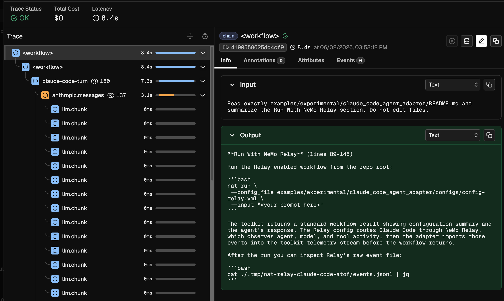

<!--
SPDX-FileCopyrightText: Copyright (c) 2026, NVIDIA CORPORATION & AFFILIATES. All rights reserved.
SPDX-License-Identifier: Apache-2.0

Licensed under the Apache License, Version 2.0 (the "License");
you may not use this file except in compliance with the License.
You may obtain a copy of the License at

http://www.apache.org/licenses/LICENSE-2.0

Unless required by applicable law or agreed to in writing, software
distributed under the License is distributed on an "AS IS" BASIS,
WITHOUT WARRANTIES OR CONDITIONS OF ANY KIND, either express or implied.
See the License for the specific language governing permissions and
limitations under the License.
-->

# Claude Code With NeMo Relay

This experimental NVIDIA NeMo Agent Toolkit example prototypes a primitive agent workflow type for Claude Code. The primary workflow runs Claude Code through NeMo Relay so toolkit runs can include Claude Code agent, model, and tool telemetry.

## Integration Flow



NeMo Agent Toolkit owns the workflow lifecycle and presents Claude Code as a normal workflow type. NeMo Relay sits between the toolkit and Claude Code so it can observe the Claude Code run. Claude Code uses the authentication and settings available in the same environment that launches `nat`, and Phoenix can visualize the combined toolkit and Relay telemetry.

## Installation And Setup

If you have not already done so, follow the instructions in the [Install Guide](../../../docs/source/get-started/installation.md#install-from-source) to create the development environment and install NeMo Agent Toolkit.

Install this workflow package:

```bash
uv pip install -e examples/experimental/claude_code_agent_adapter
```

Install Claude Code so the `claude` command is available on `PATH`:

```bash
npm install -g @anthropic-ai/claude-code
claude --version
```

Configure Claude Code in the same shell or user profile that launches `nat`:

```bash
claude auth status
claude auth login
```

After login, `claude auth status` should show an active Claude Code session. The workflow uses the Claude Code authentication available in the environment that launches `nat`, so credentials do not need to be added to the workflow YAML.

Install the NeMo Relay CLI from source into the current environment. Replace `../NeMo-Flow` with the path to your local NeMo Relay source checkout if it lives somewhere else:

```bash
cargo install --path ../NeMo-Flow/crates/cli --root "${VIRTUAL_ENV:-.venv}" --locked
nemo-relay --help
```

## Run With NeMo Relay

From the repository root, run the Relay-enabled Claude Code workflow:

```bash
nat run \
  --config_file examples/experimental/claude_code_agent_adapter/configs/config-relay.yml \
  --input "Read exactly these files: examples/experimental/claude_code_agent_adapter/pyproject.toml and examples/experimental/claude_code_agent_adapter/src/nat_claude_code_agent_adapter/register.py. Summarize how pyproject.toml exposes the nat.components entry point and how register.py registers the _type claude_code_agent workflow with NeMo Agent Toolkit. Do not edit files."
```

The run should return a normal NeMo Agent Toolkit workflow result:

```text
Configuration Summary:
--------------------
Workflow Type: claude_code_agent
Number of Functions: 0
Number of Function Groups: 0
Number of LLMs: 0
Number of Embedders: 0
Number of Memory: 0
Number of Object Stores: 0
Number of Retrievers: 0
Number of TTC Strategies: 0
Number of Authentication Providers: 0

Workflow Result:
Here's the summary:

pyproject.toml declares a nat.components entry point group:

[project.entry-points.'nat.components']
nat_claude_code_agent_adapter = "nat_claude_code_agent_adapter.register"

When this package is installed, the toolkit plugin loader discovers the nat.components entry point and imports nat_claude_code_agent_adapter.register automatically.

register.py defines the workflow config class:

class ClaudeCodeAgentWorkflowConfig(AgentBaseConfig, name="claude_code_agent"):

Inheriting from AgentBaseConfig with name="claude_code_agent" registers _type: claude_code_agent as the discriminator key in the toolkit config system.

register.py then wires the workflow factory into the toolkit registry:

@register_function(config_type=ClaudeCodeAgentWorkflowConfig)
async def claude_code_agent(config: ClaudeCodeAgentWorkflowConfig, _builder: Builder):

The factory yields FunctionInfo with non-streaming and streaming handlers. Those handlers delegate to either the Claude Agent SDK path or the Relay-enabled Claude Code CLI subprocess path, depending on relay_enabled.
```

The Relay config routes the Claude Code run through NeMo Relay. Relay observes Claude Code agent, model, and tool activity, then the adapter imports those events into the toolkit telemetry stream before the workflow returns.

You can inspect Relay's raw event file after the workflow finishes:

```bash
cat ./.tmp/nat-relay-claude-code-atof/events.jsonl | jq
```

## Phoenix With NeMo Relay

Install the Phoenix integration if it is not already available, then start Phoenix:

```bash
uv pip install -e packages/nvidia_nat_phoenix
docker run -it --rm -p 4317:4317 -p 6006:6006 arizephoenix/phoenix:13.22
```

In another terminal, run the Relay/Phoenix config:

```bash
nat run \
  --config_file examples/experimental/claude_code_agent_adapter/configs/config-relay-phoenix.yml \
  --input "Read exactly examples/experimental/claude_code_agent_adapter/README.md and summarize the Run With NeMo Relay section. Do not edit files."
```

Open `http://localhost:6006` and select the `nat-relay-claude-code` project. The trace should include the toolkit workflow span plus imported Relay/Claude Code agent, LLM, and tool spans.



## Evaluate With NeMo Relay

The evaluation smoke config uses the same Relay bridge and writes ATIF output:

```bash
nat eval \
  --config_file examples/experimental/claude_code_agent_adapter/configs/config-relay-phoenix-eval.yml
```

Eval outputs are written under `./.tmp/nat/examples/claude_code_agent_adapter/relay_phoenix_eval/`.
