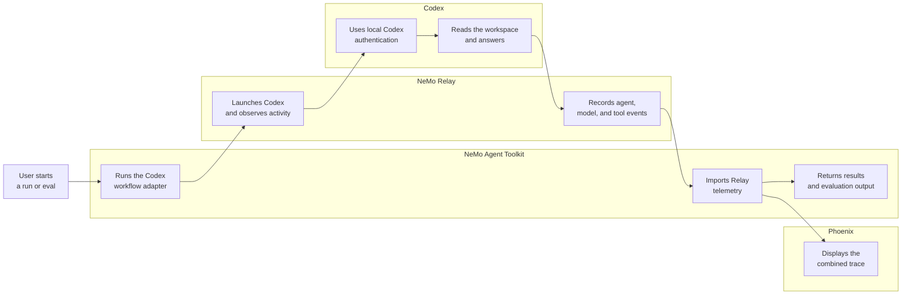
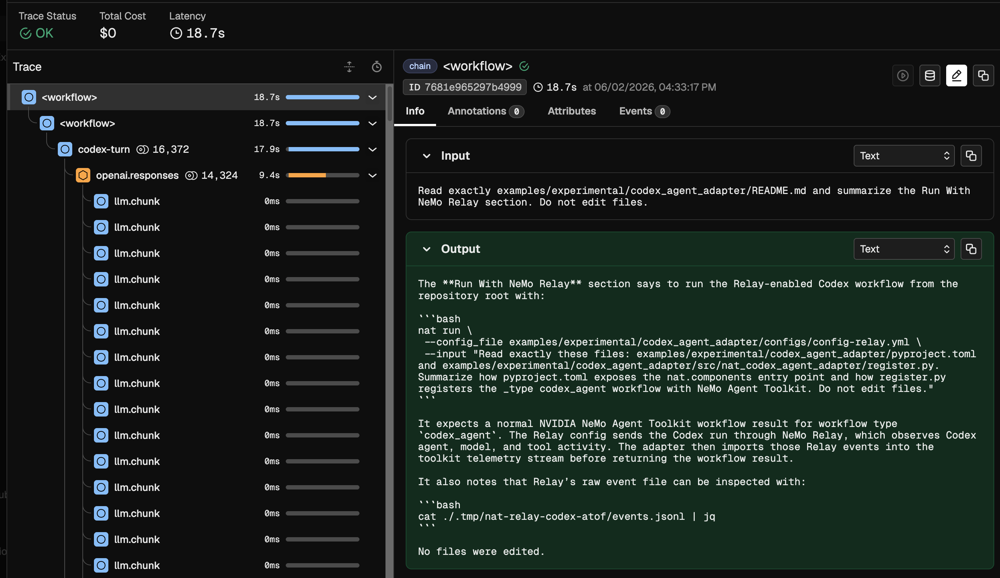

<!--
SPDX-FileCopyrightText: Copyright (c) 2026, NVIDIA CORPORATION & AFFILIATES. All rights reserved.
SPDX-License-Identifier: Apache-2.0

Licensed under the Apache License, Version 2.0 (the "License");
you may not use this file except in compliance with the License.
You may obtain a copy of the License at

http://www.apache.org/licenses/LICENSE-2.0

Unless required by applicable law or agreed to in writing, software
distributed under the License is distributed on an "AS IS" BASIS,
WITHOUT WARRANTIES OR CONDITIONS OF ANY KIND, either express or implied.
See the License for the specific language governing permissions and
limitations under the License.
-->

# Codex With NeMo Relay

This experimental NVIDIA NeMo Agent Toolkit example prototypes a primitive agent workflow type for Codex. The primary workflow runs Codex through NeMo Relay so toolkit runs can include Codex agent, model, and tool telemetry.

## Integration Flow



NeMo Agent Toolkit owns the workflow and evaluation lifecycle. NeMo Relay sits between the toolkit and Codex so it can observe the Codex run. Codex uses the authentication and settings available in the same environment that launches `nat`, and Phoenix visualizes the combined toolkit and Relay telemetry.

## Installation And Setup

If you have not already done so, follow the instructions in the [Install Guide](../../../docs/source/get-started/installation.md#install-from-source) to create the development environment and install NeMo Agent Toolkit.

Install this workflow package:

```bash
uv pip install -e examples/experimental/codex_agent_adapter
```

Install Codex CLI so the `codex` command is available on `PATH`:

```bash
npm install -g @openai/codex
codex --version
```

Configure Codex in the same environment that launches `nat`:

```bash
codex login
codex login status
```

The version should be `0.129.0` or newer. This example is configured for Codex's stored ChatGPT login. If `OPENAI_API_KEY` is set in the shell that launches `nat`, the adapter removes it from the Relay/Codex subprocess environment so Codex model-catalog requests continue to use the ChatGPT Codex backend. Codex may ask you to review and activate hooks before it emits agent and tool hook events.

Set the root of your local NeMo Relay source checkout, then install the NeMo Relay CLI from source into the current environment:

```bash
export NEMO_RELAY_ROOT=/absolute/path/to/NeMo-Relay
cargo install --path "$NEMO_RELAY_ROOT/crates/cli" --root "${VIRTUAL_ENV:-.venv}" --locked
nemo-relay --help
```

## Run With NeMo Relay

From the repository root, run the Relay-enabled Codex workflow:

```bash
nat run \
  --config_file examples/experimental/codex_agent_adapter/configs/config-relay.yml \
  --input "Read exactly these files: examples/experimental/codex_agent_adapter/pyproject.toml and examples/experimental/codex_agent_adapter/src/nat_codex_agent_adapter/register.py, then summarize how pyproject.toml exposes the nat.components entry point and how register.py registers the _type codex_agent workflow with NeMo Agent Toolkit. Do not edit files."
```

The run should return a normal NeMo Agent Toolkit workflow result:

```text
Configuration Summary:
--------------------
Workflow Type: codex_agent
Number of Functions: 0
Number of Function Groups: 0
Number of LLMs: 0
Number of Embedders: 0
Number of Memory: 0
Number of Object Stores: 0
Number of Retrievers: 0
Number of TTC Strategies: 0
Number of Authentication Providers: 0

Workflow Result:
I read only the two requested files and made no edits.

In pyproject.toml, the package exposes a NVIDIA NeMo Agent Toolkit component entry point here:

[project.entry-points.'nat.components']
nat_codex_agent_adapter = "nat_codex_agent_adapter.register"

That means when the example package is installed, NeMo Agent Toolkit's component discovery can import nat_codex_agent_adapter.register. The import triggers the registration code in that module.

In register.py, the _type is established by:

class CodexAgentWorkflowConfig(AgentBaseConfig, name="codex_agent"):

The name="codex_agent" on the config class is what makes this component configurable as _type: codex_agent.

The actual registration happens with:

@register_function(config_type=CodexAgentWorkflowConfig)
async def codex_agent(config: CodexAgentWorkflowConfig, _builder: Builder):

That decorator tells the toolkit to register codex_agent as a function or workflow component using CodexAgentWorkflowConfig. When instantiated, the function yields a FunctionInfo with both a normal response function and a streaming function. Those handlers convert incoming toolkit chat input, build a Codex prompt, run Codex through NeMo Relay, then return a toolkit-compatible response.
```

The Relay config routes the Codex run through NeMo Relay. Relay observes Codex agent, model, and tool activity, then the adapter imports those events into the toolkit telemetry stream before the workflow returns.

You can inspect Relay's raw event file:

```bash
cat ./.tmp/nat-relay-codex-atof/events.jsonl | jq
```

## Phoenix With NeMo Relay

Install the Phoenix integration if it is not already available, then start Phoenix:

```bash
uv pip install -e packages/nvidia_nat_phoenix
docker run -it --rm -p 4317:4317 -p 6006:6006 arizephoenix/phoenix:13.22
```

In another terminal, run the Relay/Phoenix config:

```bash
nat run \
  --config_file examples/experimental/codex_agent_adapter/configs/config-relay-phoenix.yml \
  --input "Read exactly examples/experimental/codex_agent_adapter/README.md and summarize the Run With NeMo Relay section. Do not edit files."
```

Open `http://localhost:6006` and select the `nat-relay-codex` project. The trace should include the toolkit workflow span plus imported Relay/Codex agent, LLM, and tool spans.



## Evaluate With NeMo Relay

The evaluation sample config uses the same Relay bridge and writes ATIF output:

```bash
nat eval \
  --config_file examples/experimental/codex_agent_adapter/configs/config-relay-phoenix-eval.yml
```

Eval outputs are written under `./.tmp/nat/examples/codex_agent_adapter/relay_phoenix_eval/`.
