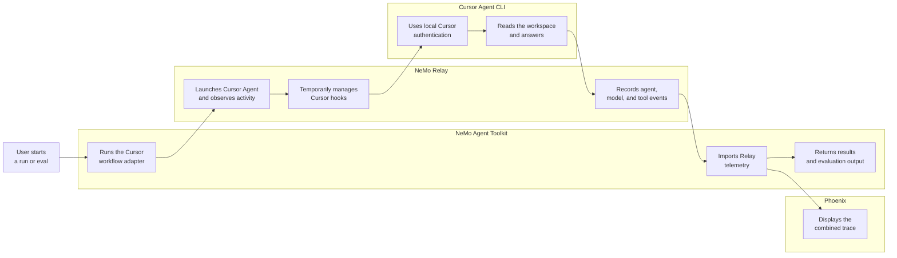
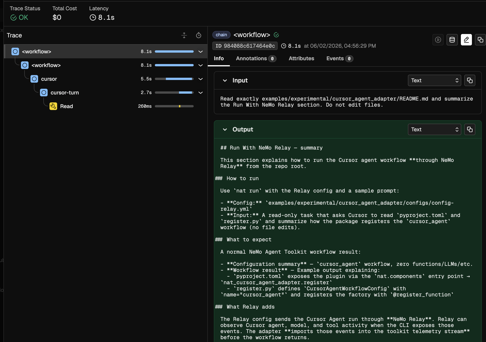

<!--
SPDX-FileCopyrightText: Copyright (c) 2026, NVIDIA CORPORATION & AFFILIATES. All rights reserved.
SPDX-License-Identifier: Apache-2.0

Licensed under the Apache License, Version 2.0 (the "License");
you may not use this file except in compliance with the License.
You may obtain a copy of the License at

http://www.apache.org/licenses/LICENSE-2.0

Unless required by applicable law or agreed to in writing, software
distributed under the License is distributed on an "AS IS" BASIS,
WITHOUT WARRANTIES OR CONDITIONS OF ANY KIND, either express or implied.
See the License for the specific language governing permissions and
limitations under the License.
-->

# Cursor Agent With NeMo Relay

This experimental NVIDIA NeMo Agent Toolkit example prototypes a primitive agent workflow type for Cursor Agent CLI. The primary workflow runs Cursor Agent through NeMo Relay so toolkit runs can include Cursor agent, model, and tool telemetry when the local Cursor CLI exposes those events.

## Integration Flow



NeMo Agent Toolkit owns the workflow and evaluation lifecycle. NeMo Relay sits between the toolkit and Cursor Agent so it can observe the Cursor run. During a transparent CLI run, Relay temporarily merges hook entries into the project `.cursor/hooks.json` file and restores the original file after Cursor exits. Phoenix visualizes the combined toolkit and Relay telemetry.

## Installation And Setup

If you have not already done so, follow the instructions in the [Install Guide](../../../docs/source/get-started/installation.md#install-from-source) to create the development environment and install NeMo Agent Toolkit.

Install this workflow package:

```bash
uv pip install -e examples/experimental/cursor_agent_adapter
```

Install Cursor Agent CLI so the `cursor-agent` command is available on `PATH`:

```bash
curl https://cursor.com/install -fsS | bash
cursor-agent --version
```

Configure Cursor Agent in the same environment that launches `nat`:

```bash
cursor-agent login
cursor-agent status
```

For non-interactive environments, you can export `CURSOR_API_KEY` before starting `nat`. Cursor Agent requires workspace trust for headless `--print` runs; this example passes `--trust` because the repository checkout is expected to be reviewed before running the workflow.

Set the root of your local NeMo Relay source checkout, then install the NeMo Relay CLI from source into the current environment:

```bash
export NEMO_RELAY_ROOT=/absolute/path/to/NeMo-Relay
cargo install --path "$NEMO_RELAY_ROOT/crates/cli" --root "${VIRTUAL_ENV:-.venv}" --locked
nemo-relay --help
```

## Run With NeMo Relay

From the repository root, run the Relay-enabled Cursor workflow:

```bash
nat run \
  --config_file examples/experimental/cursor_agent_adapter/configs/config-relay.yml \
  --input "Read exactly these files: examples/experimental/cursor_agent_adapter/pyproject.toml and examples/experimental/cursor_agent_adapter/src/nat_cursor_agent_adapter/register.py, then summarize how pyproject.toml exposes the nat.components entry point and how register.py registers the _type cursor_agent workflow with NeMo Agent Toolkit. Do not edit files."
```

The run should return a normal NeMo Agent Toolkit workflow result:

```text
Configuration Summary:
--------------------
Workflow Type: cursor_agent
Number of Functions: 0
Number of Function Groups: 0
Number of LLMs: 0
Number of Embedders: 0
Number of Memory: 0
Number of Object Stores: 0
Number of Retrievers: 0
Number of TTC Strategies: 0
Number of Authentication Providers: 0

Workflow Result:
How pyproject.toml exposes the NAT component:

The package declares a setuptools entry point in the nat.components group:

[project.entry-points.'nat.components']
nat_cursor_agent_adapter = "nat_cursor_agent_adapter.register"

When nat_cursor_agent_adapter is installed, setuptools registers that entry point. NeMo Agent Toolkit scans the nat.components group at startup and imports nat_cursor_agent_adapter.register, which runs the decorators and registration logic in that module.

How register.py registers the cursor_agent _type:

Registration happens in two linked steps: config model plus decorated function.

First, the config model defines _type: cursor_agent:

class CursorAgentWorkflowConfig(AgentBaseConfig, name="cursor_agent"):

AgentBaseConfig with name="cursor_agent" is the config class NeMo Agent Toolkit uses for YAML with _type: cursor_agent. Fields cover Cursor CLI behavior and optional NeMo Relay telemetry.

Second, @register_function wires the config to the runtime function:

@register_function(config_type=CursorAgentWorkflowConfig)
async def cursor_agent(config: CursorAgentWorkflowConfig, _builder: Builder):

The cursor_agent factory yields one FunctionInfo with a non-streaming response function and a streaming function. Both paths convert toolkit input, build a prompt, run Cursor through NeMo Relay, then return a toolkit-compatible response.

Summary: pyproject.toml exposes the plugin by pointing the nat.components entry point at nat_cursor_agent_adapter.register. That module defines CursorAgentWorkflowConfig with name="cursor_agent" and registers the workflow factory with @register_function.
```

The Relay config routes the Cursor Agent run through NeMo Relay. Relay observes Cursor agent, model, and tool activity when available, then the adapter imports those events into the toolkit telemetry stream before the workflow returns.

You can inspect the raw Relay event file:

```bash
cat ./.tmp/nat-relay-cursor-atof/events.jsonl | jq
```

## Phoenix With NeMo Relay

Install the Phoenix integration if it is not already available, then start Phoenix:

```bash
uv pip install -e packages/nvidia_nat_phoenix
docker run -it --rm -p 4317:4317 -p 6006:6006 arizephoenix/phoenix:13.22
```

In another terminal, run the Relay/Phoenix config:

```bash
nat run \
  --config_file examples/experimental/cursor_agent_adapter/configs/config-relay-phoenix.yml \
  --input "Read exactly examples/experimental/cursor_agent_adapter/README.md and summarize the Run With NeMo Relay section. Do not edit files."
```

Open `http://localhost:6006` and select the `nat-relay-cursor` project. The trace should include the toolkit workflow span plus imported Relay/Cursor agent, LLM, and tool spans when the local Cursor CLI emits them.



## Evaluate With NeMo Relay

The evaluation sample config uses the same Relay bridge and writes ATIF output:

```bash
nat eval \
  --config_file examples/experimental/cursor_agent_adapter/configs/config-relay-phoenix-eval.yml
```

Eval outputs are written under `./.tmp/nat/examples/cursor_agent_adapter/relay_phoenix_eval/`.
