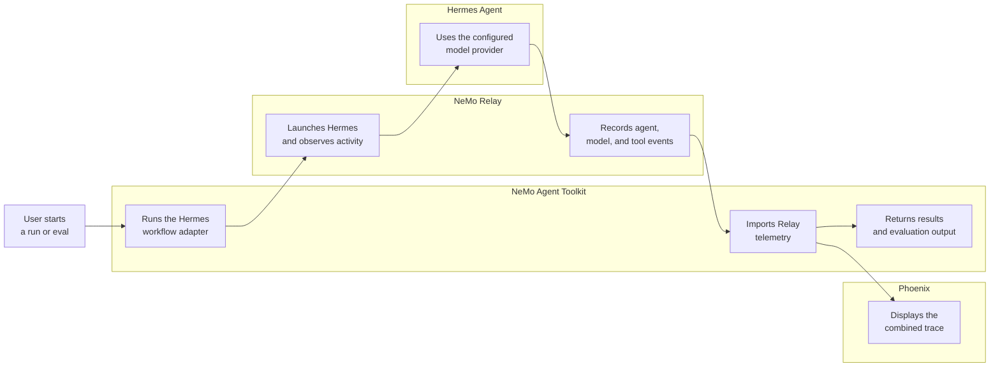
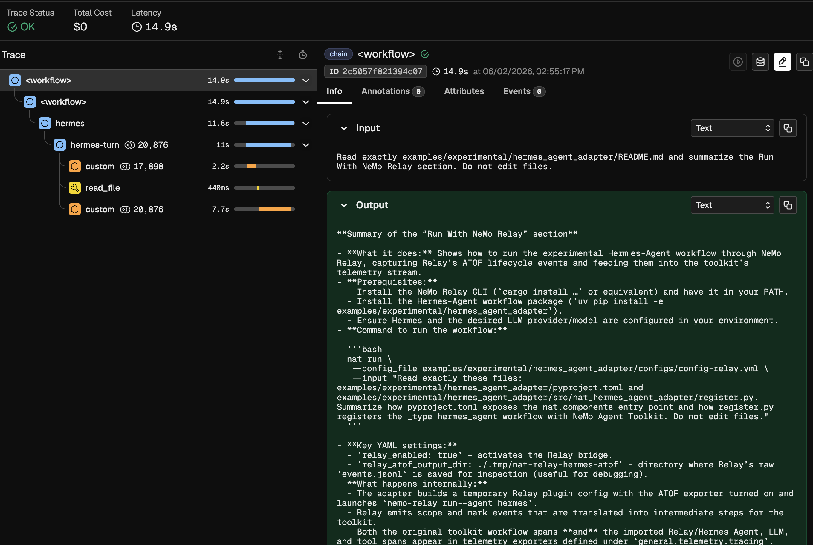

<!--
SPDX-FileCopyrightText: Copyright (c) 2026, NVIDIA CORPORATION & AFFILIATES. All rights reserved.
SPDX-License-Identifier: Apache-2.0

Licensed under the Apache License, Version 2.0 (the "License");
you may not use this file except in compliance with the License.
You may obtain a copy of the License at

http://www.apache.org/licenses/LICENSE-2.0

Unless required by applicable law or agreed to in writing, software
distributed under the License is distributed on an "AS IS" BASIS,
WITHOUT WARRANTIES OR CONDITIONS OF ANY KIND, either express or implied.
See the License for the specific language governing permissions and
limitations under the License.
-->

# Hermes Agent With NeMo Relay

This experimental NVIDIA NeMo Agent Toolkit example prototypes a primitive agent workflow type backed by Hermes Agent CLI and launched through NeMo Relay.

## Integration Flow



NeMo Agent Toolkit owns the workflow and evaluation lifecycle. NeMo Relay sits between the toolkit and Hermes Agent so it can observe the Hermes run. Hermes Agent talks to the configured model provider, and Phoenix visualizes the combined toolkit and Relay telemetry.

## Installation And Setup

If you have not already done so, follow the instructions in the [Install Guide](../../../docs/source/get-started/installation.md#install-from-source) to create the development environment and install NeMo Agent Toolkit.

Install this workflow package:

```bash
uv pip install -e examples/experimental/hermes_agent_adapter
```

NeMo Relay is a prerequisite for this workflow. Clone the NeMo Relay source locally, set the checkout root, then install the NeMo Relay CLI from source into the current environment:

```bash
git clone git@github.com:NVIDIA/NeMo-Relay.git
export NEMO_RELAY_ROOT=/absolute/path/to/NeMo-Relay
cargo install --path "$NEMO_RELAY_ROOT/crates/cli" --root "${VIRTUAL_ENV:-.venv}" --locked
nemo-relay --help
```

Configure Hermes Agent in the same environment that launches `nat`:

```bash
uvx --from hermes-agent hermes setup
uvx --from hermes-agent hermes auth
uvx --from hermes-agent hermes model
uvx --from hermes-agent hermes status
```

The workflow config launches Hermes Agent with `uvx`, so a global `hermes` executable is not required. `hermes status` should show a concrete model and an authenticated provider before a live model-backed workflow run.

## Run With NeMo Relay

From the repository root, run the Relay-enabled workflow:

```bash
nat run \
  --config_file examples/experimental/hermes_agent_adapter/configs/config-relay.yml \
  --input "Read exactly these files: examples/experimental/hermes_agent_adapter/pyproject.toml and examples/experimental/hermes_agent_adapter/src/nat_hermes_agent_adapter/register.py, then summarize how pyproject.toml exposes the nat.components entry point and how register.py registers the _type hermes_agent workflow with NeMo Agent Toolkit. Do not edit files."
```

The run should return a normal NeMo Agent Toolkit workflow result:

```text
Configuration Summary:
--------------------
Workflow Type: hermes_agent
Number of Functions: 0
Number of Function Groups: 0
Number of LLMs: 0
Number of Embedders: 0
Number of Memory: 0
Number of Object Stores: 0
Number of Retrievers: 0
Number of TTC Strategies: 0
Number of Authentication Providers: 0

Workflow Result:
The pyproject.toml exposes the adapter as a nat.components entry point:

[project.entry-points.'nat.components']
nat_hermes_agent_adapter = "nat_hermes_agent_adapter.register"

This mapping tells NeMo Agent Toolkit that nat_hermes_agent_adapter.register provides a component under the nat.components group.

The register.py file registers the workflow by defining HermesAgentWorkflowConfig with name="hermes_agent" and decorating the hermes_agent factory with @register_function(config_type=HermesAgentWorkflowConfig).

Consequently, NeMo Agent Toolkit can discover and load the _type hermes_agent workflow.
```

The Relay config routes the Hermes run through NeMo Relay. Relay observes Hermes agent, model, and tool activity, then the adapter imports those events into the toolkit telemetry stream before the workflow returns.

You can inspect the raw Relay event file:

```bash
cat ./.tmp/nat-relay-hermes-atof/events.jsonl | jq
```

## Phoenix With NeMo Relay

Install the Phoenix integration if it is not already available, then start Phoenix:

```bash
uv pip install -e packages/nvidia_nat_phoenix
docker run -it --rm -p 4317:4317 -p 6006:6006 arizephoenix/phoenix:13.22
```

In another terminal, run the Relay/Phoenix config:

```bash
nat run \
  --config_file examples/experimental/hermes_agent_adapter/configs/config-relay-phoenix.yml \
  --input "Read exactly examples/experimental/hermes_agent_adapter/README.md and summarize the Run With NeMo Relay section. Do not edit files."
```

Open `http://localhost:6006` and select the `nat-relay-hermes` project. The trace should include the toolkit workflow span plus imported Relay/Hermes agent, LLM, and tool spans.



## Evaluate With NeMo Relay

The evaluation sample config uses the same Relay bridge and writes ATIF output:

```bash
nat eval \
  --config_file examples/experimental/hermes_agent_adapter/configs/config-relay-phoenix-eval.yml
```

Eval outputs are written under `./.tmp/nat/examples/hermes_agent_adapter/relay_phoenix_eval/`.
