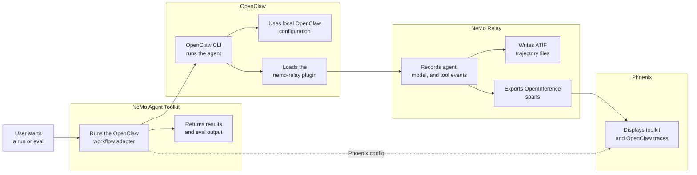

<!--
SPDX-FileCopyrightText: Copyright (c) 2026, NVIDIA CORPORATION & AFFILIATES. All rights reserved.
SPDX-License-Identifier: Apache-2.0

Licensed under the Apache License, Version 2.0 (the "License");
you may not use this file except in compliance with the License.
You may obtain a copy of the License at

http://www.apache.org/licenses/LICENSE-2.0

Unless required by applicable law or agreed to in writing, software
distributed under the License is distributed on an "AS IS" BASIS,
WITHOUT WARRANTIES OR CONDITIONS OF ANY KIND, either express or implied.
See the License for the specific language governing permissions and
limitations under the License.
-->

# OpenClaw Agent With NeMo Relay

This experimental NVIDIA NeMo Agent Toolkit example prototypes a primitive agent workflow type for OpenClaw. The workflow invokes `openclaw agent`, while OpenClaw loads the `nemo-relay` plugin to observe the agent run and export telemetry.

## Integration Flow



NeMo Agent Toolkit owns the workflow and evaluation lifecycle. OpenClaw owns the agent execution. NeMo Relay is loaded through OpenClaw's plugin system, so this workflow does not launch `nemo-relay run` or import a Relay `events.jsonl` file. The plugin writes ATIF files and can send OpenInference spans directly to Phoenix.

## Installation And Setup

If you have not already done so, follow the instructions in the [Install Guide](../../../docs/source/get-started/installation.md#install-from-source) to create the development environment and install NeMo Agent Toolkit.

Install this workflow package:

```bash
uv pip install -e examples/experimental/openclaw_agent_adapter
```

Install OpenClaw CLI so the `openclaw` command is available on `PATH`, then configure it in the same environment that launches `nat`:

```bash
npm install -g openclaw@latest
openclaw --version
openclaw onboard
openclaw doctor
```

Configure OpenClaw Gateway for local token-authenticated runs. Gateway mode is required because the `nemo-relay` plugin runs inside OpenClaw Gateway:

```bash
openclaw config set gateway.mode local
openclaw config set gateway.bind loopback
openclaw config set gateway.auth.mode token
openclaw config set gateway.auth.token "$(openssl rand -hex 32)"
openclaw config validate
```

Configure Gateway-mode Codex app-server policy. These settings live in OpenClaw config because Gateway, not the short-lived `openclaw` CLI process launched by `nat`, owns the actual agent runtime:

```bash
openclaw config patch --stdin <<'JSON'
{
  "plugins": {
    "entries": {
      "codex": {
        "enabled": true,
        "config": {
          "appServer": {
            "mode": "guardian",
            "approvalPolicy": "on-request",
            "sandbox": "workspace-write"
          }
        }
      }
    }
  }
}
JSON
openclaw config validate
```

Build and link the NeMo Relay OpenClaw plugin from source. Replace `../NeMo-Flow` with the path to your local NeMo Relay source checkout if it lives somewhere else:

```bash
(
  cd ../NeMo-Flow
  npm install --workspace=nemo-relay-node --workspace=nemo-relay-openclaw --ignore-scripts
  npm run build --workspace=nemo-relay-node
  npm run build --workspace=nemo-relay-openclaw
)
openclaw plugins install --link ../NeMo-Flow/integrations/openclaw
openclaw gateway restart
openclaw plugins inspect nemo-relay --runtime --json
```

This source install is used because the `nemo-relay-openclaw` package may not be available from the public npm registry in the test environment.

Merge a `nemo-relay` plugin entry into your OpenClaw config. OpenClaw commonly reads `~/.openclaw/openclaw.json`; use the config path reported by `openclaw doctor` if it differs. Preserve any existing `plugins.load`, `plugins.allow`, and `plugins.entries` values. If your config already has `plugins.allow`, add `nemo-relay` alongside the plugins you already trust. The JSON below is an excerpt, not a full config replacement:

```json
{
  "plugins": {
    "allow": ["nemo-relay"],
    "entries": {
      "nemo-relay": {
        "enabled": true,
        "hooks": {
          "allowConversationAccess": true
        },
        "config": {
          "enabled": true,
          "backend": "hooks",
          "plugins": {
            "version": 1,
            "components": [
              {
                "kind": "observability",
                "enabled": true,
                "config": {
                  "version": 1,
                  "atif": {
                    "enabled": true,
                    "agent_name": "openclaw",
                    "output_directory": "/absolute/path/to/nemo-agent-toolkit/.tmp/nat-relay-openclaw-atif"
                  },
                  "openinference": {
                    "enabled": false,
                    "transport": "http_binary",
                    "endpoint": "http://localhost:6006/v1/traces",
                    "service_name": "openclaw-nemo-relay"
                  }
                }
              }
            ]
          },
          "capture": {
            "includePrompts": true,
            "includeResponses": true,
            "stripToolArgs": true,
            "stripToolResults": true
          }
        }
      }
    }
  }
}
```

Restart OpenClaw Gateway after changing the plugin config:

```bash
openclaw gateway restart
openclaw gateway call nemoRelay.status --json
```

Use an absolute `output_directory` so OpenClaw Gateway writes ATIF output to the intended repository checkout even when Gateway starts from a different working directory.

If OpenClaw Gateway is not installed as a service, install and start it:

```bash
openclaw gateway install
openclaw gateway start
```

For a foreground-only run instead, start `openclaw gateway run` in one terminal and run the `nat` workflow in another terminal.

Restart Gateway after changing the Codex app-server policy. If you previously ran this example with an older session key and saw `approval_policy: Never`, use the session keys in the current configuration files or choose another fresh `session_key` so OpenClaw does not reuse a persisted Codex thread created with the rejected policy.

## Run With NeMo Relay

From the repository root, run the OpenClaw workflow:

```bash
nat run \
  --config_file examples/experimental/openclaw_agent_adapter/configs/config-relay.yml \
  --input "Read exactly these files: $(pwd)/examples/experimental/openclaw_agent_adapter/pyproject.toml and $(pwd)/examples/experimental/openclaw_agent_adapter/src/nat_openclaw_agent_adapter/register.py. Summarize how pyproject.toml exposes the nat.components entry point and how register.py registers the _type openclaw_agent workflow with NeMo Agent Toolkit. Do not edit files."
```

The run should return a normal NeMo Agent Toolkit workflow result:

````text
Configuration Summary:
--------------------
Workflow Type: openclaw_agent
Number of Functions: 0
Number of Function Groups: 0
Number of LLMs: 0
Number of Embedders: 0
Number of Memory: 0
Number of Object Stores: 0
Number of Retrievers: 0
Number of TTC Strategies: 0
Number of Authentication Providers: 0

Workflow Result:
[pyproject.toml](/Users/yuchenz/Desktop/Work/Project/nemo-agent-toolkit/examples/experimental/openclaw_agent_adapter/pyproject.toml:44) exposes a `nat.components` entry point:

```toml
[project.entry-points.'nat.components']
nat_openclaw_agent_adapter = "nat_openclaw_agent_adapter.register"
```

That tells NeMo Agent Toolkit to load the `nat_openclaw_agent_adapter.register` module when discovering NAT components from the installed package.

In [register.py](/Users/yuchenz/Desktop/Work/Project/nemo-agent-toolkit/examples/experimental/openclaw_agent_adapter/src/nat_openclaw_agent_adapter/register.py), the workflow type is defined by `OpenClawAgentWorkflowConfig(AgentBaseConfig, name="openclaw_agent")`. That `name` is what makes the NAT config `_type` be `openclaw_agent`.

The actual registration happens with:

```python
@register_function(config_type=OpenClawAgentWorkflowConfig)
async def openclaw_agent(...)
```

When NAT imports the entry-point module, this decorator registers the `openclaw_agent` workflow for that config type. The function yields `FunctionInfo.create(...)` with both `single_fn` and `stream_fn`, so NAT can invoke OpenClaw through either normal or streaming chat paths.
````

The workflow config runs OpenClaw through Gateway mode so the OpenClaw-managed `nemo-relay` plugin can observe the run. Because Gateway-side agents normally execute from the OpenClaw workspace, the adapter also passes the configured workflow `working_directory` as path context and the commands above use absolute file paths. The plugin writes ATIF files to the directory configured in OpenClaw:

```bash
find ./.tmp/nat-relay-openclaw-atif -maxdepth 1 -type f -name '*.json' -print
```

## Phoenix With NeMo Relay

Install the Phoenix integration if it is not already available, then start Phoenix:

```bash
uv pip install -e packages/nvidia_nat_phoenix
docker run -it --rm -p 4317:4317 -p 6006:6006 arizephoenix/phoenix:13.22
```

Enable the `openinference` section in the OpenClaw `nemo-relay` plugin config, then restart OpenClaw Gateway:

```json
"openinference": {
  "enabled": true,
  "transport": "http_binary",
  "endpoint": "http://localhost:6006/v1/traces",
  "service_name": "openclaw-nemo-relay"
}
```

```bash
openclaw gateway restart
```

In another terminal, run the Relay/Phoenix config:

```bash
nat run \
  --config_file examples/experimental/openclaw_agent_adapter/configs/config-relay-phoenix.yml \
  --input "Read exactly $(pwd)/examples/experimental/openclaw_agent_adapter/README.md and summarize the Run With NeMo Relay section. Do not edit files."
```

Open `http://localhost:6006`. The NeMo Agent Toolkit Phoenix config exports the toolkit workflow trace to the `nat-relay-openclaw` project. The OpenClaw plugin exports OpenClaw agent, model, and tool spans to Phoenix through its OpenInference exporter.

## Evaluate With NeMo Relay

The evaluation smoke config uses the same OpenClaw plugin setup and writes toolkit ATIF output:

```bash
nat eval \
  --config_file examples/experimental/openclaw_agent_adapter/configs/config-relay-phoenix-eval.yml
```

Eval outputs are written under `./.tmp/nat/examples/openclaw_agent_adapter/relay_phoenix_eval/`. OpenClaw plugin ATIF output is written to the directory configured in OpenClaw.

## Troubleshooting

If no OpenClaw Relay telemetry appears, verify the plugin status from the same shell that runs `nat`:

```bash
openclaw plugins inspect nemo-relay --runtime --json
openclaw gateway call nemoRelay.status --json
```

If OpenClaw reports a Codex app-server policy error, keep the example's `guardian`, `on-request`, and `workspace-write` settings, then use a fresh `session_key` so OpenClaw does not reuse an older session created with a rejected policy.
