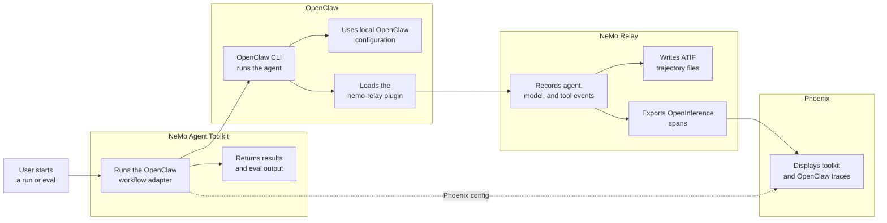

<!--
SPDX-FileCopyrightText: Copyright (c) 2026, NVIDIA CORPORATION & AFFILIATES. All rights reserved.
SPDX-License-Identifier: Apache-2.0

Licensed under the Apache License, Version 2.0 (the "License");
you may not use this file except in compliance with the License.
You may obtain a copy of the License at

http://www.apache.org/licenses/LICENSE-2.0

Unless required by applicable law or agreed to in writing, software
distributed under the License is distributed on an "AS IS" BASIS,
WITHOUT WARRANTIES OR CONDITIONS OF ANY KIND, either express or implied.
See the License for the specific language governing permissions and
limitations under the License.
-->

# OpenClaw Agent With NeMo Relay

This experimental NVIDIA NeMo Agent Toolkit example prototypes a primitive agent workflow type for OpenClaw. The workflow invokes `openclaw agent`, while OpenClaw loads the `nemo-relay` plugin to observe the agent run and export telemetry.

## Integration Flow



NeMo Agent Toolkit owns the workflow and evaluation lifecycle. OpenClaw owns the agent execution. NeMo Relay is loaded through OpenClaw's plugin system, so this workflow does not launch `nemo-relay run` or import a Relay `events.jsonl` file. The plugin can write ATIF files and send OpenInference spans directly to Phoenix when those exporters are enabled in OpenClaw config.

## Installation And Setup

If you have not already done so, follow the instructions in the [Install Guide](../../../docs/source/get-started/installation.md#install-from-source) to create the development environment and install NeMo Agent Toolkit.

Install this workflow package and verify that `nat` is available:

```bash
uv pip install -e examples/experimental/openclaw_agent_adapter
nat --version
```

Install OpenClaw CLI so the `openclaw` command is available on `PATH`, then onboard OpenClaw in the same shell environment that launches `nat`:

```bash
npm install -g openclaw@latest
openclaw --version
openclaw onboard
openclaw doctor
```

The example configs use Gateway mode (`local: false`) because the `nemo-relay` plugin runs inside OpenClaw Gateway. Configure Gateway for local token-authenticated runs:

```bash
openclaw config set gateway.mode local
openclaw config set gateway.bind loopback
openclaw config set gateway.auth.mode token
openclaw config set gateway.auth.token "$(openssl rand -hex 32)"
openclaw config validate
```

Configure the Gateway-side Codex app-server policy used by these example configs. Gateway owns the actual agent runtime, so these settings must live in OpenClaw config rather than only in the short-lived `openclaw` CLI process launched by `nat`:

```bash
openclaw config patch --stdin <<'JSON'
{
  "plugins": {
    "entries": {
      "codex": {
        "enabled": true,
        "config": {
          "appServer": {
            "mode": "guardian",
            "approvalPolicy": "on-request",
            "sandbox": "workspace-write"
          }
        }
      }
    }
  }
}
JSON
openclaw config validate
```

Clone the NeMo Relay source locally, then build and link the NeMo Relay OpenClaw plugin from source:

```bash
git clone git@github.com:NVIDIA/NeMo-Relay.git
export NEMO_RELAY_ROOT=/absolute/path/to/NeMo-Relay
(
  cd "$NEMO_RELAY_ROOT"
  npm install --workspace=nemo-relay-node --workspace=nemo-relay-openclaw --ignore-scripts
  npm run build --workspace=nemo-relay-node
  npm run build --workspace=nemo-relay-openclaw
)
openclaw plugins install --link "$NEMO_RELAY_ROOT/integrations/openclaw"
```

This source install is used because the `nemo-relay-openclaw` package may not be available from the public npm registry in the test environment.

Enable the `nemo-relay` plugin and choose the ATIF output directory. Use an absolute path so Gateway writes files to the intended repository checkout even when Gateway starts from a different working directory. If you already maintain other OpenClaw plugin entries, merge the `nemo-relay` keys below with your existing config instead of deleting unrelated plugins:

```bash
export OPENCLAW_ATIF_DIR="$(pwd)/.tmp/nat-relay-openclaw-atif"
mkdir -p "$OPENCLAW_ATIF_DIR"

node <<'JS' | openclaw config patch --stdin
const atifDir = process.env.OPENCLAW_ATIF_DIR;
if (!atifDir) {
  throw new Error("OPENCLAW_ATIF_DIR is not set");
}

const patch = {
  plugins: {
    allow: ["nemo-relay"],
    entries: {
      "nemo-relay": {
        enabled: true,
        hooks: {
          allowConversationAccess: true,
        },
        config: {
          enabled: true,
          backend: "hooks",
          plugins: {
            version: 1,
            components: [
              {
                kind: "observability",
                enabled: true,
                config: {
                  version: 1,
                  atif: {
                    enabled: true,
                    agent_name: "openclaw",
                    output_directory: atifDir,
                  },
                  openinference: {
                    enabled: false,
                    transport: "http_binary",
                    endpoint: "http://localhost:6006/v1/traces",
                    service_name: "openclaw-nemo-relay",
                  },
                },
              },
            ],
          },
          capture: {
            includePrompts: true,
            includeResponses: true,
            stripToolArgs: true,
            stripToolResults: true,
          },
        },
      },
    },
  },
};

process.stdout.write(JSON.stringify(patch, null, 2));
JS
openclaw config validate
```

Start Gateway in a separate terminal and leave it running while you run the workflow:

```bash
openclaw gateway run
```

In the terminal that runs `nat`, verify that Gateway loaded the plugin:

```bash
openclaw plugins inspect nemo-relay --runtime --json
openclaw gateway call nemoRelay.status --json
```

## Run With NeMo Relay

From the repository root, run the OpenClaw workflow:

```bash
nat run \
  --config_file examples/experimental/openclaw_agent_adapter/configs/config-relay.yml \
  --input "Read exactly these files: $(pwd)/examples/experimental/openclaw_agent_adapter/pyproject.toml and $(pwd)/examples/experimental/openclaw_agent_adapter/src/nat_openclaw_agent_adapter/register.py. Summarize how pyproject.toml exposes the nat.components entry point and how register.py registers the _type openclaw_agent workflow with NeMo Agent Toolkit. Do not edit files."
```

The run should return a normal NeMo Agent Toolkit workflow result summarizing the adapter package and registration code. Because Gateway-side agents normally execute from the OpenClaw workspace, the adapter also passes the configured workflow `working_directory` as path context and the command above uses absolute file paths.

## Phoenix With NeMo Relay

Install the Phoenix integration if it is not already available, then start Phoenix:

```bash
uv pip install -e packages/nvidia_nat_phoenix
docker run -it --rm -p 4317:4317 -p 6006:6006 arizephoenix/phoenix:13.22
```

Enable the `openinference` section in the OpenClaw `nemo-relay` plugin config, then restart Gateway by stopping and rerunning `openclaw gateway run`:

```json
"openinference": {
  "enabled": true,
  "transport": "http_binary",
  "endpoint": "http://localhost:6006/v1/traces",
  "service_name": "openclaw-nemo-relay"
}
```

In another terminal, run the Relay/Phoenix config:

```bash
nat run \
  --config_file examples/experimental/openclaw_agent_adapter/configs/config-relay-phoenix.yml \
  --input "Read exactly $(pwd)/examples/experimental/openclaw_agent_adapter/README.md and summarize the Run With NeMo Relay section. Do not edit files."
```

Open `http://localhost:6006`. The NeMo Agent Toolkit Phoenix config exports the toolkit workflow trace to the `nat-relay-openclaw` project. The OpenClaw plugin exports OpenClaw agent, model, and tool spans to Phoenix through its OpenInference exporter.

## Evaluate With NeMo Relay

The evaluation sample config uses the same OpenClaw plugin setup and measures toolkit workflow runtime. It uses the profiler `avg_workflow_runtime` evaluator, so install profiler support before running `nat eval`:

```bash
uv pip install -e ".[profiler]"
nat eval \
  --config_file examples/experimental/openclaw_agent_adapter/configs/config-relay-phoenix-eval.yml
```

Eval outputs are written under `./.tmp/nat/examples/openclaw_agent_adapter/relay_phoenix_eval/`. OpenClaw plugin ATIF output is written to the directory configured in OpenClaw.
