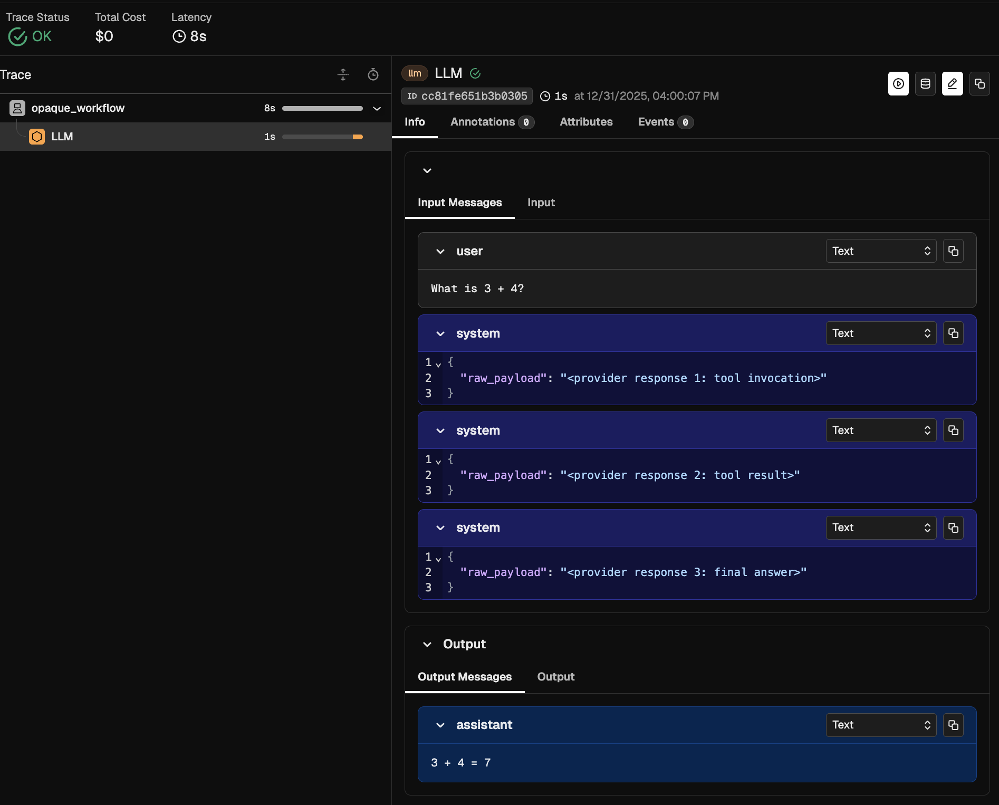
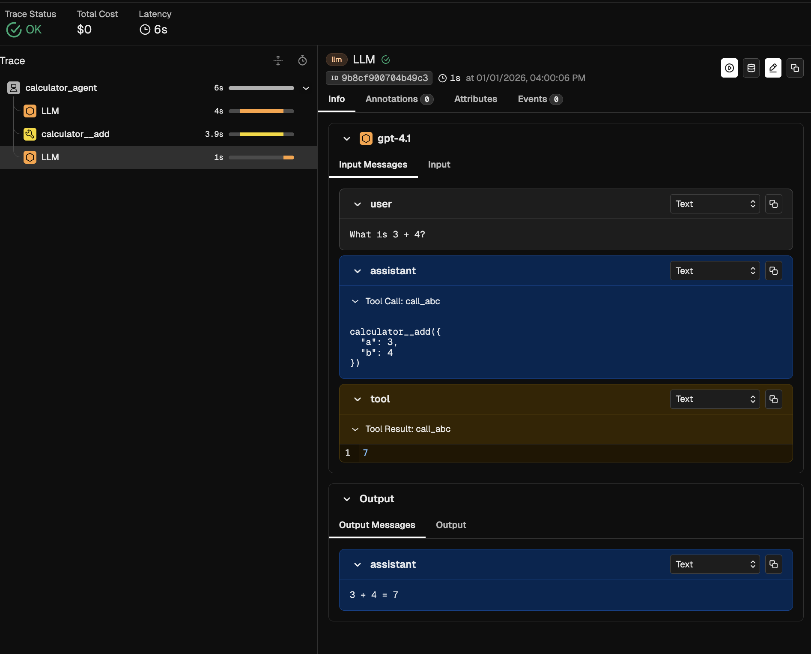
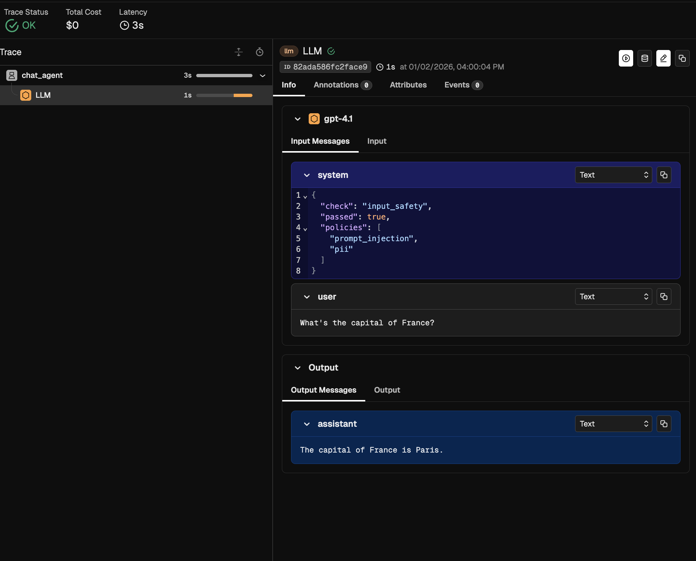
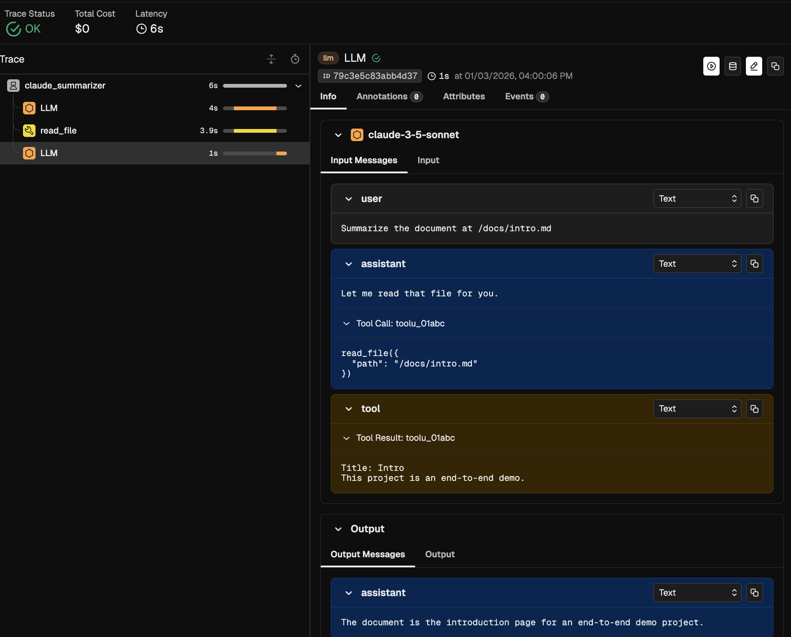
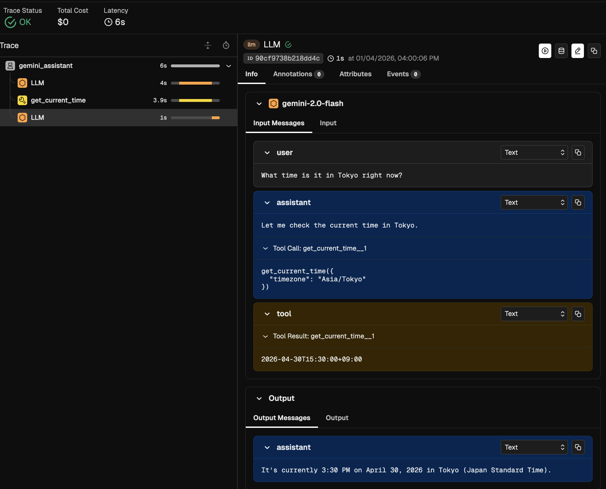
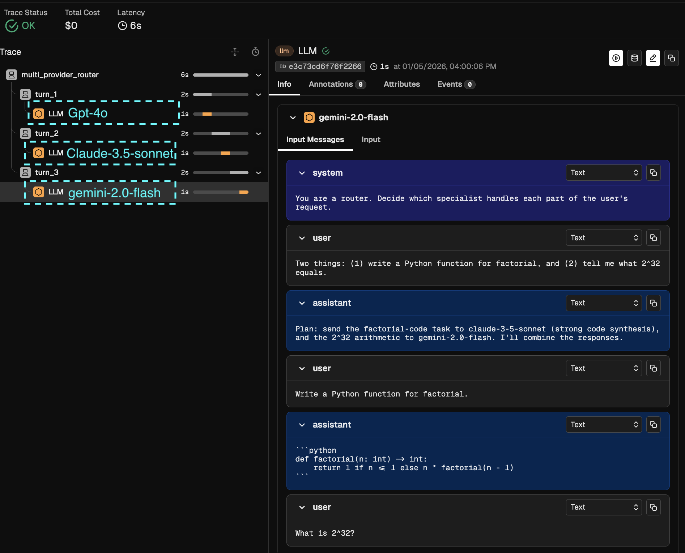

<!--
SPDX-FileCopyrightText: Copyright (c) 2026, NVIDIA CORPORATION & AFFILIATES. All rights reserved.
SPDX-License-Identifier: Apache-2.0

Licensed under the Apache License, Version 2.0 (the "License");
you may not use this file except in compliance with the License.
You may obtain a copy of the License at

http://www.apache.org/licenses/LICENSE-2.0

Unless required by applicable law or agreed to in writing, software
distributed under the License is distributed on an "AS IS" BASIS,
WITHOUT WARRANTIES OR CONDITIONS OF ANY KIND, either express or implied.
See the License for the specific language governing permissions and
limitations under the License.
-->

# ATOF-to-ATIF Examples

End-to-end examples exercising the ATOF v0.1 reference implementation. Six scenarios cover the two enrichment tiers, the `mark` event kind, and three real-world LLM payload shapes (OpenAI chat-completions, Anthropic Messages, Gemini `generateContent`) plus a heterogeneous orchestrator that mixes all three in a single stream. See spec §1.1 in [`../../atof-event-format.md`](../../atof-event-format.md) for tier definitions and §3 for event kinds.

This README doubles as the ATOF → ATIF conversion reference: the mapping table, dispatch conventions, and known limitations live in the [Conversion reference](#conversion-reference) section at the bottom.

## Scripts

- `generate_atof_examples.py` — produces `./output/exmpNN_atof.jsonl` for each scenario using the v0.1 public API (`scope` / `mark` event models, `write_jsonl`).
- `convert_atof_examples_to_atif.py` — reads each regenerated JSONL, runs the ATOF→ATIF converter (`nat.atof.scripts.atof_to_atif_converter.convert_file`), and writes `./output/exmpNN_atif.json` as a formatted ATIF `Trajectory`.

## The scenarios

Each subsection below ends with a Phoenix span tree screenshot taken after exporting the converted ATIF JSON to a local Arize Phoenix instance. See [Verifying in Phoenix](#verifying-in-phoenix) for the export command.

### EXMP-01 — tier-1 raw pass-through

A calculator-shaped workflow where the producer can't classify any scope. Every `scope` event carries `category: "unknown"`, `category_profile: null`, and opaque raw JSON in `data`. Demonstrates the floor: a valid ATOF stream capturing only timing + raw payloads, with no semantic tagging.

Converts to an ATIF trajectory shaped as **user → opaque system steps → agent**: the root opaque scope's start payload (e.g. `{"raw_query": "..."}`) is lifted into a leading `source: "user"` step (Branch A), the inner unclassified scope-ends each become `source: "system"` steps via the generic fall-through, and the root opaque scope's end payload (e.g. `{"raw_result": "..."}`) is lifted into a trailing `source: "agent"` step (Branch B). `Trajectory.agent.name` uses the outermost root scope's `name` since no `category: "agent"` event is present.

**When to use:** a runtime wrapping a third-party framework whose callback fires a raw blob the wrapper can't classify, but where the producer still places the user objective on the root scope-start and the agent's final result on the root scope-end.



### EXMP-02 — tier-2 semantic-tagged

Same calculator workflow as EXMP-01 but with every scope classified (`category: "agent"` / `"llm"` / `"tool"`) and `category_profile` populated (`category_profile.model_name` for LLM events, `category_profile.tool_call_id` for tool events — see spec §4.4). Additionally demonstrates `attributes: ["remote"]` on the tool scope (the tool is dispatched out-of-process, spec §2.1) and `data_schema` on the LLM scopes pointing at `openai/chat-completions@1` (spec §2).

Converts to a rich ATIF trajectory with user / agent / observation steps, with `Trajectory.agent.name` derived from the `category: "agent"` scope's `name`. The Phoenix view shows the LLM span with a child TOOL span carrying the calculator invocation.

**When to use:** native producers that classify events at the hook site.



### EXMP-03 — mark events (in-line guardrail)

A short chat agent that fires a single in-line `mark` event mid-trajectory. The mark is `category: "guardrail"` (a first-class spec category per [`atof-event-format.md`](../../atof-event-format.md) §4), parented under the agent scope, and fires AFTER the agent scope-start and BEFORE the LLM scope-start — riding alongside the agent's lifecycle rather than bracketing it. The mark records an input-safety policy check (`{"check": "input_safety", "passed": true, "policies": ["prompt_injection", "pii"]}`).

Because the mark's `data` shape doesn't match a role-extraction heuristic, the converter takes the JSON-blob fall-through arm at [`atof_to_atif_converter.py`](../../src/nat/atof/scripts/atof_to_atif_converter.py) lines 622-651: the mark surfaces as a `source: "system"` step whose `message` is the compact-JSON serialization of the mark's `data`. The single LLM turn produces the user / agent pair. Phoenix's native ATIF helper renders pre-LLM `source: "system"` steps inline as `llm.input_messages` on the LLM span. Trailing system steps after the only LLM call have nowhere to attach and are not surfaced in the UI — input-side guardrails are also more common in production (rejected prompts skip the LLM cost), so this position is doubly justified. The Phoenix view shows the workflow span with the `input_safety_check` guardrail folded into the LLM span's `llm.input_messages` alongside the user message, demonstrating that marks are in-line lifecycle checkpoints, not session brackets.

**When to use:** demonstrating in-line, categorized lifecycle checkpoints — guardrail / safety / compliance markers that ride alongside agent scopes without taking start and end pairing semantics.



### EXMP-04 — Anthropic Messages

<!-- markdown-link-check-disable -->
A document-summarization workflow where Claude calls a `read_file` tool and then formulates a summary. LLM payloads use Anthropic's Messages API shape — `messages[].content` is polymorphic string-or-block-list on input; `content[]` is a typed-block list on output, mixing `text` and `tool_use` blocks. Every LLM scope declares `data_schema = {"name": "anthropic/messages", "version": "1"}`, dispatching to a registered Anthropic-specific extractor.
<!-- markdown-link-check-enable -->

Demonstrates that the converter handles polymorphic content shapes through the registered extractor's normalization hooks. Tool calls extracted from `content[].tool_use` blocks resolve correctly into ATIF `tool_calls[]` with the matching observation results.

**When to use:** any producer emitting Claude or other Anthropic-shape payloads. Mirror this scenario when registering a new LLM-payload extractor.



### EXMP-05 — Gemini `generateContent`

<!-- markdown-link-check-disable -->
A timezone lookup workflow where Gemini calls a `get_current_time` function and then answers. LLM payloads use Gemini's `contents[].parts[]` request shape and `candidates[0].content.parts[]` response shape. Every LLM scope declares `data_schema = {"name": "gemini/generate-content", "version": "1"}`.
<!-- markdown-link-check-enable -->

Demonstrates two Gemini-specific quirks the registered extractor smooths over: role aliasing (Gemini's `"model"` role maps to `"assistant"`) and tool-call-id synthesis (Gemini omits IDs, so the extractor synthesizes `<function-name>__<index>` to keep ATIF observation-result correlation intact).

**When to use:** any producer emitting Gemini or Vertex AI `generateContent` payloads. Reference for extractors that need to synthesize provider-missing identifiers.



### EXMP-06 — Heterogeneous router

<!-- markdown-link-check-disable -->
A multi-provider orchestrator that receives a single user request, routes pieces to three specialist LLMs from different providers (OpenAI, Anthropic, Gemini), and combines their responses. The single ATOF stream carries three LLM scope events, each declaring a different `data_schema` — `openai/chat-completions@1`, `anthropic/messages@1`, and `gemini/generate-content@1` in turn.
<!-- markdown-link-check-enable -->

This is the strongest end-to-end evidence that the converter dispatches **per event** by schema, not per stream. Each LLM span in the Phoenix tree below was parsed by a different registered extractor, yet they coexist under a single trajectory and trace.

Per-step `step.model_name` (ATIF v1.7) disambiguates which provider produced each agent step: the three LLM-derived agent steps in the converted ATIF carry `model_name: "gpt-4o"` (router), `model_name: "claude-3-5-sonnet"` (code synthesis), and `model_name: "gemini-2.0-flash"` (math) respectively, while the root `agent.model_name = "gpt-4o"` reflects only the first LLM scope-end (the orchestrator/router). A consumer that previously had to guess which model produced step 5 can now read the answer off the step itself.

**When to use:** any orchestrator pattern where one workflow fans out to multiple providers. Demonstrates that no schema-switching ceremony is needed at the producer side beyond declaring `data_schema` on each event.



## Running

<!-- markdown-link-check-disable -->
```bash
cd NeMo-Agent-Toolkit/packages/nvidia_nat_atif/examples/atof_to_atif
python generate_atof_examples.py
python convert_atof_examples_to_atif.py
# Outputs in output/
```
<!-- markdown-link-check-enable -->

## Verifying in Phoenix

The screenshots above were captured by exporting the generated ATIF JSON files to a local Arize Phoenix instance through the [`export_atif_trajectory_to_phoenix`](../../../nvidia_nat_phoenix/src/nat/plugins/phoenix/scripts/export_trajectory_to_phoenix/README.md) script.

```bash
docker run -d --rm -p 4317:4317 -p 6006:6006 --name phoenix arizephoenix/phoenix:13.22

uv pip install -e packages/nvidia_nat_phoenix

uv run python -m nat.plugins.phoenix.scripts.export_trajectory_to_phoenix.export_atif_trajectory_to_phoenix \
    packages/nvidia_nat_atif/examples/atof_to_atif/output/exmp0{1,2,3,4,5,6}_atif.json \
    --project atof-pr-1890-examples
```

Open the Phoenix UI at `http://localhost:6006`, select the `atof-pr-1890-examples` project, and the six traces appear with the span trees shown above.

## Event counts

| Scenario | Events | Tier | Workflow                                                           |
| -------- | ------ | ---- | ------------------------------------------------------------------ |
| EXMP-01  | 8      | 1    | Opaque wrapper: three unclassified inner callbacks                 |
| EXMP-02  | 8      | 2    | Calculator: agent → LLM → tool → LLM → agent                       |
| EXMP-03  | 5      | 2    | Chat agent with in-line guardrail mark                             |
| EXMP-04  | 8      | 2    | Claude document summarizer with `read_file` tool (Anthropic shape) |
| EXMP-05  | 8      | 2    | Gemini timezone lookup with `get_current_time` function            |
| EXMP-06  | 8      | 2    | Multi-provider router: OpenAI + Anthropic + Gemini in one stream   |

EXMP-01, EXMP-02, EXMP-04, EXMP-05, and EXMP-06 each consist of paired `scope` events. EXMP-03 consists of two paired `scope` events (one agent + one LLM) plus a single in-line `mark` event. The ATOF v0.1 spec has no stream-level metadata event.

---

## Conversion reference

This section is the canonical mapping from ATOF event streams to ATIF trajectories. The reference implementation lives at [`../../src/nat/atof/scripts/atof_to_atif_converter.py`](../../src/nat/atof/scripts/atof_to_atif_converter.py); the code is the source of truth for edge cases. This section documents the conventions any consumer should follow to round-trip cleanly.

### Source mapping

ATIF requires every `Step` to declare a `source ∈ {"user", "agent", "system"}`. ATOF events carry no `source` field — the converter derives it from the event's `kind`, `scope_category`, and `category`:


| ATOF event                           | Condition                                              | ATIF `source` | Step content                                                                                                           |
| ------------------------------------ | ------------------------------------------------------ | ------------- | ---------------------------------------------------------------------------------------------------------------------- |
| `scope`, `scope_category: "start"`   | `category == "llm"`                                    | `user`        | `message` = serialized messages array from `event.data`                                                                |
| `scope`, `scope_category: "end"`     | `category == "llm"`                                    | `agent`       | `message` = LLM response content; `tool_calls` extracted from `event.data`; `model_name` set from `category_profile.model_name` (falls back to `event.name` when `category_profile` is null). Set on every agent step emitted from an LLM scope-end; NOT set on no-LLM orchestrator steps (`llm_call_count: 0`). |
| `scope`, `scope_category: "end"`     | `category == "tool"`                                   | `system`      | merged into `observation.results[]`; consecutive tool ends flush as a single step                                      |
| `mark`                               | `data != null`                                         | `system`      | `message` = serialized `data` (null-data marks are skipped)                                                            |
| `scope`, `scope_category: "start"`   | `category == "agent"`                                  | (none)        | call-graph shaping only — `name` captured for `Trajectory.agent.name`                                                  |
| `scope`, `scope_category: "start"`   | `parent_uuid is null` and `category ∉ {"agent","llm","tool","context"}` | `user`        | **Tier-1 root boundary promotion (Branch A).** `message` = `_serialize_root_data(event.data)` (single-key-dict lift, else compact JSON; emission skipped if data is empty/None). |
| `scope`, `scope_category: "end"`     | `parent_uuid is null` and `category ∉ {"llm","tool","agent","context"}` | `agent`       | **Tier-1 root boundary promotion (Branch B).** `message` = `_serialize_root_data(event.data)` (same heuristic; emission skipped if empty/None). |
| `scope`, `scope_category: "end"`     | `parent_uuid is not null` and `category ∉ {"llm","tool","agent","context"}` | `system`      | `message` = serialized `event.data`; ancestry + invocation timing preserved. Covers inner tier-1 opaque and unclassified categories. |
| `scope`, `scope_category: "start"`   | `parent_uuid is not null` and `category ∉ {"llm","agent"}` | (none)        | call-graph shaping only — included in `extra.ancestry` chains                                                          |


**Tier-1 pass-through guarantee.** A strict tier-1 stream — every scope with `category == "unknown"` and `category_profile: null` — converts to a non-empty trajectory shaped as **user → opaque system steps → agent**. The root opaque scope's start payload is lifted into a leading `source: "user"` step (Branch A) and its end payload is lifted into a trailing `source: "agent"` step (Branch B), using the `_serialize_root_data` heuristic: a `str` is passed through; a single-key dict whose value is a string lifts that string out (covers the common `{"query": "..."}` / `{"result": "..."}` shape); any other non-empty dict serializes to compact JSON; `None` and `{}` skip emission entirely (no boundary step). Inner (non-root) opaque `scope_category: "end"` events still become `source: "system"` steps whose `message` is the serialized raw `event.data`. `Trajectory.agent.name` falls back to the outermost (root) start event's `name` when no `category == "agent"` event is present.

### Why `(kind, scope_category, category)` as dispatch key

The three string literals `"llm"`, `"tool"`, `"agent"` are the `category` values the reference converter recognizes for **specialised** ATIF-step materialisation:

- **`llm`** scopes become paired user and agent steps with messages and tool-call extraction.
- **`tool`** scopes become merged observation results buffered between LLM turns.
- **`agent`** scopes populate `Trajectory.agent.name` only (no step emitted).

All **other** scope-end events (`function`, `retriever`, `embedder`, `reranker`, `guardrail`, `evaluator`, `custom`, `unknown`) fall into the generic opaque-system-step arm — each contributes a `source: "system"` step whose `message` is the serialised raw `event.data` — **except at the root boundary**, where the converter promotes the root opaque scope-start to a `source: "user"` step (Branch A) and the root opaque scope-end to a `source: "agent"` step (Branch B) using the `_serialize_root_data` heuristic. This guarantees that **every tier produces a non-empty ATIF trajectory**: tier-1 streams yield user → opaque system → agent shapes that preserve the producer's user objective and final result; tier-2 streams enrich the inner structure with user, agent, and observation steps where scopes are classified.

### Tool-result merging

Consecutive `tool` scope-end events between two LLM turns produce **one** ATIF system step with multiple `observation.results[]`, not one step per tool result. Per Harbor's ATIF RFC, observations belong to the agent turn that produced them — a single `system` step with N results models "the system returning the results of the N tools the agent just called." Per-tool steps would inflate `step_id` counts and confuse downstream metrics.

A flush happens at three triggers:

1. **Next LLM turn begins** (`scope` event with `scope_category: "start"` and `category == "llm"`) — flushes pending observations into a single `system` step before the new `user` step is appended.
2. **`mark` event with non-null `data`** — flushes pending observations before the mark's `system` step.
3. **End of stream** — flushes any remaining observations.

### ID mappings

| ATOF field                                                    | ATIF field                              | Mapping rule                                                             |
| ------------------------------------------------------------- | --------------------------------------- | ------------------------------------------------------------------------ |
| `event.uuid`                                                  | `extra.ancestry.function_id`            | Direct                                                                   |
| `event.parent_uuid`                                           | `extra.ancestry.parent_id`              | Direct (empty string if `null`)                                          |
| `event.name`                                                  | `extra.ancestry.function_name`          | Direct                                                                   |
| `name_map[parent_uuid]`                                       | `extra.ancestry.parent_name`            | Looked up via pre-pass `uuid → name` map; `"unknown"` if unresolved      |
| `event.category_profile.tool_call_id` (`category == "tool"`)  | `tool_calls[*].tool_call_id`            | Read from the `category_profile` sub-object (spec §4.4)                  |
| `event.category_profile.tool_call_id` (`category == "tool"`)  | `observation.results[*].source_call_id` | Same value                                                               |
| `event.category_profile.model_name` (`category == "llm"`)     | `Trajectory.agent.model_name`           | First LLM scope-end's `category_profile.model_name` wins                 |
| `event.category_profile.model_name` (`category == "llm"`)     | `Step.model_name` (per-step)            | On every agent step emitted from an LLM scope-end; falls back to `event.name` when `category_profile` is null. NOT set on no-LLM orchestrator steps (`llm_call_count: 0`). |
| `scope` start event `name` (`category == "agent"`)            | `Trajectory.agent.name`                 | First `agent` scope wins; falls back to root scope start's `name` if absent |

### Producers that need different mappings

If your runtime emits payloads the built-in extractors don't recognize — a non-OpenAI LLM shape, a vendor-specific tool-result wrapper, or a custom `mark` convention — you have four options, ordered from cleanest to most invasive:

1. **Register a custom extractor** (recommended). Declare a `data_schema` on your events and plug a matching extractor into `nat.atof.extractors`. No core converter change is required. See [Extending the converter](#extending-the-converter) below.
2. **Wrap a known category**. Emit your custom scope as `category == "llm"` or `category == "tool"` and use `attributes` + `data` fields to carry the distinguishing semantics.
3. **Use a `mark` event with structured `data`**. For non-lifecycle observations, a `mark` with non-null `data` produces a `system` step with the data serialized into `message`. Fastest path for one-off events.
4. **Fork the reference converter**. Only needed when your category needs entirely new ATIF structural rules (new step sources, new observation shapes, and so on).

Option 1 is the right default. It keeps producer-specific parsing out of the core dispatch and composes cleanly with the JSON Schema `validator`.

### Extending the converter

The converter maintains two registries that producers plug into, both keyed on the event-level `data_schema = {name, version}` identifier.

| Registry | Purpose | Public API |
|----------|---------|------------|
| `SCHEMA_REGISTRY` | JSON Schema `validators` that run in a pre-pass; raise `DataSchemaViolationError` on mismatch. | `nat.atof.register_schema(name, version, schema)` |
| `LLM_EXTRACTOR_REGISTRY` / `TOOL_EXTRACTOR_REGISTRY` / `MARK_EXTRACTOR_REGISTRY` | Extractor objects that pull ATIF-relevant content out of `event.data` during conversion. | `nat.atof.register_llm_extractor(name, version, extractor)` (and `register_tool_extractor`, `register_mark_extractor`) |

Built-in defaults:

- `openai/chat-completions@1` ships with both a permissive JSON Schema and the `OpenAiChatCompletionsLlmExtractor`. Events without a `data_schema` fall back to this extractor.
- `GenericToolResultExtractor` unwraps single-key `{result}` or `{output}` wrappers and JSON-serializes the rest. Used for every `tool` scope unless overridden.
- `NatRoleMarkExtractor` lifts `mark` events whose payload carries `{"role": "user" | "system" | "agent", "content": ...}` as that-sourced ATIF steps.

#### Step 1: Declare the `data_schema` on every event you emit

The `data_schema` field is optional (spec §2), but declaring it is what activates validation and custom extractor dispatch.

<!-- markdown-link-check-disable -->
```python
from nat.atof import ScopeEvent

ScopeEvent(
    scope_category="end",
    uuid="llm-001",
    parent_uuid="root-001",
    timestamp="2026-01-01T00:00:02Z",
    name="claude-sonnet",
    category="llm",
    category_profile={"model_name": "claude-sonnet"},
    data={"output_blocks": [{"type": "text", "text": "hello"}]},
    data_schema={"name": "anthropic/messages", "version": "1"},
)
```
<!-- markdown-link-check-enable -->

#### Step 2: Register a JSON Schema

Register the schema before calling `convert()`. The pre-pass validates every event carrying `data_schema = (name, version)` against the registered schema.

<!-- markdown-link-check-disable -->
```python
from nat.atof import register_schema

register_schema(
    "anthropic/messages",
    "1",
    {
        "$schema": "https://json-schema.org/draft/2020-12/schema",
        "type": "object",
        "anyOf": [
            {"required": ["input"]},
            {"required": ["output_blocks"]},
        ],
    },
)
```
<!-- markdown-link-check-enable -->


A validation failure raises `DataSchemaViolationError` with the offending event UUID, the declared schema, the JSON-pointer path to the failure, and the underlying `validator` message.

Unregistered `data_schema` values log a `WARNING` and skip validation — the converter cannot validate what it doesn't know about.

#### Step 3: Register extractors for the matching schema

Extractors are duck-typed against the protocols in `nat.atof.extractors`:

<!-- markdown-link-check-disable -->
```python
from nat.atof import register_llm_extractor

class AnthropicMessagesV1Extractor:
    def extract_input_messages(self, data):
        return [
            {"role": item["role"], "content": "".join(p.get("text", "") for p in item["parts"])}
            for item in (data or {}).get("input", [])
        ]

    def extract_output_text(self, data):
        blocks = (data or {}).get("output_blocks", [])
        return "".join(b.get("text", "") for b in blocks if b.get("type") == "text")

    def extract_tool_calls(self, data):
        return []  # Add Anthropic tool-use parsing here when needed.

register_llm_extractor("anthropic/messages", "1", AnthropicMessagesV1Extractor())
```
<!-- markdown-link-check-enable -->

`register_tool_extractor` and `register_mark_extractor` work the same way for `tool` scope-ends and `mark` events. The full protocol signatures are in `nat.atof.extractors`:

```python
class LlmPayloadExtractor(Protocol):
    def extract_input_messages(self, data) -> list[dict]: ...
    def extract_output_text(self, data) -> str: ...
    def extract_tool_calls(self, data) -> list[dict]: ...

class ToolPayloadExtractor(Protocol):
    def extract_tool_result(self, data) -> str | None: ...

class MarkPayloadExtractor(Protocol):
    def extract_role_and_content(self, data) -> tuple[str, Any] | None: ...
```

#### Step 4: Convert

With the schema and extractor registered, the usual `convert()` / `convert_file()` calls handle your producer's payloads end-to-end:

```python
from nat.atof.scripts.atof_to_atif_converter import convert_file

trajectory = convert_file("my_anthropic_run.jsonl", "my_anthropic_run.atif.json")
```

#### Fail-fast guarantees

The converter raises on two kinds of producer-conformance failure, in this order:

1. `DataSchemaViolationError` — `event.data` doesn't conform to its declared, registered `data_schema`. Fires in the pre-pass with JSON-pointer context.
2. `ShapeMismatchError` — the resolved extractor returned nothing usable from a non-empty `event.data`. Fires during dispatch with the observed top-level keys.

Both exceptions carry the offending event's UUID so producers can locate the failing event quickly. Events without a `data_schema` skip validation entirely and still benefit from shape-mismatch detection against the fallback extractor.

### Known limitations

- **Tools without `category_profile.tool_call_id`.** Tool events emitted without a `category_profile.tool_call_id` (tier-1 producers that don't have provider-assigned correlation IDs) produce `observation.results[*].source_call_id == None`. The call graph can still be constructed via `parent_uuid` / `extra.ancestry`, but invocation-level correlation is lost.
- **Naive RFC 3339 timestamps.** `datetime.fromisoformat()` accepts naive ISO 8601 strings (no timezone), which spec §5.1 forbids. Naive strings reinterpret in the consumer's local timezone and can silently shift `ts_micros` by hours between environments. Producers MUST emit `Z` or an explicit UTC offset.
- **Null-data marks.** A `mark` event whose `data` field is `null` is skipped — no step is emitted. If you need a marker step with empty content, emit `data: {}` instead — the converter produces a `system` step with `message == "{}"`.

### Public API

Two entry points in [`../../src/nat/atof/scripts/atof_to_atif_converter.py`](../../src/nat/atof/scripts/atof_to_atif_converter.py):

```python
def convert(events: list[Event]) -> Trajectory:
    """In-memory: typed ATOF events → validated ATIF Trajectory."""


def convert_file(input_path: str | Path, output_path: str | Path | None = None) -> Trajectory:
    """File-based: read .jsonl → convert → optionally write ATIF JSON."""
```

Both return a Pydantic-validated `nat.atif.trajectory.Trajectory` (the Toolkit-side ATIF model that mirrors Harbor's `0001-trajectory-format.md` RFC v1.7).

---

## See also

- [`../../atof-event-format.md`](../../atof-event-format.md) — canonical ATOF v0.1 spec (wire format, categories, event kinds)
- [`../../src/nat/atof/scripts/atof_to_atif_converter.py`](../../src/nat/atof/scripts/atof_to_atif_converter.py) — reference converter implementation
- [`../../src/nat/atof/schemas.py`](../../src/nat/atof/schemas.py) — JSON Schema registry and `register_schema` helper
- [`../../src/nat/atof/extractors.py`](../../src/nat/atof/extractors.py) — pluggable extractor protocols and registries
- [`../../tests/test_tier1_conversion.py`](../../tests/test_tier1_conversion.py) — tier-1 opaque-stream tests
- [`../../tests/test_data_schema_validation.py`](../../tests/test_data_schema_validation.py) — schema registration + validation tests
- [`../../tests/test_extractors.py`](../../tests/test_extractors.py) — extractor protocols, defaults, and custom-producer integration tests
- [`../../tests/test_shape_mismatch.py`](../../tests/test_shape_mismatch.py) — `ShapeMismatchError` fail-fast tests
