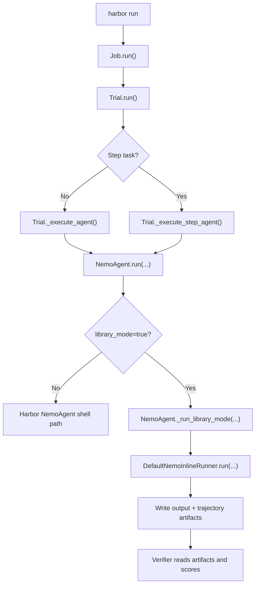
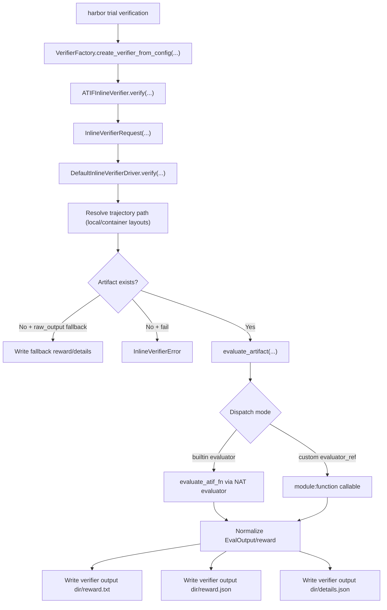

<!--
SPDX-FileCopyrightText: Copyright (c) 2026, NVIDIA CORPORATION & AFFILIATES. All rights reserved.
SPDX-License-Identifier: Apache-2.0

Licensed under the Apache License, Version 2.0 (the "License");
you may not use this file except in compliance with the License.
You may obtain a copy of the License at

http://www.apache.org/licenses/LICENSE-2.0

Unless required by applicable law or agreed to in writing, software
distributed under the License is distributed on an "AS IS" BASIS,
WITHOUT WARRANTIES OR CONDITIONS OF ANY KIND, either express or implied.
See the License for the specific language governing permissions and
limitations under the License.
-->

# nvidia-nat-harbor

`nvidia-nat-harbor` integrates [Harbor](https://github.com/NVIDIA/harbor) evaluation runs with NVIDIA NeMo Agent Toolkit (NAT) workflows and evaluators.

This package provides:

- A NAT-backed Harbor agent (`NemoAgent`)
- A host-local Harbor environment implementation (`LocalEnvironment`)
- An inline ATIF verifier class for Harbor verifier import hooks (`ATIFInlineVerifier`)
- ATIF verifier bridge utilities for script-based compatibility (`nat_harbor.verifier.bridge_runner`)
- Library-mode contracts and implementations for inline agent/verifier execution

## Python and dependencies

- Python: `>=3.12,<3.14`
- Core dependencies:
  - `nvidia-nat-core`
  - `nvidia-nat-eval`
  - `harbor>=0.5.0`

## Install (editable, monorepo workflow)

From repo root:

```bash
uv sync --active
```

Install sample workflow packages used by the simple calculator Harbor examples:

```bash
uv pip install -e examples/getting_started/simple_calculator
uv pip install -e examples/evaluation_and_profiling/simple_calculator_eval
```

## Current environment mode behavior

`harbor run --env local` is not accepted by current Harbor CLI enum validation.

Use this supported workaround:

- Set `--env docker`
- Set `--environment-import-path nat_harbor.environments.local:LocalEnvironment`

This keeps execution host-local through the imported environment class while satisfying Harbor CLI validation.

This is a temporary compatibility path. Once first-class local environment support is upstreamed in Harbor, this workaround can be dropped in favor of direct `--env local` usage. See [`upstream-plan.md`](./upstream-plan.md).

## Execution modes

The examples use three related but separate concepts:

| Term | How it is selected | What runs on the host |
|---|---|---|
| Local environment | `--environment-import-path nat_harbor.environments.local:LocalEnvironment` with the temporary `--env docker` workaround | Harbor environment operations and shell commands |
| Shell compatibility mode | Default `NemoAgent` behavior when `library_mode` is not set | The NAT wrapper subprocess and task `tests/test.sh` |
| Library mode | `--ak library_mode=true` | NAT workflow execution in-process through the active Harbor Python |
| Inline verifier | `--verifier-import-path nat_harbor.verifier.inline_verifier:ATIFInlineVerifier` | ATIF evaluator dispatch in-process through the active Harbor Python |

For new local development, prefer **local environment + library mode + inline verifier**. Shell compatibility mode is useful for parity checks against script-based Harbor tasks, but it needs explicit host Python wiring because the agent wrapper and `tests/test.sh` are subprocesses.

The local environment backend is for developer iteration, not benchmark
isolation. It uses best-effort path translation to keep expected Harbor
artifacts under the trial directory, but it still executes host processes.

For shell compatibility runs, point both the agent wrapper and verifier script at the repo virtual environment:

```bash
HOST_PYTHON="$(pwd)/.venv/bin/python"

PATH="$(dirname "$HOST_PYTHON"):$PATH" \
harbor run \
  ... \
  --ak python_bin="$HOST_PYTHON" \
  --ve NAT_HARBOR_PYTHON_BIN="$HOST_PYTHON"
```

## Inline execution mode

`library_mode=true` enables inline agent execution for `NemoAgent`.

Enable it with:

```bash
--ak library_mode=true
```

Inline verifier execution is configured through Harbor's verifier import hook:

```bash
--verifier-import-path nat_harbor.verifier.inline_verifier:ATIFInlineVerifier
```

This requires Harbor verifier import-hook support (`harbor.verifier.factory`,
`VerifierConfig.import_path`, and the `--verifier-import-path` CLI flag).
Until that hook is available in a released Harbor version, use the Harbor side
branch as an editable source checkout:

```bash
git clone https://github.com/AnuradhaKaruppiah/harbor.git external/harbor
git -C external/harbor checkout ak-harbor-libary-mode
uv pip install -e external/harbor
```

If `external/harbor` already exists, update it to the side branch instead of
cloning again. Do not patch the Harbor files inside `.venv` or
`site-packages`; `uv sync` or a reinstall can overwrite those changes.

You can confirm the active Harbor CLI has the hook with:

```bash
harbor run --help | rg "verifier-import|verifier-kwarg"
```

Then pass evaluator selection via verifier env flags, for example:

```bash
--ve NAT_HARBOR_ATIF_EVALUATOR_KIND=trajectory
--ve NAT_HARBOR_ATIF_CONFIG_FILE=<path-to-eval-config>
--ve NAT_HARBOR_ATIF_EVALUATOR_NAME=<registered-evaluator-name>
```

Use `nat_harbor.verifier.bridge_runner` only for script-based compatibility paths.

### Trial runner flow



### Verifier inline flow



`nat_harbor.verifier.bridge_runner` remains available for script-based compatibility flows and is intentionally not shown in this primary inline diagram.

## How to run (simple calculator examples)

Run all commands from the repository root with the repo virtual environment
active, or call `.venv/bin/harbor` explicitly.

### 1) Run adapter to set up the Harbor dataset

```bash
python examples/evaluation_and_profiling/simple_calculator_eval/harbor_adapters/simple_calculator_nested/run_adapter.py \
  --output-dir .tmp/harbor/datasets/simple-calculator-nested \
  --overwrite
```

### 2) Run a single task in library mode using NAT workflow config

This uses NAT workflow config:
`examples/evaluation_and_profiling/simple_calculator_eval/configs/config-nested-harbor-eval.yaml`

```bash
rm -rf .tmp/harbor/jobs-local/sc-nested-library-inline-smoke

harbor run \
  --path .tmp/harbor/datasets/simple-calculator-nested \
  -l 1 \
  --job-name sc-nested-library-inline-smoke \
  --jobs-dir .tmp/harbor/jobs-local \
  --yes -n 1 --max-retries 1 \
  --agent-import-path nat_harbor.agents.installed.nemo_agent:NemoAgent \
  --environment-import-path nat_harbor.environments.local:LocalEnvironment \
  --verifier-import-path nat_harbor.verifier.inline_verifier:ATIFInlineVerifier \
  --env docker \
  --model nvidia/nemotron-3-nano-30b-a3b \
  --ak config_file=examples/evaluation_and_profiling/simple_calculator_eval/configs/config-nested-harbor-eval.yaml \
  --ak local_install_policy=skip \
  --ak library_mode=true \
  --ve NAT_HARBOR_ATIF_EVALUATOR_KIND=trajectory \
  --ve NAT_HARBOR_ATIF_CONFIG_FILE=examples/evaluation_and_profiling/simple_calculator_eval/src/nat_simple_calculator_eval/configs/config-nested-trajectory-eval.yml \
  --ve NAT_HARBOR_ATIF_EVALUATOR_NAME=trajectory_eval
```

### 3) Run all tasks in library mode

```bash
rm -rf .tmp/harbor/jobs-local/sc-nested-library-inline

harbor run \
  --path .tmp/harbor/datasets/simple-calculator-nested \
  --job-name sc-nested-library-inline \
  --jobs-dir .tmp/harbor/jobs-local \
  --yes -n 1 --max-retries 1 \
  --agent-import-path nat_harbor.agents.installed.nemo_agent:NemoAgent \
  --environment-import-path nat_harbor.environments.local:LocalEnvironment \
  --verifier-import-path nat_harbor.verifier.inline_verifier:ATIFInlineVerifier \
  --env docker \
  --model nvidia/nemotron-3-nano-30b-a3b \
  --ak config_file=examples/evaluation_and_profiling/simple_calculator_eval/configs/config-nested-harbor-eval.yaml \
  --ak local_install_policy=skip \
  --ak library_mode=true \
  --ve NAT_HARBOR_ATIF_EVALUATOR_KIND=trajectory \
  --ve NAT_HARBOR_ATIF_CONFIG_FILE=examples/evaluation_and_profiling/simple_calculator_eval/src/nat_simple_calculator_eval/configs/config-nested-trajectory-eval.yml \
  --ve NAT_HARBOR_ATIF_EVALUATOR_NAME=trajectory_eval
```

## Package layout

- `src/nat_harbor/agents/installed/nemo_agent.py`: NAT Harbor agent subclass
- `src/nat_harbor/agents/installed/inline_runner.py`: default inline NAT workflow runner
- `src/nat_harbor/environments/local.py`: host-local environment implementation
- `src/nat_harbor/verifier/inline_verifier.py`: Harbor inline verifier class, driver, and contracts
- `src/nat_harbor/verifier/bridge_runner.py`: legacy CLI entrypoint for script-based verifier bridge

## Additional example docs

For end-to-end Harbor example commands and evaluator lane variants, see:

- `examples/evaluation_and_profiling/simple_calculator_eval/harbor-eval-readme.md`
