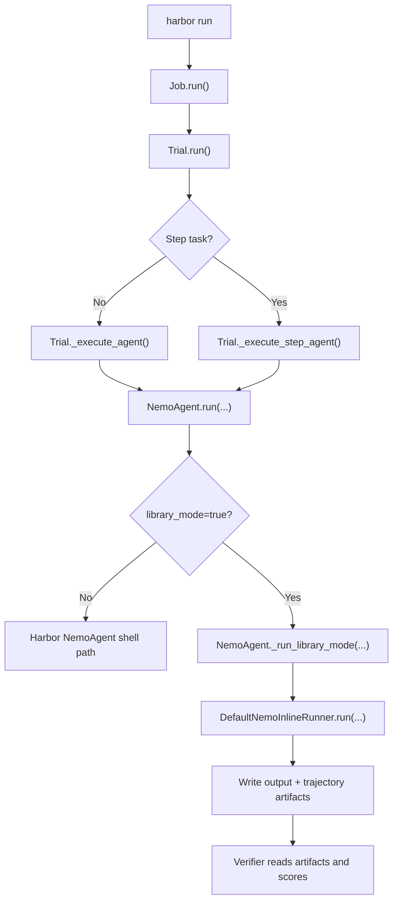
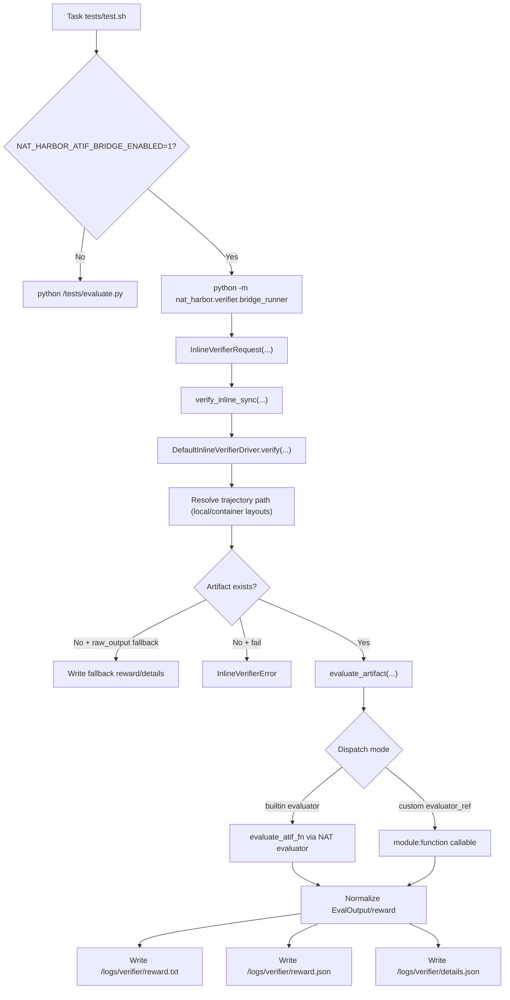

<!--
SPDX-FileCopyrightText: Copyright (c) 2026, NVIDIA CORPORATION & AFFILIATES. All rights reserved.
SPDX-License-Identifier: Apache-2.0

Licensed under the Apache License, Version 2.0 (the "License");
you may not use this file except in compliance with the License.
You may obtain a copy of the License at

http://www.apache.org/licenses/LICENSE-2.0

Unless required by applicable law or agreed to in writing, software
distributed under the License is distributed on an "AS IS" BASIS,
WITHOUT WARRANTIES OR CONDITIONS OF ANY KIND, either express or implied.
See the License for the specific language governing permissions and
limitations under the License.
-->

# nvidia-nat-harbor

`nvidia-nat-harbor` integrates [Harbor](https://github.com/NVIDIA/harbor) evaluation runs with NVIDIA NeMo Agent Toolkit (NAT) workflows and evaluators.

This package provides:

- A NAT-backed Harbor agent (`NemoAgent`)
- A host-local Harbor environment implementation (`LocalEnvironment`)
- ATIF verifier bridge utilities for NAT evaluators (`nat_harbor.verifier.bridge_runner`)
- Library-mode contracts and implementations for inline agent/verifier execution

## Python and dependencies

- Python: `>=3.12,<3.14`
- Core dependencies:
  - `nvidia-nat-core`
  - `nvidia-nat-eval`
  - `harbor>=0.5.0`

## Install (editable, monorepo workflow)

From repo root:

```bash
uv sync --active
```

Install sample workflow packages used by the simple calculator Harbor examples:

```bash
uv pip install -e examples/getting_started/simple_calculator
uv pip install -e examples/evaluation_and_profiling/simple_calculator_eval
```

## Current environment mode behavior

`harbor run --env local` is not accepted by current Harbor CLI enum validation.

Use this supported workaround:

- Set `--env docker`
- Set `--environment-import-path nat_harbor.environments.local:LocalEnvironment`

This keeps execution host-local through the imported environment class while satisfying Harbor CLI validation.

## Library mode

Library mode enables an inline execution path for NAT agent and verifier logic.

Enable it with:

```bash
--ak library_mode=true
```

When using ATIF bridge scoring, also pass verifier env flags, for example:

```bash
--ve NAT_HARBOR_ATIF_BRIDGE_ENABLED=1
--ve NAT_HARBOR_ATIF_EVALUATOR_KIND=trajectory
--ve NAT_HARBOR_ATIF_CONFIG_FILE=<path-to-eval-config>
--ve NAT_HARBOR_ATIF_EVALUATOR_NAME=<registered-evaluator-name>
```

### Trial runner flow



### Verifier library-mode flow



## How to run (simple calculator examples)

Run all commands from repository root.

### 1) Run adapter to set up the Harbor dataset

```bash
python examples/evaluation_and_profiling/simple_calculator_eval/harbor_adapters/simple_calculator_nested/run_adapter.py \
  --output-dir .tmp/harbor/datasets/simple-calculator-nested \
  --overwrite
```

### 2) Run a single task in library mode using NAT workflow config

This uses NAT workflow config:
`examples/evaluation_and_profiling/simple_calculator_eval/configs/config-nested-harbor-eval.yaml`

```bash
rm -rf .tmp/harbor/jobs-local/sc-nested-library-inline-smoke

harbor run \
  --path .tmp/harbor/datasets/simple-calculator-nested \
  -l 1 \
  --job-name sc-nested-library-inline-smoke \
  --jobs-dir .tmp/harbor/jobs-local \
  --yes -n 1 --max-retries 1 \
  --agent-import-path nat_harbor.agents.installed.nemo_agent:NemoAgent \
  --environment-import-path nat_harbor.environments.local:LocalEnvironment \
  --env docker \
  --model nvidia/nemotron-3-nano-30b-a3b \
  --ak config_file=examples/evaluation_and_profiling/simple_calculator_eval/configs/config-nested-harbor-eval.yaml \
  --ak local_install_policy=skip \
  --ak library_mode=true \
  --ve NAT_HARBOR_ATIF_BRIDGE_ENABLED=1 \
  --ve NAT_HARBOR_ATIF_EVALUATOR_KIND=trajectory \
  --ve NAT_HARBOR_ATIF_CONFIG_FILE=examples/evaluation_and_profiling/simple_calculator_eval/src/nat_simple_calculator_eval/configs/config-nested-trajectory-eval.yml \
  --ve NAT_HARBOR_ATIF_EVALUATOR_NAME=trajectory_eval
```

### 3) Run all tasks in library mode

```bash
rm -rf .tmp/harbor/jobs-local/sc-nested-library-inline

harbor run \
  --path .tmp/harbor/datasets/simple-calculator-nested \
  --job-name sc-nested-library-inline \
  --jobs-dir .tmp/harbor/jobs-local \
  --yes -n 1 --max-retries 1 \
  --agent-import-path nat_harbor.agents.installed.nemo_agent:NemoAgent \
  --environment-import-path nat_harbor.environments.local:LocalEnvironment \
  --env docker \
  --model nvidia/nemotron-3-nano-30b-a3b \
  --ak config_file=examples/evaluation_and_profiling/simple_calculator_eval/configs/config-nested-harbor-eval.yaml \
  --ak local_install_policy=skip \
  --ak library_mode=true \
  --ve NAT_HARBOR_ATIF_BRIDGE_ENABLED=1 \
  --ve NAT_HARBOR_ATIF_EVALUATOR_KIND=trajectory \
  --ve NAT_HARBOR_ATIF_CONFIG_FILE=examples/evaluation_and_profiling/simple_calculator_eval/src/nat_simple_calculator_eval/configs/config-nested-trajectory-eval.yml \
  --ve NAT_HARBOR_ATIF_EVALUATOR_NAME=trajectory_eval
```

## Package layout

- `src/nat_harbor/agents/installed/nemo_agent.py`: NAT Harbor agent subclass
- `src/nat_harbor/agents/installed/inline_runner.py`: default inline NAT workflow runner
- `src/nat_harbor/environments/local.py`: host-local environment implementation
- `src/nat_harbor/verifier/bridge_runner.py`: CLI entrypoint used by Harbor verifier scripts
- `src/nat_harbor/verifier/library_mode.py`: inline verifier driver and contracts

## Additional example docs

For end-to-end Harbor example commands and evaluator lane variants, see:

- `examples/evaluation_and_profiling/simple_calculator_eval/harbor-eval-readme.md`

