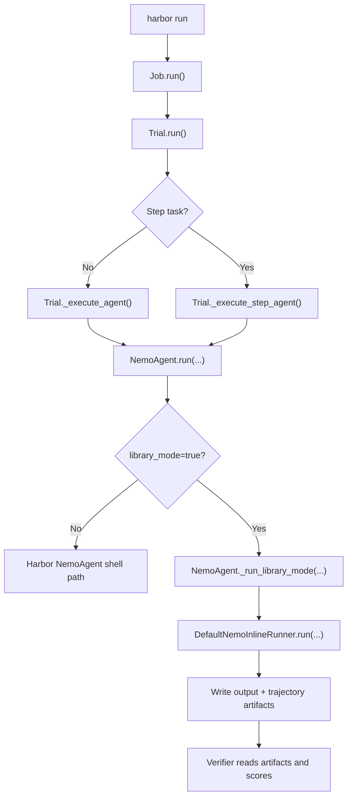
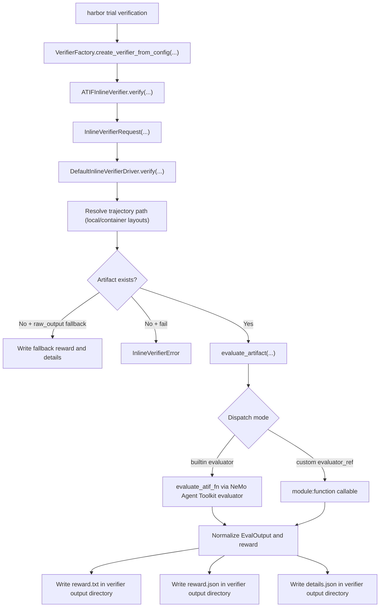

<!--
SPDX-FileCopyrightText: Copyright (c) 2026, NVIDIA CORPORATION & AFFILIATES. All rights reserved.
SPDX-License-Identifier: Apache-2.0

Licensed under the Apache License, Version 2.0 (the "License");
you may not use this file except in compliance with the License.
You may obtain a copy of the License at

http://www.apache.org/licenses/LICENSE-2.0

Unless required by applicable law or agreed to in writing, software
distributed under the License is distributed on an "AS IS" BASIS,
WITHOUT WARRANTIES OR CONDITIONS OF ANY KIND, either express or implied.
See the License for the specific language governing permissions and
limitations under the License.
-->

# `nvidia-nat-harbor`

`nvidia-nat-harbor` integrates [Harbor](https://github.com/harbor-framework/harbor) evaluation runs with NVIDIA NeMo Agent Toolkit workflows and evaluators.

Use this README for package setup, execution-mode concepts, and a short
library-mode smoke path. The simple calculator example cookbook and
adapter guide are linked at the end. For a short discussion-oriented overview,
see [`harbor-library-mode.md`](./harbor-library-mode.md).

This package provides:

- A NeMo Agent Toolkit-backed Harbor agent (`NemoAgent`)
- A host-local Harbor environment implementation (`LocalEnvironment`)
- An inline ATIF verifier class for Harbor verifier import hooks (`ATIFInlineVerifier`)
- ATIF verifier bridge utilities for script-based compatibility (`nat_harbor.verifier.bridge_runner`)
- Library-mode contracts and implementations for inline agent and verifier execution

## Python and dependencies

- Python: `>=3.12,<3.14`
- Core dependencies:
  - `nvidia-nat-core`
  - `nvidia-nat-eval`
  - `harbor>=0.5.0`

## Install (Editable Repository Workflow)

From repo root:

```bash
uv venv --python 3.13 --seed .venv
source .venv/bin/activate
```

Then install the Harbor integration package:

```bash
uv pip install -e packages/nvidia_nat_harbor
```

Install the Harbor side branch used by the inline verifier examples:

```bash
git clone https://github.com/AnuradhaKaruppiah/harbor.git external/harbor
git -C external/harbor checkout ak-harbor-libary-mode
uv pip install -e external/harbor
```

If `external/harbor` already exists, update it to the side branch instead of
cloning again. Do not patch the Harbor files inside `.venv` or
`site-packages`; `uv sync` or a reinstall can overwrite those changes.

Install sample workflow packages used by the simple calculator Harbor examples:

```bash
uv pip install -e examples/getting_started/simple_calculator
uv pip install -e examples/evaluation_and_profiling/simple_calculator_eval
```

## Phoenix tracing

The simple calculator configuration files used below enable Phoenix tracing at
`http://localhost:6006/v1/traces`. Start Phoenix in a separate terminal before
running those examples:

```bash
uv venv --python 3.13 --seed .venv-phoenix
source .venv-phoenix/bin/activate
uv pip install arize-phoenix
phoenix serve
```

## Current environment mode behavior

`harbor run --env local` is not accepted by current Harbor CLI enumeration validation.

Use this supported workaround:

- Set `--env docker`
- Set `--environment-import-path nat_harbor.environments.local:LocalEnvironment`

This keeps execution host-local through the imported environment class while satisfying Harbor CLI validation.

This is a temporary compatibility path. Once first-class local environment support is accepted upstream in Harbor, this workaround can be dropped in favor of direct `--env local` usage. See [`upstream-plan.md`](./upstream-plan.md).

## Execution modes

The examples use three related but separate concepts:

| Term | How it is selected | What runs on the host |
|---|---|---|
| Local environment | `--environment-import-path nat_harbor.environments.local:LocalEnvironment` with the temporary `--env docker` workaround | Harbor environment operations and shell commands |
| Shell compatibility mode | Default `NemoAgent` behavior when `library_mode` is not set | The NeMo Agent Toolkit wrapper process and task verifier script |
| Library mode | `--ak library_mode=true` | NeMo Agent Toolkit workflow execution in-process through the active Harbor Python |
| Inline verifier | `--verifier-import-path nat_harbor.verifier.inline_verifier:ATIFInlineVerifier` | ATIF evaluator dispatch in-process through the active Harbor Python |

For new local development, prefer **local environment + library mode + inline verifier**. Shell compatibility mode is useful for parity checks against script-based Harbor tasks, but it needs explicit host Python wiring because the agent wrapper and task verifier script run as child processes.

The local environment backend is for developer iteration, not benchmark
isolation. It uses best-effort path translation to keep expected Harbor
artifacts under the trial directory, but it still executes host processes.

For shell compatibility runs, point both the agent wrapper and verifier script at the repo virtual environment:

```bash
NAT_HARBOR_HOST_PYTHON="$(pwd)/.venv/bin/python"

PATH="$(dirname "$NAT_HARBOR_HOST_PYTHON"):$PATH" \
harbor run \
  ... \
  --ak python_bin="$NAT_HARBOR_HOST_PYTHON" \
  --ve NAT_HARBOR_PYTHON_BIN="$NAT_HARBOR_HOST_PYTHON"
```

## Inline execution mode

`library_mode=true` enables inline agent execution for `NemoAgent`.

Enable it with:

```bash
--ak library_mode=true
```

Inline verifier execution is configured through the Harbor verifier import hook:

```bash
--verifier-import-path nat_harbor.verifier.inline_verifier:ATIFInlineVerifier
```

This requires Harbor verifier import-hook support (`harbor.verifier.factory`,
`VerifierConfig.import_path`, and the `--verifier-import-path` CLI flag).
Until that hook is available in a released Harbor version, use the Harbor side
branch as an editable source checkout:

```bash
uv pip install -e external/harbor
```

See the install section for the full checkout command.

You can confirm the active Harbor CLI has the hook with:

```bash
harbor run --help | rg "verifier-import|verifier-kwarg"
```

Then pass evaluator selection via verifier environment flags, for example:

```bash
--ve NAT_HARBOR_ATIF_EVALUATOR_KIND=trajectory
--ve NAT_HARBOR_ATIF_CONFIG_FILE=<path-to-eval-config>
--ve NAT_HARBOR_ATIF_EVALUATOR_NAME=<registered-evaluator-name>
--ve NAT_HARBOR_ATIF_EVALUATOR_TIMEOUT_SEC=600
```

Use `nat_harbor.verifier.bridge_runner` only for script-based compatibility paths.

Inline library-mode execution temporarily overlays per-trial environment
variables while invoking the NeMo Agent Toolkit workflow in-process. Because `os.environ` is
process-global, `DefaultNemoInlineRunner` serializes that environment overlay
with an async lock. This keeps concurrent inline trials from reading verifier
or agent environment settings from another trial while still preserving the
normal Harbor artifact layout.

### Trial runner flow



### Verifier inline flow



`nat_harbor.verifier.bridge_runner` remains available for script-based compatibility flows and is intentionally not shown in this primary inline diagram.

## How to run (simple calculator examples)

Run all commands from the repository root. This section shows the shortest
power-of-two trajectory path for checking the integration. For shell compatibility,
tunable-rag, and custom-evaluator variants, use the detailed command README
linked below.

Set the shared paths once:

```bash
NAT_HARBOR_POWER_OF_TWO_ADAPTER=examples/evaluation_and_profiling/simple_calculator_eval/harbor_adapters/simple_calculator_power_of_two/run_adapter.py
NAT_HARBOR_POWER_OF_TWO_DATASET_DIR=.tmp/harbor/datasets/simple-calculator-power-of-two
NAT_HARBOR_JOBS_DIR=.tmp/harbor/jobs-local
NAT_HARBOR_TRAJECTORY_CONFIG=examples/evaluation_and_profiling/simple_calculator_eval/configs/config-nested-trajectory-eval.yml
export NVIDIA_API_KEY=<your-api-key>
```

### 1) Run adapter to set up the Harbor dataset

```bash
python "$NAT_HARBOR_POWER_OF_TWO_ADAPTER" \
  --output-dir "$NAT_HARBOR_POWER_OF_TWO_DATASET_DIR" \
  --overwrite
```

### 2) Run a single task in library mode using NeMo Agent Toolkit workflow config

```bash
rm -rf "$NAT_HARBOR_JOBS_DIR/sc-power-of-two-library-inline-smoke"

.venv/bin/harbor run \
  --path "$NAT_HARBOR_POWER_OF_TWO_DATASET_DIR" \
  -l 1 \
  --job-name sc-power-of-two-library-inline-smoke \
  --jobs-dir "$NAT_HARBOR_JOBS_DIR" \
  --yes -n 1 --max-retries 1 \
  --agent-import-path nat_harbor.agents.installed.nemo_agent:NemoAgent \
  --environment-import-path nat_harbor.environments.local:LocalEnvironment \
  --verifier-import-path nat_harbor.verifier.inline_verifier:ATIFInlineVerifier \
  --env docker \
  --model nvidia/nemotron-3-nano-30b-a3b \
  --ak config_file="$NAT_HARBOR_TRAJECTORY_CONFIG" \
  --ak local_install_policy=skip \
  --ak library_mode=true \
  --ve NAT_HARBOR_ATIF_EVALUATOR_KIND=trajectory \
  --ve NAT_HARBOR_ATIF_CONFIG_FILE="$NAT_HARBOR_TRAJECTORY_CONFIG" \
  --ve NAT_HARBOR_ATIF_EVALUATOR_NAME=trajectory_eval
```

### 3) Run all tasks in library mode

```bash
rm -rf "$NAT_HARBOR_JOBS_DIR/sc-power-of-two-library-inline"

.venv/bin/harbor run \
  --path "$NAT_HARBOR_POWER_OF_TWO_DATASET_DIR" \
  --job-name sc-power-of-two-library-inline \
  --jobs-dir "$NAT_HARBOR_JOBS_DIR" \
  --yes -n 1 --max-retries 1 \
  --agent-import-path nat_harbor.agents.installed.nemo_agent:NemoAgent \
  --environment-import-path nat_harbor.environments.local:LocalEnvironment \
  --verifier-import-path nat_harbor.verifier.inline_verifier:ATIFInlineVerifier \
  --env docker \
  --model nvidia/nemotron-3-nano-30b-a3b \
  --ak config_file="$NAT_HARBOR_TRAJECTORY_CONFIG" \
  --ak local_install_policy=skip \
  --ak library_mode=true \
  --ve NAT_HARBOR_ATIF_EVALUATOR_KIND=trajectory \
  --ve NAT_HARBOR_ATIF_CONFIG_FILE="$NAT_HARBOR_TRAJECTORY_CONFIG" \
  --ve NAT_HARBOR_ATIF_EVALUATOR_NAME=trajectory_eval
```

## Related docs

- [Harbor library mode discussion guide](./harbor-library-mode.md)
- [Simple calculator example cookbook](../../examples/evaluation_and_profiling/simple_calculator_eval/harbor-eval-readme.md)
- [Simple calculator Harbor adapter guide](../../examples/evaluation_and_profiling/simple_calculator_eval/harbor_adapters/README.md)

## Third-Party Notices

`nvidia-nat-harbor` depends on Harbor and its resolved dependency set. The
Harbor lockfile currently resolves `pathspec==1.1.0`, which is licensed under
the Mozilla Public License Version 2.0 (`MPL-2.0`).

- [pathspec third-party notice](./third_party/notices/pathspec-1.1.0.md)
- [as-received third-party source package](./third_party/source/pathspec-1.1.0.tar.gz)
