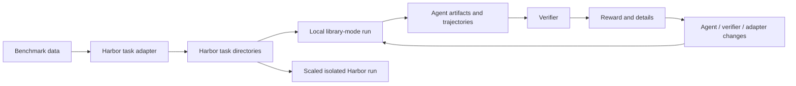
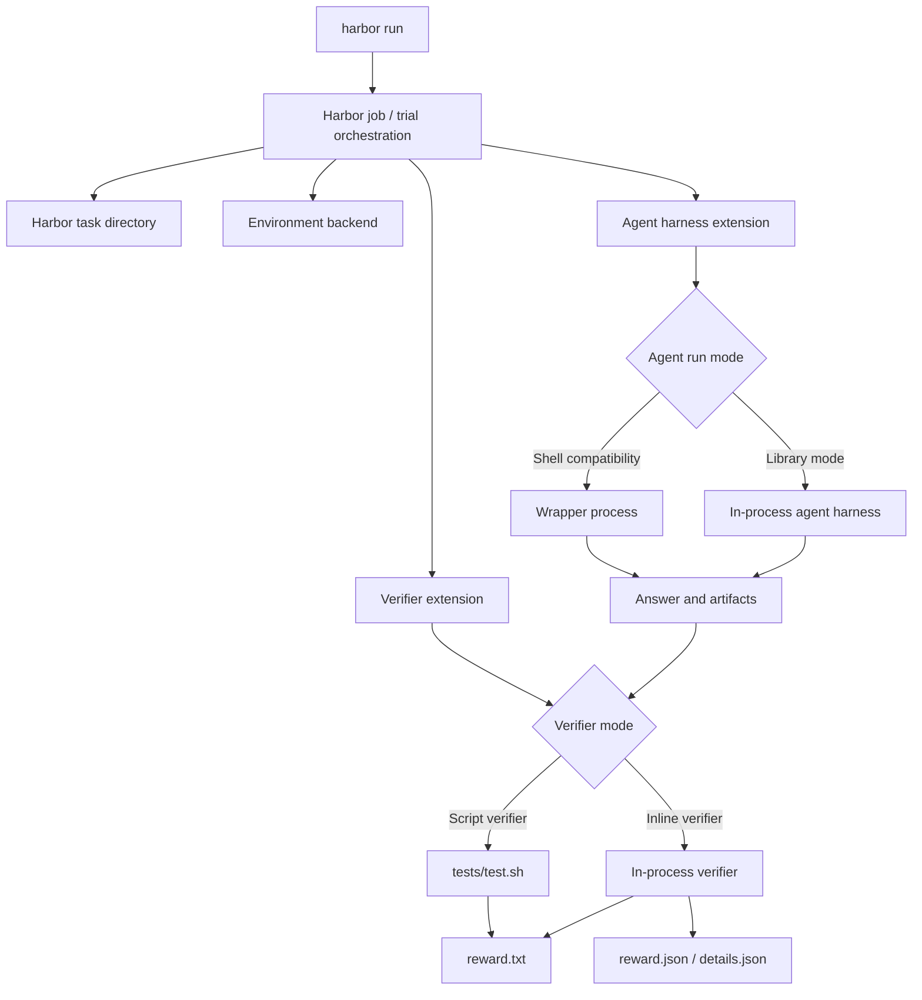

<!--
SPDX-FileCopyrightText: Copyright (c) 2026, NVIDIA CORPORATION & AFFILIATES. All rights reserved.
SPDX-License-Identifier: Apache-2.0

Licensed under the Apache License, Version 2.0 (the "License");
you may not use this file except in compliance with the License.
You may obtain a copy of the License at

http://www.apache.org/licenses/LICENSE-2.0

Unless required by applicable law or agreed to in writing, software
distributed under the License is distributed on an "AS IS" BASIS,
WITHOUT WARRANTIES OR CONDITIONS OF ANY KIND, either express or implied.
See the License for the specific language governing permissions and
limitations under the License.
-->

# Harbor Library Mode for Evaluation-Driven Development

This document is a short discussion guide for Harbor library mode. It is meant
for internal design review, Discord/social discussion, and socializing the idea
with partner teams.

`nvidia-nat-harbor` is the current reference implementation for the Harbor
NeMo Agent integration. The intended Harbor pattern is broader: any
Harbor-enabled agent harness should be able to participate if it can expose a
Harbor agent adapter and, optionally, an in-process runner.

For commands and implementation details, use the reference docs at the end.

## Purpose

Harbor library mode is a development path for building agents, verifiers, and
benchmark adapters against Harbor's task and artifact model before running at
scale.

It addresses two related needs:

| Need | Why it matters |
|---|---|
| Run agent harnesses and verifiers inline | Developers can use normal Python debugging, structured logging, and direct runtime APIs instead of debugging only through shell wrappers. |
| Preserve Harbor task shape during local iteration | The same task directories, artifacts, and reward outputs can be used for local development and later isolated/scaled execution. |

The development loop is:

1. Convert benchmark data into Harbor task directories.
2. Run a Harbor-enabled agent harness against those tasks locally.
3. Score outputs with an inline verifier or a script verifier.
4. Inspect artifacts, trajectories, rewards, and failures.
5. Fix the agent harness, config, adapter, or verifier.
6. Reuse the same task shape for larger isolated runs.

The loop below is intentionally generic. The same shape should work for NeMo
Agent, OpenHands-style harnesses, or any other agent harness that can read
Harbor task directories and write Harbor trial artifacts.

Local mode is a development backend. It executes host processes and should not
be described as benchmark isolation.

## 1. How To Build Any Agent Or Verifier In Library Mode

Library mode is a Harbor extension pattern, not a NeMo Agent-only contract. The
agent harness and verifier decide how to run in-process; Harbor
provides the orchestration, task layout, artifact layout, and extension hooks.

### Agent Harness Contract

A library-mode agent harness needs to provide:

| Requirement | Description |
|---|---|
| Harbor agent adapter | An importable agent class that Harbor can construct for a trial. |
| Run-mode selection | A way to select shell compatibility mode, library mode, or another future mode. |
| In-process runner | A function or class that invokes the harness runtime inside the active Harbor Python process. |
| Task input mapping | Logic that maps Harbor task files and metadata into the harness input format. |
| Artifact writer | Logic that writes answer, logs, trajectory, and harness-specific artifacts into the Harbor trial layout. |
| Error reporting | Clear failures when configuration, inputs, credentials, or required artifacts are missing. |

Shell compatibility mode can remain available for existing Harbor tasks. Library
mode adds a faster path for development without removing the script-oriented
path.

### Verifier Contract

A library-mode verifier needs to provide:

| Requirement | Description |
|---|---|
| Importable verifier class | A verifier class loaded through Harbor's verifier import hook. |
| Artifact reader | Logic that reads the agent output and any required artifact files from the trial layout. |
| Scoring function | A direct in-process scorer, evaluator, or adapter into an external scoring library. |
| Reward writer | `reward.txt` for Harbor aggregation, with optional structured files such as `reward.json` and `details.json`. |
| Failure behavior | Explicit behavior for missing artifacts, invalid inputs, evaluator errors, and retryable failures. |

The verifier contract should stay generic. ATIF is one possible verifier/evaluator
implementation used by the NeMo Agent reference path; it should not be
treated as the primary Harbor contract.

### Generic Library Mode Contract

At a high level, Harbor remains the evaluation orchestrator. Agent harnesses
and verifier implementations provide runtime-specific behavior through
extension points.

## 2. NeMo Agent Reference Implementation

`nvidia-nat-harbor` shows one concrete implementation of the generic pattern
above.

Editable source:
<https://lucid.app/lucidchart/3c46c4a3-01f3-4077-a210-630da7c36324/edit?invitationId=inv_4c5860e4-22e9-45e0-a1b7-98d622785b98&page=0_0#>

### Reference Agent

| Area | NeMo Agent implementation |
|---|---|
| Harbor agent adapter | `nat_harbor.agents.installed.nemo_agent:NemoAgent` |
| Shell compatibility mode | Existing Harbor-style wrapper process path. |
| Library mode | `--ak library_mode=true` selects in-process workflow execution. |
| In-process runner | `DefaultNemoInlineRunner` invokes the NeMo Agent workflow config in the active Harbor Python process. |
| Artifact behavior | Writes output and trajectory artifacts into the Harbor trial layout for verifier consumption. |

### Reference Verifiers

| Verifier path | Purpose |
|---|---|
| Inline verifier | `nat_harbor.verifier.inline_verifier:ATIFInlineVerifier` loads NeMo Agent evaluator logic in-process. |
| Built-in evaluator lanes | Current examples cover trajectory and tunable-rag evaluator paths. |
| Custom evaluator callable | Examples can dispatch to `module:function` evaluators for lightweight task-specific scoring. |
| Script bridge | `nat_harbor.verifier.bridge_runner` preserves compatibility with `tests/test.sh` verifier paths. |

In this reference implementation, ATIF is the NeMo Agent evaluator adapter used
by the inline verifier. Other harnesses should be able to provide their own
verifier implementation without adopting ATIF.

## 3. What Harbor Needs To Enable

The Harbor framework does not need to own every agent harness runtime or
evaluator implementation. It needs generic extension points that allow
integration packages to provide runtime-specific behavior.

| Priority | Harbor capability | Outcome |
|---|---|---|
| P0 | Generic verifier import hook | External packages can provide verifier classes without patching Harbor internals. |
| P1 | First-class local environment mode | Users can select `--env local` directly instead of using a temporary CLI validation workaround. |
| P1 | Local install policy | Local runs can safely skip dependency installation when the developer environment is already prepared. |
| P2 | Agent run-mode extension point | Integrations can select shell mode, library mode, or future modes without baking harness-specific logic into Harbor core. |
| P2 | Stable artifact and path contracts | Agents and verifiers can move between local development and isolated execution without changing task structure. |

Keep Harbor generic:

- job and trial orchestration
- environment lifecycle
- artifact layout
- verifier loading contracts
- agent run-mode plumbing

Keep harness-specific logic in integration packages. For NeMo Agent, that means
keeping these pieces in `nvidia-nat-harbor`:

- workflow config loading and invocation
- ATIF evaluator dispatch
- trajectory artifact construction
- custom evaluator callable support
- NeMo Agent-specific sample coercion and result normalization

## 4. Current Code Changes

This section captures the implementation nuts and bolts. It is intentionally
secondary to the concept above.

### In `nvidia-nat-harbor`

| Area | Current support |
|---|---|
| Agent | `NemoAgent` can run in shell compatibility mode or library mode. |
| Library runner | `DefaultNemoInlineRunner` invokes NeMo Agent workflows in-process. |
| Environment | `LocalEnvironment` provides host-local Harbor execution for development. |
| Verifier | `ATIFInlineVerifier` dispatches built-in or custom ATIF evaluators in-process. |
| Script bridge | `bridge_runner` keeps compatibility with `tests/test.sh` verifier paths. |
| Examples | Simple calculator adapters and E2E commands demonstrate local library mode, inline verifier lanes, and shell compatibility mode. |

### Harbor-Side Support Needed

The current PR depends on Harbor-side verifier import-hook support:

- `VerifierFactory`
- `VerifierConfig.import_path`
- `VerifierConfig.kwargs`
- `--verifier-import-path`
- `--verifier-kwarg`

Until that support lands in a Harbor release, the docs use a Harbor side
branch. First-class `--env local` is also still pending, so current commands use
`--env docker` plus an imported `LocalEnvironment` class as a temporary CLI
validation workaround.

## Discussion References

- Lucid block diagram:
  <https://lucid.app/lucidchart/3c46c4a3-01f3-4077-a210-630da7c36324/edit?invitationId=inv_4c5860e4-22e9-45e0-a1b7-98d622785b98&page=0_0#>
- Package setup and detailed mode notes: [`README.md`](README.md)
- Runnable simple calculator commands:
  [`harbor-eval-readme.md`](../../examples/evaluation_and_profiling/simple_calculator_eval/harbor-eval-readme.md)
- Harbor adapter guide:
  [`harbor_adapters/README.md`](../../examples/evaluation_and_profiling/simple_calculator_eval/harbor_adapters/README.md)
- Detailed upstream plan: [`upstream-plan.md`](upstream-plan.md)
