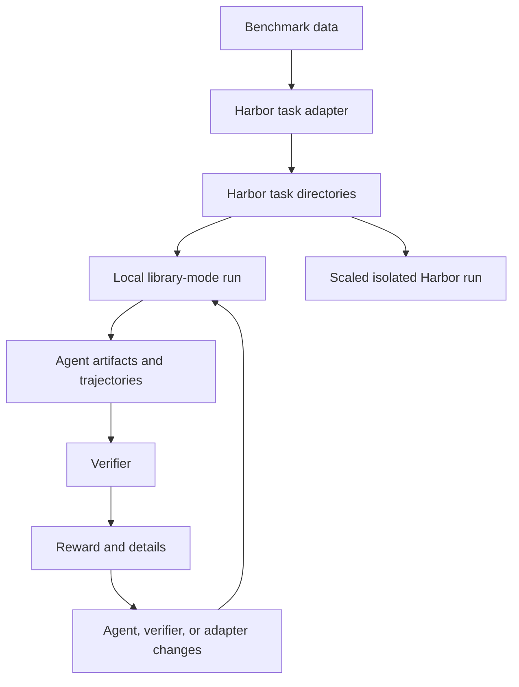
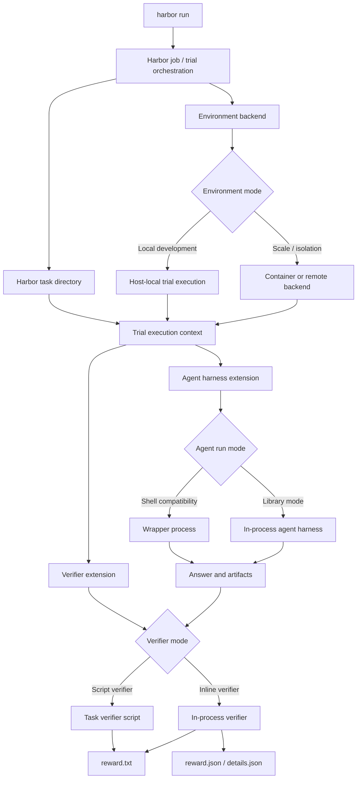

<!--
SPDX-FileCopyrightText: Copyright (c) 2026, NVIDIA CORPORATION & AFFILIATES. All rights reserved.
SPDX-License-Identifier: Apache-2.0

Licensed under the Apache License, Version 2.0 (the "License");
you may not use this file except in compliance with the License.
You may obtain a copy of the License at

http://www.apache.org/licenses/LICENSE-2.0

Unless required by applicable law or agreed to in writing, software
distributed under the License is distributed on an "AS IS" BASIS,
WITHOUT WARRANTIES OR CONDITIONS OF ANY KIND, either express or implied.
See the License for the specific language governing permissions and
limitations under the License.
-->

# Harbor Library Mode for Evaluation-Driven Development

This document is a short discussion guide for Harbor library mode with local
environment support. It is meant for internal design review, Discord
discussion, and socializing the idea with partner teams.

Harbor organizes evaluations as task directories, trial execution, and reward
artifacts. Library mode keeps that Harbor shape, but lets agent harnesses and
verifiers run locally and in-process during development.

The current reference implementation is the `nvidia-nat-harbor` package for the
Harbor NeMo Agent integration. The intended Harbor pattern is broader: any
Harbor-enabled agent harness should be able to participate if it can expose a
Harbor agent adapter and, optionally, an in-process runner.

## Purpose

Harbor library mode is a development path for building agents, verifiers, and
benchmark adapters against Harbor's task and artifact model in a local
environment before running at scale.

It addresses four related needs:

| Need | Why it matters |
|---|---|
| Run Harbor tasks in a local environment | Developers can use the host Python environment, local source checkout, debugger, and credentials while preserving Harbor's task and artifact layout. |
| Run agent harnesses and verifiers inline | Developers can use normal Python debugging, structured logging, and direct runtime APIs instead of debugging only through shell wrappers. |
| Shorten the edit-evaluate loop | Local execution plus in-process agent and verifier paths avoid repeated container setup and extra wrapper processes during development. |
| Preserve Harbor task shape during local iteration | The same task directories, artifacts, and reward outputs can be used for local development and later isolated or scaled execution. |

The development loop is:

1. Convert benchmark data into Harbor task directories.
2. Run a Harbor-enabled agent harness against those tasks locally.
3. Score outputs with an inline verifier or a script verifier.
4. Inspect artifacts, trajectories, rewards, and failures.
5. Fix the agent harness, config, adapter, or verifier.
6. Reuse the same task shape for larger isolated runs.

The loop below is intentionally generic. The same shape should work for NeMo
Agent, OpenHands-style harnesses, or any other agent harness that can read
Harbor task directories and write Harbor trial artifacts.

Local environment mode is the development backend for this loop. It executes
host processes and should not be described as benchmark isolation.

The practical benefit is faster iteration: developers can regenerate a task,
rerun a trial, inspect reward artifacts, and update the agent or verifier
without waiting on container rebuilds or shell-only integration paths.

## 1. How To Run The Local Development Loop

Local library-mode evaluation combines two ideas:

| Layer | Role |
|---|---|
| Local environment | Runs the Harbor trial against the developer's host environment while preserving Harbor task and artifact conventions. |
| Library mode | Lets the selected agent harness and verifier run in-process instead of only through shell wrappers. |

Library mode is a Harbor extension pattern, not a NeMo Agent-only contract. The
agent harness and verifier decide how to run in-process; Harbor provides the
orchestration, task layout, artifact layout, environment backend, and extension
hooks.

### Local Environment Role

A local environment backend needs to provide:

| Requirement | Description |
|---|---|
| Host-local command execution | Run setup, agent, and verifier commands on the developer host when shell compatibility paths are used. |
| Harbor path mapping | Map task, workspace, logs, and tests paths into the local trial directory so artifacts keep the expected Harbor layout. |
| Artifact preservation | Keep outputs, logs, trajectories, rewards, and details under the Harbor job and trial directories. |
| Dependency policy | Allow local runs to skip package installation when the developer environment is already prepared. |
| Clear semantics | Make it explicit that local mode is for development speed and does not provide container isolation. |

### Agent Harness Requirements

A library-mode agent harness needs to provide:

| Requirement | Description |
|---|---|
| Harbor agent adapter | An importable agent class that Harbor can construct for a trial. |
| Run-mode selection | A way to select shell compatibility mode, library mode, or another future mode. |
| In-process runner | A function or class that invokes the harness runtime inside the active Harbor Python process. |
| Task input mapping | Logic that maps Harbor task files and metadata into the harness input format. |
| Artifact writer | Logic that writes answer, logs, trajectory, and harness-specific artifacts into the Harbor trial layout. |
| Error reporting | Clear failures when configuration, inputs, credentials, or required artifacts are missing. |

Shell compatibility mode can remain available for existing Harbor tasks. Library
mode adds a faster path for development without removing the script-oriented
path.

### Verifier Requirements

A library-mode verifier needs to provide:

| Requirement | Description |
|---|---|
| Importable verifier class | A verifier class loaded through Harbor's verifier import hook. |
| Artifact reader | Logic that reads the agent output and any required artifact files from the trial layout. |
| Scoring function | A direct in-process scorer, evaluator, or adapter into an external scoring library. |
| Reward writer | `reward.txt` for Harbor aggregation, with optional structured files such as `reward.json` and `details.json`. |
| Failure behavior | Explicit behavior for missing artifacts, invalid inputs, evaluator errors, and recoverable failures. |

The verifier surface should stay generic: Harbor should load and run verifier
implementations without requiring every harness to adopt the same evaluator
format.

### Generic Local Library-Mode Flow

At a high level, Harbor remains the evaluation orchestrator. Agent harnesses
and verifier implementations provide runtime-specific behavior through
extension points.

### Concurrency Note

Local library-mode runs should keep trial artifacts isolated by job and trial
directory. Any process-global state used by inline execution also needs care.
For example, the NeMo Agent reference runner serializes temporary environment
variable overlays so concurrent inline trials do not read another trial's
agent or verifier settings.

## 2. NeMo Agent Reference Implementation

`nvidia-nat-harbor` shows one concrete implementation of the generic pattern
above.

Editable source:
<https://lucid.app/lucidchart/3c46c4a3-01f3-4077-a210-630da7c36324/edit?invitationId=inv_4c5860e4-22e9-45e0-a1b7-98d622785b98&page=0_0#>

### Reference Agent

| Area | NeMo Agent implementation |
|---|---|
| Harbor agent adapter | `nat_harbor.agents.installed.nemo_agent:NemoAgent` |
| Shell compatibility mode | Existing Harbor-style wrapper process path. |
| Library mode | `--ak library_mode=true` selects in-process workflow execution. |
| In-process runner | `DefaultNemoInlineRunner` invokes the NeMo Agent workflow config in the active Harbor Python process. |
| Artifact behavior | Writes output and trajectory artifacts into the Harbor trial layout for verifier consumption. |

### Reference Verifiers

| Verifier path | Purpose |
|---|---|
| Inline verifier | `nat_harbor.verifier.inline_verifier:ATIFInlineVerifier` loads NeMo Agent evaluator logic in-process. |
| Built-in evaluator lanes | Current examples cover trajectory and tunable-rag evaluator paths. |
| Custom evaluator callable | Examples can dispatch to `module:function` evaluators for lightweight task-specific scoring. |
| Script bridge | `nat_harbor.verifier.bridge_runner` preserves compatibility with task verifier script paths. |

In this reference implementation, ATIF is the NeMo Agent evaluator adapter used
by the inline verifier. Other harnesses should be able to provide their own
verifier implementation without adopting ATIF.

## 3. What Harbor Needs To Enable

The Harbor framework does not need to own every agent harness runtime or
evaluator implementation. The durable change should be in Harbor's extension
surface. NeMo Agent support is the reference consumer, but the Harbor pieces
should stay useful for other agent harnesses and verifier implementations.

| Priority | Harbor capability | Why it matters |
|---|---|---|
| P0 | Generic verifier import hook | External verifier classes can run inline without patching Harbor internals. |
| P1 | First-class local environment mode | Developers can run Harbor tasks locally with `--env local` instead of using a temporary CLI validation workaround. |
| P1 | Local install policy | Local development can reuse a prepared environment without hidden package mutations. |
| P2 | Agent run-mode extension point | Agent harnesses can choose shell compatibility mode, library mode, or future modes without Harbor owning harness-specific runtime logic. |
| P2 | Stable artifact and path contracts | Local development and scaled isolated execution can consume the same task shape. |

The current PR depends on Harbor-side verifier import-hook support:

- `VerifierFactory`
- `VerifierConfig.import_path`
- `VerifierConfig.kwargs`
- `--verifier-import-path`
- `--verifier-kwarg`

First-class `--env local` is still pending, so current commands use `--env
docker` plus an imported `LocalEnvironment` class as a temporary CLI validation
workaround.

Keep Harbor generic:

- job and trial orchestration
- environment lifecycle
- artifact layout
- verifier loading contracts
- agent run-mode plumbing

## 4. Proposed Next Steps

For Harbor maintainers:

- Agree on the generic verifier import-hook shape.
- Decide whether `--env local` should be a first-class Harbor environment mode.
- Decide whether agent run-mode selection should be generic Harbor plumbing or
  agent-specific behavior.

For agent harness owners:

- Identify what is needed to expose a Harbor agent adapter.
- Identify whether the harness can support an in-process library-mode runner.
- Define the verifier artifacts needed for local development and scaled runs.

For NeMo Agent:

- Use `nvidia-nat-harbor` as the reference consumer.
- Keep NeMo Agent-specific workflow loading, evaluator dispatch, and artifact
  shaping outside Harbor core.
