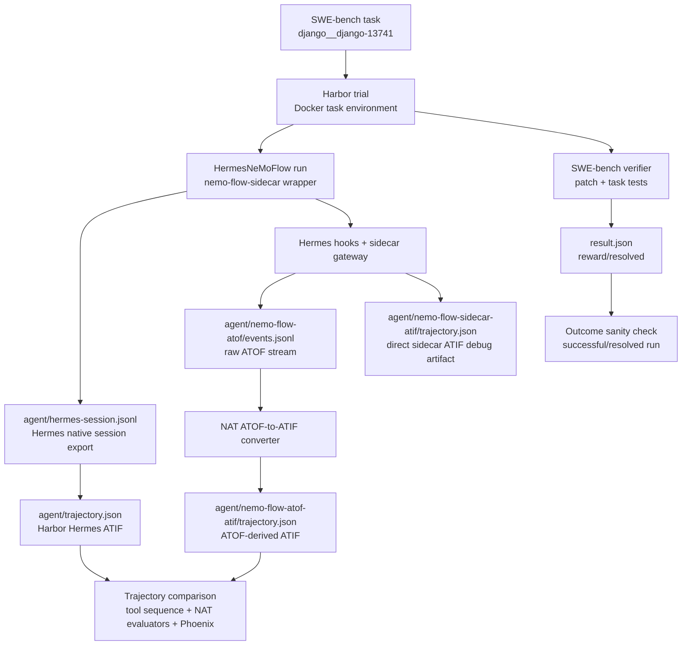

<!--
SPDX-FileCopyrightText: Copyright (c) 2026, NVIDIA CORPORATION & AFFILIATES. All rights reserved.
SPDX-License-Identifier: Apache-2.0

Licensed under the Apache License, Version 2.0 (the "License");
you may not use this file except in compliance with the License.
You may obtain a copy of the License at

http://www.apache.org/licenses/LICENSE-2.0

Unless required by applicable law or agreed to in writing, software
distributed under the License is distributed on an "AS IS" BASIS,
WITHOUT WARRANTIES OR CONDITIONS OF ANY KIND, either express or implied.
See the License for the specific language governing permissions and
limitations under the License.
-->

# Hermes NeMo-Flow Harbor Smoke

This developer workflow runs Hermes Agent on one Harbor SWE-bench task with the
NeMo-Flow sidecar enabled. It validates the first available non-patching Hermes
instrumentation path before the upstream Hermes native middleware path is
available.

The validation pass intentionally matches the OpenCode smoke: NeMo-Flow writes
raw ATOF JSONL, NAT converts that ATOF stream to ATIF after the run, and the
converted trajectory is compared against Harbor's native Hermes ATIF.

## Pipeline



One Hermes run emits three trajectory artifacts:

- Native path: Hermes session export -> Harbor Hermes adapter ->
  `agent/trajectory.json`. This is Harbor's native Hermes trajectory and is
  produced independently of the NeMo-Flow sidecar.
- NeMo-Flow path: Hermes hooks and routed model traffic -> raw ATOF JSONL ->
  NAT ATOF-to-ATIF converter -> `agent/nemo-flow-atof-atif/trajectory.json`.
- Direct sidecar ATIF remains available at
  `agent/nemo-flow-sidecar-atif/trajectory.json` as a secondary debugging
  artifact. This is emitted directly by the sidecar ATIF exporter; it is not
  produced by the ATOF-to-ATIF converter and is not the primary comparison
  target.

## Prerequisites

- Docker is running.
- NAT is checked out to a branch containing
  `nat_harbor.agents.installed.hermes_nemoflow:HermesNeMoFlow`.
- Harbor is installed from the source branch used by the Harbor integration.
- NeMo-Flow is checked out to a branch containing `nemo-flow-sidecar` with
  Hermes support and raw ATOF JSONL export support.

<!-- path-check-skip-begin -->
```bash
mkdir -p external

if [ ! -d external/harbor/.git ]; then
  git clone https://github.com/AnuradhaKaruppiah/harbor.git external/harbor
fi
git -C external/harbor fetch origin
git -C external/harbor checkout ak-harbor-libary-mode

if [ ! -d external/nemo-flow/.git ]; then
  git clone https://github.com/willkill07/NeMo-Flow.git external/nemo-flow
fi
git -C external/nemo-flow fetch origin
git -C external/nemo-flow checkout wkk_coding-agent-sidecar-integrations
```

The SWE-bench smoke task should exist at:

```text
external/harbor/datasets/swebench-opencode-smoke/django__django-13741
```

If that task is missing, create it with Harbor's SWE-bench adapter:

```bash
cd external/harbor/adapters/swebench

uv run swebench \
  --instance-id django__django-13741 \
  --task-dir ../../datasets/swebench-opencode-smoke \
  --overwrite

cd ../../../..
```

Use editable installs for local iteration:

```bash
uv venv --python 3.13 --seed .venv
uv pip install -e packages/nvidia_nat_harbor
uv pip install -e external/harbor
```
<!-- path-check-skip-end -->

`NVIDIA_BASE_URL` should point at the OpenAI-compatible NVIDIA endpoint used
for this smoke.

```bash
export NVIDIA_BASE_URL=<openai-compatible-nvidia-base-url>
```

## Run the Smoke

Create a local env file for the Docker task environment. Do not commit this
file.

<!-- path-check-skip-begin -->
```bash
mkdir -p .tmp/harbor/secrets
read -rsp 'NVIDIA_API_KEY: ' NVIDIA_API_KEY; echo
cat > .tmp/harbor/secrets/nvidia.env <<EOF
NVIDIA_API_KEY=${NVIDIA_API_KEY}
NVIDIA_BASE_URL=${NVIDIA_BASE_URL}
EOF
```

Run the NeMo-Flow-enabled Hermes smoke:

```bash
export HARBOR_JOBS_DIR=.tmp/harbor/hermes-nemoflow-smoke
export SWEBENCH_TASK=external/harbor/datasets/swebench-opencode-smoke/django__django-13741
export NEMO_FLOW_REPO="$PWD/external/nemo-flow"
export JOB_NAME=hermes-nemoflow-repeatable-smoke-1

set -a
. .tmp/harbor/secrets/nvidia.env
set +a

.venv/bin/harbor run \
  --path "$SWEBENCH_TASK" \
  -l 1 \
  --job-name "$JOB_NAME" \
  --jobs-dir "$HARBOR_JOBS_DIR" \
  --yes -n 1 --max-retries 0 \
  --env-file .tmp/harbor/secrets/nvidia.env \
  --agent-import-path nat_harbor.agents.installed.hermes_nemoflow:HermesNeMoFlow \
  --env docker \
  --model nvidia/opus-frontier \
  --ak nemo_flow_repo="$NEMO_FLOW_REPO" \
  --ak fail_missing_nemoflow_atof=true \
  --ak fail_missing_nemoflow_atif=false
```

Expected artifacts under the trial directory:

```text
agent/hermes.txt
agent/hermes-session.jsonl
agent/trajectory.json
agent/nemo-flow-atof/events.jsonl
agent/nemo-flow-atof-atif/trajectory.json
agent/nemo-flow-sidecar-atif/trajectory.json
result.json
verifier/report.json
```

## Quick Artifact Check

Set `TRIAL` to the completed trial directory:

```bash
export HARBOR_JOBS_DIR=.tmp/harbor/hermes-nemoflow-smoke
export JOB_NAME=hermes-nemoflow-repeatable-smoke-1
export TRIAL
TRIAL=$(find "$HARBOR_JOBS_DIR/$JOB_NAME" -maxdepth 1 -type d -name 'django__django-13741__*' | head -n 1)
test -n "$TRIAL"
```

Check that both ATIF artifacts load and expose token totals:

```bash
.venv/bin/python - <<'PY'
import json
import os
from pathlib import Path

from nat_harbor.verifier.evaluator_adapter import load_atif_samples

trial = Path(os.environ["TRIAL"])
agent = trial / "agent"
for rel in (
    "hermes.txt",
    "hermes-session.jsonl",
    "trajectory.json",
    "nemo-flow-atof/events.jsonl",
    "nemo-flow-atof-atif/trajectory.json",
    "nemo-flow-sidecar-atif/trajectory.json",
):
    path = agent / rel
    if not path.exists():
        raise SystemExit(f"Missing {path}")
    print("ok", rel, path.stat().st_size)

for rel in ("trajectory.json", "nemo-flow-atof-atif/trajectory.json"):
    samples = load_atif_samples(agent / rel)
    trajectory = samples[0].trajectory
    data = json.loads((agent / rel).read_text())
    metrics = data.get("final_metrics") or {}
    print(rel, trajectory.schema_version, len(trajectory.steps), metrics)

print("atof_events", sum(1 for _ in (agent / "nemo-flow-atof/events.jsonl").open()))
PY
```

Compare the native and ATOF-derived tool sequences:

```bash
.venv/bin/python -m nat_harbor.smoke.compare_atif_tools \
  --native "$TRIAL/agent/trajectory.json" \
  --candidate "$TRIAL/agent/nemo-flow-atof-atif/trajectory.json"
```

The deterministic comparison should be `match (same)` or `match (richer)` for a
healthy ATOF-derived trajectory.

## Post-Run Trajectory Scoring

Run the scorer without LLM calls first:

```bash
.venv/bin/python -m nat_harbor.smoke.score_atif_trajectories \
  --job-dir "$HARBOR_JOBS_DIR/$JOB_NAME" \
  --candidate-rel agent/nemo-flow-atof-atif/trajectory.json \
  --output-dir "$HARBOR_JOBS_DIR/$JOB_NAME/post-run-scores" \
  --no-llm
```

Run the LLM scoring pass with an OpenAI-compatible judge endpoint:

```bash
set -a
. .tmp/harbor/secrets/nvidia.env
set +a

export OPENAI_API_KEY="$NVIDIA_API_KEY"
export OPENAI_BASE_URL="$NVIDIA_BASE_URL"
export NAT_HARBOR_TRAJECTORY_JUDGE_MODEL=<openai-compatible-judge-model>

.venv/bin/python -m nat_harbor.smoke.score_atif_trajectories \
  --job-dir "$HARBOR_JOBS_DIR/$JOB_NAME" \
  --candidate-rel agent/nemo-flow-atof-atif/trajectory.json \
  --output-dir "$HARBOR_JOBS_DIR/$JOB_NAME/post-run-llm-scores" \
  --config-file packages/nvidia_nat_harbor/configs/opencode-nemoflow-trajectory-eval.yml \
  --evaluator-name trajectory_eval \
  --score-timeout-sec 45
```

## Phoenix Inspection

If Phoenix is running locally at `http://localhost:6006`, export the two ATIF
artifacts to separate projects:

```bash
ENDPOINT=http://localhost:6006/v1/traces

.venv/bin/python -m nat.plugins.phoenix.scripts.export_trajectory_to_phoenix.export_atif_trajectory_to_phoenix \
  "$TRIAL/agent/trajectory.json" \
  --endpoint "$ENDPOINT" \
  --project harbor-hermes-native

.venv/bin/python -m nat.plugins.phoenix.scripts.export_trajectory_to_phoenix.export_atif_trajectory_to_phoenix \
  "$TRIAL/agent/nemo-flow-atof-atif/trajectory.json" \
  --endpoint "$ENDPOINT" \
  --project harbor-hermes-nemoflow-atof
```

Open `http://localhost:6006` and compare the two projects.

## Known Limitations

- The wrapper builds `nemo-flow-sidecar` inside each Harbor task container, so
  the first run is slow.
- The smoke requires a NeMo-Flow sidecar branch that supports raw ATOF JSONL
  export. Older sidecar-only branches can still write direct ATIF, but they do
  not exercise the same ATOF-to-ATIF validation pass as OpenCode.
- Complete LLM lifecycle telemetry requires Hermes model traffic to use the
  sidecar gateway. This wrapper configures that path for `nvidia`, `openai`,
  `openrouter`, and `anthropic` model prefixes.
- The upstream Hermes native middleware path remains a later comparison lane.
