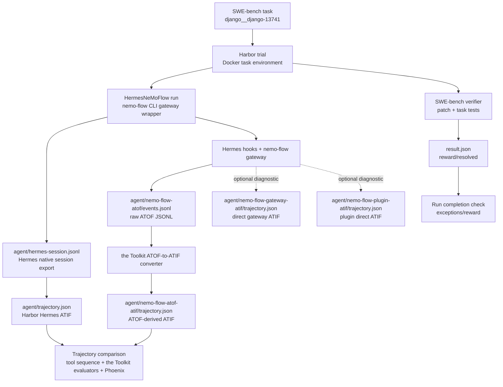

<!--
SPDX-FileCopyrightText: Copyright (c) 2026, NVIDIA CORPORATION & AFFILIATES. All rights reserved.
SPDX-License-Identifier: Apache-2.0

Licensed under the Apache License, Version 2.0 (the "License");
you may not use this file except in compliance with the License.
You may obtain a copy of the License at

http://www.apache.org/licenses/LICENSE-2.0

Unless required by applicable law or agreed to in writing, software
distributed under the License is distributed on an "AS IS" BASIS,
WITHOUT WARRANTIES OR CONDITIONS OF ANY KIND, either express or implied.
See the License for the specific language governing permissions and
limitations under the License.
-->

# Hermes NeMo-Flow Harbor Smoke

This developer workflow runs Hermes Agent on one Harbor SWE-bench task with the
NeMo-Flow CLI gateway enabled. It validates the first available non-patching
Hermes instrumentation path before the upstream Hermes native middleware path
is available.

The validation pass is based on three reference artifacts captured from the
smoke:

- Native Hermes ATIF from Harbor's Hermes adapter.
- Raw ATOF JSONL from the NeMo-Flow observability plugin.
- ATOF-derived ATIF from the Toolkit ATOF-to-ATIF converter.

Direct gateway/plugin ATIF outputs may also be created during a run, but they
are diagnostic files only for this smoke. Do not use them as evidence for the
trajectory comparison until their message shape is strict-compatible with the
Toolkit ATIF parser.

## Pipeline



One Hermes run should create these primary trajectory artifacts:

<!-- path-check-skip-begin -->
- Native path: Hermes session export -> Harbor Hermes adapter ->
  `agent/trajectory.json`. This is Harbor's native Hermes trajectory and is
  produced independently of the NeMo-Flow gateway.
- ATOF-derived ATIF: NeMo-Flow observability plugin ATOF export writes
  `agent/nemo-flow-atof/events.jsonl`, then the Toolkit converter writes
  `agent/nemo-flow-atof-atif/trajectory.json`. This is the primary NeMo-Flow
  comparison target.
<!-- path-check-skip-end -->

The run may also create direct ATIF diagnostics under
`agent/nemo-flow-gateway-atif/` and `agent/nemo-flow-plugin-atif/`. Treat those
as optional implementation diagnostics, not as the basis for this smoke's
analysis.

## Prerequisites

- Docker is running.
- The Toolkit is checked out to a branch containing
  `nat_harbor.agents.installed.hermes_nemoflow:HermesNeMoFlow`.
- Harbor is installed from the source branch used by the Harbor integration.
- NeMo-Flow `>= v0.2` is checked out. This version requirement covers CLI ATOF
  export, observability plugin activation through `--plugin-config`, and direct
  gateway ATIF export through `--atif-dir`. The published binary is
  `nemo-flow`, and the published Cargo package is `nemo-flow-cli`.

<!-- path-check-skip-begin -->
```bash
mkdir -p external

if [ ! -d external/harbor/.git ]; then
  git clone https://github.com/AnuradhaKaruppiah/harbor.git external/harbor
fi
git -C external/harbor fetch origin
git -C external/harbor checkout ak-harbor-libary-mode

if [ ! -d external/nemo-flow/.git ]; then
  git clone https://github.com/NVIDIA/NeMo-Flow.git external/nemo-flow
fi
git -C external/nemo-flow fetch origin
git -C external/nemo-flow checkout "${NEMO_FLOW_REF:-main}"
```

Set `NEMO_FLOW_REF` to a NeMo-Flow `v0.2` or newer release tag, branch, or
commit when you do not want to use `main`. If your `>= v0.2` checkout is outside
`external/nemo-flow`, point `NEMO_FLOW_REPO` at that checkout in the build step
below.

The SWE-bench smoke task should exist at:

```text
external/harbor/datasets/swebench-opencode-smoke/django__django-13741
```

If that task is missing, create it with Harbor's SWE-bench adapter:

```bash
cd external/harbor/adapters/swebench

uv run swebench \
  --instance-id django__django-13741 \
  --task-dir ../../datasets/swebench-opencode-smoke \
  --overwrite

cd ../../../..
```

Use editable installs for local iteration:

```bash
uv venv --python 3.13 --seed .venv
uv pip install -e packages/nvidia_nat_harbor
uv pip install -e external/harbor
```
<!-- path-check-skip-end -->

## Build the Prebuilt Image

For local SWE-bench validation, build a task image that already contains the
`nemo-flow` CLI. This keeps Harbor agent setup focused on Hermes startup and
runtime validation instead of cold-compiling Rust inside the trial container.

The measured cold build on an Apple Silicon workstation was:

- Prebuilt Docker image build: 2m04s wall time.
- NeMo-Flow CLI compile layer: 1m17s inside that build.
- Warm rebuild with Docker cache: under 1s.
- Exported local image size: approximately 1.76 GB.
- Previous cold in-agent compile: exceeded Harbor's default 360s setup timeout
  before Hermes started.
- Prebuilt-image Harbor startup check: environment setup completed in about 1s,
  agent setup completed in about 3m28s, and the run reached `nemo-flow run`.
  That remaining setup time is primarily Hermes installation.

Use a minimal build context so Docker does not send the local NeMo-Flow
`target/` directory.

```bash
export NEMO_FLOW_REPO="$PWD/external/nemo-flow"
export NEMO_FLOW_SHA
NEMO_FLOW_SHA=$(git -C "$NEMO_FLOW_REPO" rev-parse --short HEAD)
export PREBUILT_NEMO_FLOW_IMAGE="hermes-nemoflow-django13741:${NEMO_FLOW_SHA}"
export PREBUILT_CONTEXT=.tmp/harbor/nemo-flow-prebuilt-context

rm -rf "$PREBUILT_CONTEXT"
mkdir -p "$PREBUILT_CONTEXT"
cp "$NEMO_FLOW_REPO"/Cargo.toml \
  "$NEMO_FLOW_REPO"/Cargo.lock \
  "$NEMO_FLOW_REPO"/rust-toolchain.toml \
  "$PREBUILT_CONTEXT"/
cp -R "$NEMO_FLOW_REPO"/crates "$PREBUILT_CONTEXT"/
```

Create the prebuilt-image `Dockerfile`:

<!-- path-check-skip-begin -->
```bash
cat > .tmp/harbor/nemo-flow-prebuilt.Dockerfile <<'EOF'
FROM swebench/sweb.eval.x86_64.django_1776_django-13741:latest

WORKDIR /testbed
RUN curl -LsSf https://astral.sh/uv/0.7.13/install.sh | sh
RUN mkdir -p /logs

WORKDIR /opt/nemo-flow
RUN apt-get update \
    && apt-get install -y --no-install-recommends \
        build-essential \
        ca-certificates \
        curl \
        pkg-config \
    && rm -rf /var/lib/apt/lists/*

COPY Cargo.toml Cargo.lock rust-toolchain.toml ./
COPY crates ./crates

RUN set -eux; \
    if ! command -v cargo >/dev/null 2>&1; then \
        curl --proto '=https' --tlsv1.2 -fsSL https://sh.rustup.rs | \
        sh -s -- -y --profile minimal; \
    fi; \
    . "$HOME/.cargo/env"; \
    cargo build -p nemo-flow-cli --release; \
    install -m 0755 target/release/nemo-flow /usr/local/bin/nemo-flow; \
    nemo-flow --help >/dev/null; \
    nemo-flow run --help | grep -q -- '--atif-dir'; \
    nemo-flow run --help | grep -q -- '--plugin-config'; \
    nemo-flow hook-forward --help | grep -q -- '--atif-dir'

WORKDIR /testbed
EOF
```
<!-- path-check-skip-end -->

Build and validate the image:

<!-- path-check-skip-begin -->
```bash
/usr/bin/time -p docker build \
  --platform linux/amd64 \
  -f .tmp/harbor/nemo-flow-prebuilt.Dockerfile \
  -t "$PREBUILT_NEMO_FLOW_IMAGE" \
  "$PREBUILT_CONTEXT"

docker run --rm --platform linux/amd64 "$PREBUILT_NEMO_FLOW_IMAGE" \
  bash -lc 'command -v nemo-flow && nemo-flow run --help | grep -q -- --atif-dir && nemo-flow run --help | grep -q -- --plugin-config'
```
<!-- path-check-skip-end -->

The Linux AMD64 platform option is intentional for SWE-bench image
compatibility, especially when running Docker from an Apple Silicon host.

Create a prebuilt-image copy of the SWE-bench task by adding
`docker_image = "$PREBUILT_NEMO_FLOW_IMAGE"` to its `[environment]` section.

<!-- path-check-skip-begin -->
```bash
export SOURCE_SWEBENCH_TASK=external/harbor/datasets/swebench-opencode-smoke/django__django-13741
export SWEBENCH_TASK=.tmp/harbor/datasets/swebench-hermes-nemoflow-prebuilt/django__django-13741

rm -rf "$SWEBENCH_TASK"
mkdir -p "$(dirname "$SWEBENCH_TASK")"
cp -R "$SOURCE_SWEBENCH_TASK" "$SWEBENCH_TASK"

.venv/bin/python - <<'PY'
import os
from pathlib import Path

task = Path(os.environ["SWEBENCH_TASK"]) / "task.toml"
image = os.environ["PREBUILT_NEMO_FLOW_IMAGE"]
text = task.read_text()
if "docker_image =" not in text:
    text = text.replace("[environment]\n", f'[environment]\ndocker_image = "{image}"\n', 1)
else:
    lines = [
        f'docker_image = "{image}"' if line.startswith("docker_image = ") else line
        for line in text.splitlines()
    ]
    text = "\n".join(lines) + "\n"
task.write_text(text)
PY
```
<!-- path-check-skip-end -->

This smoke can use a local Ollama model through its OpenAI-compatible endpoint.
When the agent runs inside Docker on macOS, point the container at the host via
`host.docker.internal`. Use the provider root here, not `/v1`; the NeMo-Flow
gateway appends the incoming OpenAI path before forwarding upstream.

```bash
export OPENAI_BASE_URL=http://host.docker.internal:11434
export OPENAI_API_KEY=ollama
```

The model must also be present in the Ollama `/v1/models` response. This smoke
uses `openai/qwen3.6:35b`; the `openai/` prefix selects the Harbor OpenAI
provider route and the upstream Ollama model ID remains `qwen3.6:35b`.

Side note: if Ollama is not already serving this model, start it from another
terminal before running Harbor. Binding to `0.0.0.0` makes the endpoint
reachable from Docker containers through `host.docker.internal`.

```bash
ollama pull qwen3.6:35b
OLLAMA_HOST=0.0.0.0:11434 ollama serve
```

In a separate terminal, warm the model and validate host-side IO:

```bash
ollama run qwen3.6:35b "Reply with exactly: ok"
curl http://localhost:11434/v1/models
```

## Run the Smoke

Create a local environment file for the Docker task environment. Do not commit this
file.

<!-- path-check-skip-begin -->
```bash
mkdir -p .tmp/harbor/secrets
cat > .tmp/harbor/secrets/ollama.env <<EOF
OPENAI_API_KEY=${OPENAI_API_KEY}
OPENAI_BASE_URL=${OPENAI_BASE_URL}
EOF
```

Run the NeMo-Flow-enabled Hermes smoke:

```bash
export HARBOR_JOBS_DIR=.tmp/harbor/hermes-nemoflow-smoke
export SWEBENCH_TASK=.tmp/harbor/datasets/swebench-hermes-nemoflow-prebuilt/django__django-13741
export JOB_NAME=hermes-nemoflow-repeatable-smoke-1

set -a
. .tmp/harbor/secrets/ollama.env
set +a

.venv/bin/harbor run \
  --path "$SWEBENCH_TASK" \
  -l 1 \
  --job-name "$JOB_NAME" \
  --jobs-dir "$HARBOR_JOBS_DIR" \
  --yes -n 1 --max-retries 0 --no-delete \
  --env-file .tmp/harbor/secrets/ollama.env \
  --agent-import-path nat_harbor.agents.installed.hermes_nemoflow:HermesNeMoFlow \
  --env docker \
  --model openai/qwen3.6:35b \
  --ak use_prebuilt_nemo_flow=true \
  --ak enable_nemoflow_observability_plugin=true \
  --ak fail_missing_nemoflow_atof=true \
  --ak fail_missing_nemoflow_atif=true \
  --ak fail_nemoflow_atof_conversion=false
```

A completed run may create these files under the trial directory.

Primary evidence artifacts:

```text
agent/trajectory.json
agent/nemo-flow-atof/events.jsonl
agent/nemo-flow-atof-atif/trajectory.json
```

Additional files to look for when checking run completion or debugging:

```text
agent/hermes.txt
agent/hermes-session.jsonl
agent/nemo-flow-gateway-atif/trajectory.json
agent/nemo-flow-plugin-atif/trajectory.json
result.json
verifier/report.json
```

The additional files are useful for confirming that the run completed and that
diagnostic exporters ran. They are not used as evidence in this smoke.

## Reference Artifacts

Reference artifacts from a completed smoke are checked in under:

```text
packages/nvidia_nat_harbor/data/hermes-nemoflow-smoke/
```

These files are the stable evidence set for this smoke:

| Evidence | Checked-in fixture | Status |
| --- | --- | --- |
| Native Hermes ATIF | `native-hermes-trajectory.json` | Valid ATIF for the Toolkit parser, `ATIF-v1.2`, 32 steps, `total_steps=32`. |
| NeMo-Flow raw ATOF | `nemo-flow-atof-events.jsonl` | 228 ATOF events captured through the NeMo-Flow observability plugin. |
| NeMo-Flow ATOF-derived ATIF | `nemo-flow-atof-atif-trajectory.json` | Valid ATIF for the Toolkit parser, `ATIF-v1.7`, 36 steps, `total_prompt_tokens=887910`, `total_completion_tokens=8071`, `total_tokens=895981`. |

The reference fixture comparison produced an exact native vs ATOF-derived tool
sequence match:

```text
Native tools (32): execute_code=9, patch=6, read_file=6, search_files=5, terminal=6
Candidate tools (32): execute_code=9, patch=6, read_file=6, search_files=5, terminal=6
```

The native Hermes ATIF fixture is still a multi-step trajectory even though it
does not currently produce a rich Phoenix span tree. It has 32 ATIF steps and
32 tool calls, but its steps do not include the `extra` ancestry/invocation
metadata that the ATIF-to-Phoenix exporter uses to create child LLM and tool
spans. When exported to Phoenix, this native trajectory is expected to appear
as a single workflow span with root input/output. Use it as the native
trajectory and tool-sequence baseline, not as the span-level observability
baseline.

## Quick Artifact Check

Set `TRIAL` to the completed trial directory:

```bash
export HARBOR_JOBS_DIR=.tmp/harbor/hermes-nemoflow-smoke
export JOB_NAME=hermes-nemoflow-repeatable-smoke-1
export TRIAL
TRIAL=$(find "$HARBOR_JOBS_DIR/$JOB_NAME" -maxdepth 1 -type d -name 'django__django-13741__*' | head -n 1)
test -n "$TRIAL"
```

Check that the run created the evidence files. Additional run-completion and
diagnostic files are reported if present, but this smoke does not use them as
trajectory evidence.

```bash
.venv/bin/python - <<'PY'
import json
import os
from pathlib import Path

from nat_harbor.verifier.evaluator_adapter import load_atif_samples

trial = Path(os.environ["TRIAL"])
agent = trial / "agent"
evidence = (
    "trajectory.json",
    "nemo-flow-atof/events.jsonl",
    "nemo-flow-atof-atif/trajectory.json",
)
run_outputs = (
    "hermes.txt",
    "hermes-session.jsonl",
)
diagnostic = (
    "nemo-flow-gateway-atif/trajectory.json",
    "nemo-flow-plugin-atif/trajectory.json",
)
for rel in evidence:
    path = agent / rel
    if not path.exists():
        raise SystemExit(f"Missing {path}")
    print("evidence", rel, path.stat().st_size)
for rel in run_outputs:
    path = agent / rel
    print("run-output", rel, "present" if path.exists() else "missing")
for rel in diagnostic:
    path = agent / rel
    print("diagnostic", rel, "present" if path.exists() else "missing")

for rel in (
    "trajectory.json",
    "nemo-flow-atof-atif/trajectory.json",
):
    path = agent / rel
    data = json.loads(path.read_text())
    try:
        samples = load_atif_samples(path)
        trajectory = samples[0].trajectory
        metrics = data.get("final_metrics") or {}
        print("valid", rel, trajectory.schema_version, len(trajectory.steps), metrics)
    except Exception as exc:
        steps = data.get("steps") or []
        first_message_type = type((steps[0] or {}).get("message")).__name__ if steps else "missing"
        print("invalid", rel, type(exc).__name__, len(steps), first_message_type)

atof_path = agent / "nemo-flow-atof/events.jsonl"
print("atof_events", sum(1 for _ in atof_path.open()))
PY
```

Compare the native and ATOF-derived tool sequences:

```bash
.venv/bin/python -m nat_harbor.smoke.compare_atif_tools \
  --native "$TRIAL/agent/trajectory.json" \
  --candidate "$TRIAL/agent/nemo-flow-atof-atif/trajectory.json"
```

If the ATOF-derived comparison is missing tool semantics, inspect
`agent/nemo-flow-atof/events.jsonl` before changing the ATIF exporter because
the raw event stream shows whether the data was captured.

## Post-Run Trajectory Scoring

Run the scorer without LLM calls first:

```bash
.venv/bin/python -m nat_harbor.smoke.score_atif_trajectories \
  --job-dir "$HARBOR_JOBS_DIR/$JOB_NAME" \
  --candidate-rel agent/nemo-flow-atof-atif/trajectory.json \
  --output-dir "$HARBOR_JOBS_DIR/$JOB_NAME/post-run-scores" \
  --no-llm
```

Run the LLM scoring pass with an OpenAI-compatible judge endpoint:

```bash
set -a
. .tmp/harbor/secrets/ollama.env
set +a

# This command runs on the host, not inside Docker.
export OPENAI_BASE_URL=http://localhost:11434/v1
export NAT_HARBOR_TRAJECTORY_JUDGE_MODEL=qwen3.6:35b

.venv/bin/python -m nat_harbor.smoke.score_atif_trajectories \
  --job-dir "$HARBOR_JOBS_DIR/$JOB_NAME" \
  --candidate-rel agent/nemo-flow-atof-atif/trajectory.json \
  --output-dir "$HARBOR_JOBS_DIR/$JOB_NAME/post-run-llm-scores" \
  --config-file packages/nvidia_nat_harbor/configs/opencode-nemoflow-trajectory-eval.yml \
  --evaluator-name trajectory_eval \
  --score-timeout-sec 45
```

## Phoenix Inspection

If Phoenix is running locally at `http://localhost:6006`, export the ATIF
artifacts to separate projects:

```bash
ENDPOINT=http://localhost:6006/v1/traces

.venv/bin/python -m nat.plugins.phoenix.scripts.export_trajectory_to_phoenix.export_atif_trajectory_to_phoenix \
  "$TRIAL/agent/trajectory.json" \
  --endpoint "$ENDPOINT" \
  --project harbor-hermes-native

.venv/bin/python -m nat.plugins.phoenix.scripts.export_trajectory_to_phoenix.export_atif_trajectory_to_phoenix \
  "$TRIAL/agent/nemo-flow-atof-atif/trajectory.json" \
  --endpoint "$ENDPOINT" \
  --project harbor-hermes-nemoflow-atof
```

Open `http://localhost:6006` and compare the two evidence projects. Export
direct gateway/plugin ATIF only for debugging, not as smoke evidence, until
those files are strict-compatible with the Toolkit ATIF parser.

In Phoenix, expect `harbor-hermes-native` to show one root workflow span with
input/output. That does not mean the native ATIF fixture only has one step; it
means the native fixture lacks the span-construction metadata needed by the
ATIF-to-Phoenix exporter. The richer span tree should come from
`harbor-hermes-nemoflow-atof`, which is built from the ATOF-derived ATIF.

## Known Limitations

- The default wrapper path can build `nemo-flow-cli` (binary `nemo-flow`) inside
  each Harbor task container. The smoke uses a prebuilt task image instead.
- Use `--no-delete` with the prebuilt-image smoke. Harbor's default Docker
  cleanup uses `docker compose down --rmi all`, which can remove the local
  prebuilt image after the trial.
- On Apple Silicon hosts, the SWE-bench image used by this task is an
  `linux/amd64` image. A cold `cargo build -p nemo-flow-cli --release` then
  runs under emulation during Harbor agent setup and can exceed Harbor's
  default 360 second agent setup timeout before Hermes starts. If the trial log
  stops at the NeMo-Flow CLI build command, no model endpoint has been reached
  yet. The prebuilt image avoids that trial-startup cost.
- The ATOF path requires NeMo-Flow `>= v0.2` observability plugin activation in
  the CLI gateway. The `enable_nemoflow_observability_plugin=true` smoke should
  require `agent/nemo-flow-atof/events.jsonl`; use
  `fail_missing_nemoflow_atof=false` only when running against older
  direct-ATIF-only gateway branches.
- The Toolkit ATOF-to-ATIF conversion is initially best-effort in this smoke
  (`fail_nemoflow_atof_conversion=false`) so raw ATOF can still be inspected if
  reconstruction fails. Flip it to `true` once the converter result is stable.
- Direct gateway/plugin ATIF files may be emitted, but they are diagnostic
  outputs for this smoke. Base the analysis on the checked-in native Hermes
  ATIF, raw ATOF JSONL, and ATOF-derived ATIF fixtures.
- Complete LLM lifecycle telemetry requires Hermes model traffic to use the
  NeMo-Flow gateway. This wrapper configures that path for `nvidia`, `openai`,
  `openrouter`, and `anthropic` model prefixes.
- If `hermes.txt` shows `HTTP 502: gateway upstream error: builder error`,
  check the upstream base URL first. For the local Ollama smoke, the Docker
  task container should use `http://host.docker.internal:11434`, while
  host-side curl checks can use `http://localhost:11434/v1`.
- The upstream Hermes native middleware path remains a later comparison lane.
