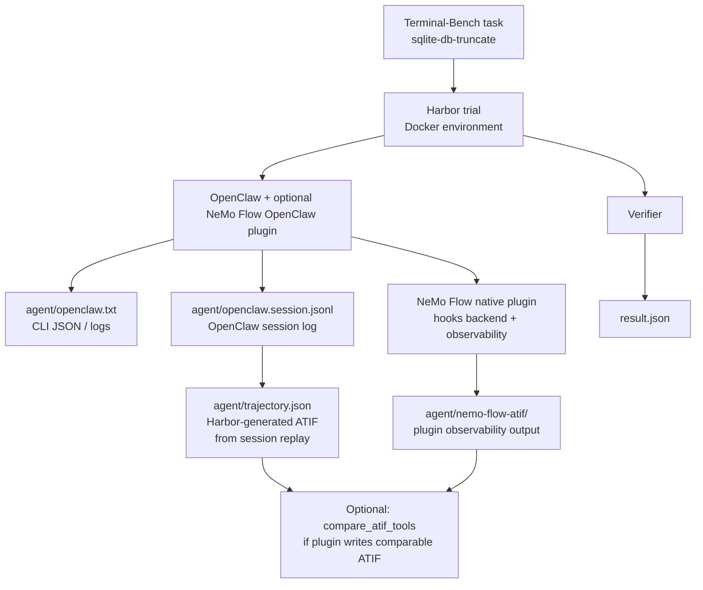

<!--
SPDX-FileCopyrightText: Copyright (c) 2026, NVIDIA CORPORATION & AFFILIATES. All rights reserved.
SPDX-License-Identifier: Apache-2.0

Licensed under the Apache License, Version 2.0 (the "License");
you may not use this file except in compliance with the License.
You may obtain a copy of the License at

http://www.apache.org/licenses/LICENSE-2.0

Unless required by applicable law or agreed to in writing, software
distributed under the License is distributed on an "AS IS" BASIS,
WITHOUT WARRANTIES OR CONDITIONS OF ANY KIND, either express or implied.
See the License for the specific language governing permissions and
limitations under the License.
-->

# OpenClaw NeMo-Flow Harbor Smoke

This workflow runs **OpenClaw** inside a Harbor trial with the published **NeMo
Flow OpenClaw native plugin** (`npm:nemo-flow-openclaw`, pinned inside the
agent): hooks backend and in-process observability, not a Harbor-side “ATIF
export” pipeline. You can drive it with **Terminal-Bench** (`sqlite-db-truncate`)
or with the same **SWE-bench** smoke instance as the OpenCode and Hermes smokes
(`django__django-13741` under `swebench-opencode-smoke`).

Because OpenClaw may not be registered in the Harbor build you have installed,
this smoke loads the agent from **NeMo Agent Toolkit** via
`--agent-import-path` (no `-a openclaw` required).

## Pipeline



After a successful NeMo-Flow-enabled run, expect under `agent/`:

<!-- path-check-skip-begin -->

- `openclaw.txt` — CLI stdout (`openclaw agent --local --json`).
- `openclaw.session.jsonl` — session log; Harbor derives ATIF (OpenClaw has no native ATIF).
- `trajectory.json` — Harbor ATIF from the session log.
- `nemo-flow-atif/` — NeMo Flow OpenClaw plugin observability output.

At the trial root: `result.json` (outcome).

<!-- path-check-skip-end -->

## Prerequisites

- Docker is running.
- Python environment with **Harbor** and **`nvidia-nat-harbor`** installed so
  `harbor` and `nat_harbor` import cleanly (editable install from this repo is
  typical).

From the NeMo Agent Toolkit repository root:

<!-- path-check-skip-begin -->

```bash
uv venv --python 3.13 --seed .venv
uv pip install -e packages/nvidia_nat_harbor
uv pip install -e external/harbor
```

Use a Harbor revision that ships the built-in **Terminal-Bench** benchmark
dataset (`terminal-bench@2.0`). If Harbor lives under `external/harbor`, use
that path in `uv pip install -e` instead of `external/harbor`.

<!-- path-check-skip-end -->

Create a secrets file (do not commit it). **`NVIDIA_BASE_URL` is only exercised
against the OpenAI-compatible base on `integrate.api.nvidia.com` for this
workflow today** (for example `https://integrate.api.nvidia.com/v1`). Other
NVIDIA inference hosts are not covered here yet.

<!-- path-check-skip-begin -->

```bash
mkdir -p .tmp/harbor/secrets
read -rsp 'NVIDIA_API_KEY: ' NVIDIA_API_KEY; echo
read -rsp 'NVIDIA_BASE_URL (integrate.api.nvidia.com OpenAI-compatible base): ' NVIDIA_BASE_URL; echo
cat > .tmp/harbor/secrets/nvidia.env <<EOF
NVIDIA_API_KEY=${NVIDIA_API_KEY}
NVIDIA_BASE_URL=${NVIDIA_BASE_URL}
EOF
```

<!-- path-check-skip-end -->

## Run the smoke (Terminal-Bench)

This matches a recent working invocation, except **`--agent-import-path`**
replaces `-a openclaw`** so you do not depend on Harbor registering the OpenClaw
agent name.

<!-- path-check-skip-begin -->

```bash
cd /external/NeMo-Agent-Toolkit

set -a
. .tmp/harbor/secrets/nvidia.env
set +a

.venv/bin/harbor run \
  -d terminal-bench@2.0 \
  -i sqlite-db-truncate \
  --agent-import-path nat_harbor.agents.installed.openclaw:OpenClaw \
  -m nvidia/qwen/qwen3.5-397b-a17b \
  -e docker \
  --env-file .tmp/harbor/secrets/nvidia.env \
  --jobs-dir .tmp/harbor-openclaw-nemoflow \
  --n-concurrent 1 \
  --agent-kwarg enable_nemo_flow=true \
  -q \
  -y
```

Disable NeMo Flow (faster setup, no native plugin):

```bash
.venv/bin/harbor run \
  -d terminal-bench@2.0 \
  -i sqlite-db-truncate \
  --agent-import-path nat_harbor.agents.installed.openclaw:OpenClaw \
  -m nvidia/qwen/qwen3.5-397b-a17b \
  -e docker \
  --env-file .tmp/harbor/secrets/nvidia.env \
  --jobs-dir .tmp/harbor-openclaw-nemoflow \
  --n-concurrent 1 \
  --agent-kwarg enable_nemo_flow=false \
  -q \
  -y
```

## Run the smoke (SWE-bench)

Same prepared SWE-bench instance as **`opencode-nemoflow-smoke.md`** and
**`hermes-nemoflow-smoke.md`**: `django__django-13741` under
`swebench-opencode-smoke`. The task directory should be:

```text
external/harbor/datasets/swebench-opencode-smoke/django__django-13741
```

If it is missing, create it from a Harbor checkout (same adapter invocation as
in the OpenCode smoke prerequisites):

```bash
cd external/harbor/adapters/swebench

uv run swebench \
  --instance-id django__django-13741 \
  --task-dir ../../datasets/swebench-opencode-smoke \
  --overwrite

cd ../../../..
```

NeMo-Flow-enabled run (OpenClaw import path, same model family as the OpenCode
smoke):

```bash
cd /external/NeMo-Agent-Toolkit

export HARBOR_JOBS_DIR=.tmp/harbor/openclaw-nemoflow-swebench
export SWEBENCH_TASK=external/harbor/datasets/swebench-opencode-smoke/django__django-13741
export JOB_NAME=openclaw-nemoflow-swebench-smoke-1

set -a
. .tmp/harbor/secrets/nvidia.env
set +a

.venv/bin/harbor run \
  --path "$SWEBENCH_TASK" \
  -l 1 \
  --job-name "$JOB_NAME" \
  --jobs-dir "$HARBOR_JOBS_DIR" \
  --yes -n 1 --max-retries 0 \
  --env-file .tmp/harbor/secrets/nvidia.env \
  --agent-import-path nat_harbor.agents.installed.openclaw:OpenClaw \
  --env docker \
  --model nvidia/qwen/qwen3.5-397b-a17b \
  --agent-kwarg enable_nemo_flow=true
```


<!-- path-check-skip-end -->

## Quick artifact check

### Terminal-Bench

Set `TRIAL` to the completed trial directory (layout varies slightly by Harbor
version; adjust the `find` if needed):

<!-- path-check-skip-begin -->

```bash
export HARBOR_JOBS_DIR=.tmp/harbor-openclaw-nemoflow
TRIAL=$(find "$HARBOR_JOBS_DIR" -mindepth 2 -maxdepth 3 -type d -name 'sqlite-db-truncate__*' | head -n 1)
test -n "$TRIAL"
ls -la "$TRIAL/agent"
```

### SWE-bench

After a run with `JOB_NAME=openclaw-nemoflow-swebench-smoke-1`:

```bash
export HARBOR_JOBS_DIR=.tmp/harbor/openclaw-nemoflow-swebench
export JOB_NAME=openclaw-nemoflow-swebench-smoke-1
TRIAL=$(find "$HARBOR_JOBS_DIR/$JOB_NAME" -maxdepth 1 -type d -name 'django__django-13741__*' | head -n 1)
test -n "$TRIAL"
ls -la "$TRIAL/agent"
```

### Optional tool comparison

Pick one NeMo Flow plugin observability JSON under `nemo-flow-atif` (if present):

```bash
PLUGIN_TRAJ=$(find "$TRIAL/agent/nemo-flow-atif" -maxdepth 1 -type f -name '*.json' | head -n 1)
echo "PLUGIN_TRAJ=${PLUGIN_TRAJ}"
```

Optional: compare Harbor `trajectory.json` to a plugin artifact **only when** that
file is ATIF-shaped enough for the tool (native plugin output varies by version):

```bash
test -f "$TRIAL/agent/trajectory.json"
test -n "$PLUGIN_TRAJ"

.venv/bin/python -m nat_harbor.smoke.compare_atif_tools \
  --native "$TRIAL/agent/trajectory.json" \
  --candidate "$PLUGIN_TRAJ"
```

<!-- path-check-skip-end -->

## Known limitations

<!-- path-check-skip-begin -->

- **Setup time:** each trial installs Node, OpenClaw, and (when enabled) the
  NeMo Flow npm plugin inside the container.
- **Network:** `npm install -g` and `openclaw plugins install` need reliable
  access to the npm registry.
- **ATIF schema:** the vendored agent under `nat_harbor` may emit
  `ATIF-v1.6` in `trajectory.json` when used with Harbor releases whose
  `Trajectory` model does not yet list `ATIF-v1.7`; the upstream Harbor OpenClaw
  agent may use v1.7 once dependencies align.

<!-- path-check-skip-end -->
