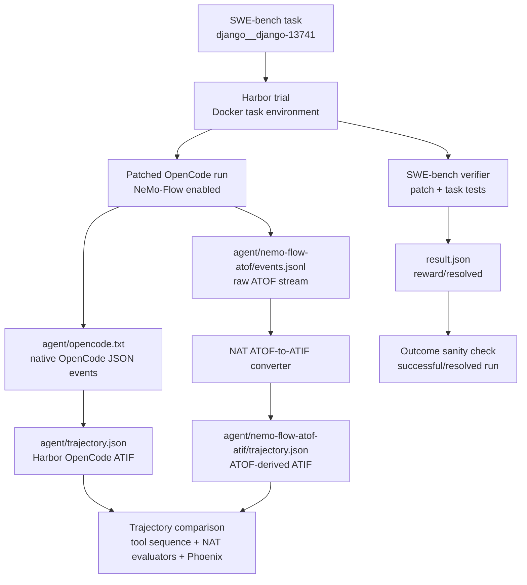

<!--
SPDX-FileCopyrightText: Copyright (c) 2026, NVIDIA CORPORATION & AFFILIATES. All rights reserved.
SPDX-License-Identifier: Apache-2.0

Licensed under the Apache License, Version 2.0 (the "License");
you may not use this file except in compliance with the License.
You may obtain a copy of the License at

http://www.apache.org/licenses/LICENSE-2.0

Unless required by applicable law or agreed to in writing, software
distributed under the License is distributed on an "AS IS" BASIS,
WITHOUT WARRANTIES OR CONDITIONS OF ANY KIND, either express or implied.
See the License for the specific language governing permissions and
limitations under the License.
-->

# OpenCode NeMo-Flow Harbor Smoke

This developer workflow compares OpenCode's native event stream with NeMo-Flow
ATOF for the same Harbor SWE-bench task execution.

This smoke still depends on NAT and Harbor branch-local integration code until
the Harbor OpenCode wrapper and related support are promoted to their target
branches.

## Pipeline



<!-- path-check-skip-begin -->
One NeMo-Flow-enabled OpenCode run emits both source streams:

- Native path: OpenCode JSON events -> Harbor OpenCode adapter ->
  `agent/trajectory.json`.
- NeMo-Flow path: ATOF JSONL -> NAT ATOF-to-ATIF converter ->
  `agent/nemo-flow-atof-atif/trajectory.json`.
- A no-NeMo-Flow run is optional control coverage for instrumentation side
  effects, not required for the native-vs-ATOF artifact comparison.
<!-- path-check-skip-end -->

## Prerequisites

- Docker is running.
- NAT is checked out to a branch containing
  `nat_harbor.agents.installed.opencode_nemoflow:OpenCodeNeMoFlow`.

Clone the external Harbor and NeMo-Flow repositories and check out the expected
branches. The Harbor checkout is used for SWE-bench adapter assets and, after
the editable install below, for Harbor branch-local runtime support.

<!-- path-check-skip-begin -->
```bash
mkdir -p external

if [ ! -d external/harbor/.git ]; then
  git clone https://github.com/AnuradhaKaruppiah/harbor.git external/harbor
fi
git -C external/harbor fetch origin
git -C external/harbor checkout ak-harbor-libary-mode

if [ ! -d external/nemo-flow/.git ]; then
  git clone https://github.com/NVIDIA/NeMo-Flow.git external/nemo-flow
fi
git -C external/nemo-flow fetch origin
git -C external/nemo-flow checkout main
```

The SWE-bench smoke task should exist at:

```text
external/harbor/datasets/swebench-opencode-smoke/django__django-13741
```

If that task is missing, create it with Harbor's SWE-bench adapter:

```bash
cd external/harbor/adapters/swebench

uv run swebench \
  --instance-id django__django-13741 \
  --task-dir ../../datasets/swebench-opencode-smoke \
  --overwrite

cd ../../../..
```

Use an editable install for the local packages:

```bash
uv venv --python 3.13 --seed .venv
uv pip install -e packages/nvidia_nat_harbor
uv pip install -e external/harbor
.venv/bin/python - <<'PY'
import importlib.metadata as md
print("harbor", md.version("harbor"))
PY
```

Prepare the NeMo-Flow OpenCode patch:

```bash
cd external/nemo-flow
./scripts/bootstrap-third-party.sh
./scripts/apply-patches.sh --check
if [ ! -e third_party/opencode/packages/opencode/src/nemo_flow/index.ts ]; then
  git -C third_party/opencode apply ../../patches/opencode/0001-add-nemo-flow-integration.patch
fi

cd crates/node
npm install
npm run build

cd ../../../..
```

The smoke expects the NeMo-Flow Node binding at:

```text
external/nemo-flow/crates/node/nemo-flow.linux-x64-gnu.node
```
<!-- path-check-skip-end -->

`NVIDIA_BASE_URL` should point at the OpenAI-compatible NVIDIA endpoint used
for this smoke:

```bash
export NVIDIA_BASE_URL=<openai-compatible-nvidia-base-url>
```

## Run the Smoke

Create a local env file for the Docker task environment. Do not commit this
file.

<!-- path-check-skip-begin -->
```bash
mkdir -p .tmp/harbor/secrets
read -rsp 'NVIDIA_API_KEY: ' NVIDIA_API_KEY; echo
cat > .tmp/harbor/secrets/nvidia.env <<EOF
NVIDIA_API_KEY=${NVIDIA_API_KEY}
NVIDIA_BASE_URL=${NVIDIA_BASE_URL}
EOF
```

Run the NeMo-Flow-enabled OpenCode smoke:

```bash
export HARBOR_JOBS_DIR=.tmp/harbor/opencode-nemoflow-smoke
export SWEBENCH_TASK=external/harbor/datasets/swebench-opencode-smoke/django__django-13741
export NEMO_FLOW_REPO="$PWD/external/nemo-flow"
export JOB_NAME=opencode-nemoflow-repeatable-smoke-1

set -a
. .tmp/harbor/secrets/nvidia.env
set +a

.venv/bin/harbor run \
  --path "$SWEBENCH_TASK" \
  -l 1 \
  --job-name "$JOB_NAME" \
  --jobs-dir "$HARBOR_JOBS_DIR" \
  --yes -n 1 --max-retries 0 \
  --env-file .tmp/harbor/secrets/nvidia.env \
  --agent-import-path nat_harbor.agents.installed.opencode_nemoflow:OpenCodeNeMoFlow \
  --env docker \
  --model nvidia/opus-frontier \
  --ak nemo_flow_repo="$NEMO_FLOW_REPO" \
  --ak fail_missing_nemoflow_atof=true \
  --ak fail_missing_nemoflow_atif=false
```

Expected artifacts under the trial directory:

```text
agent/opencode.txt
agent/trajectory.json
agent/nemo-flow-atof/events.jsonl
agent/nemo-flow-atof-atif/trajectory.json
result.json
verifier/report.json
```

## Quick Artifact Check

Set `TRIAL` to the completed trial directory:

```bash
export HARBOR_JOBS_DIR=.tmp/harbor/opencode-nemoflow-smoke
export JOB_NAME=opencode-nemoflow-repeatable-smoke-1
export TRIAL
TRIAL=$(find "$HARBOR_JOBS_DIR/$JOB_NAME" -maxdepth 1 -type d -name 'django__django-13741__*' | head -n 1)
test -n "$TRIAL"
```

Check that both ATIF artifacts load:

```bash
.venv/bin/python - <<'PY'
import os
from pathlib import Path

from nat_harbor.verifier.evaluator_adapter import load_atif_samples

trial = Path(os.environ["TRIAL"])
agent = trial / "agent"
for rel in (
    "opencode.txt",
    "trajectory.json",
    "nemo-flow-atof/events.jsonl",
    "nemo-flow-atof-atif/trajectory.json",
):
    path = agent / rel
    if not path.exists():
        raise SystemExit(f"Missing {path}")
    print("ok", rel, path.stat().st_size)

for rel in ("trajectory.json", "nemo-flow-atof-atif/trajectory.json"):
    samples = load_atif_samples(agent / rel)
    trajectory = samples[0].trajectory
    print(rel, trajectory.schema_version, len(trajectory.steps))

print("atof_events", sum(1 for _ in (agent / "nemo-flow-atof/events.jsonl").open()))
PY
```

Compare the native and ATOF-derived tool sequences:

```bash
.venv/bin/python -m nat_harbor.smoke.compare_atif_tools \
  --native "$TRIAL/agent/trajectory.json" \
  --candidate "$TRIAL/agent/nemo-flow-atof-atif/trajectory.json"
```

Current expected result:

```text
Classification: match (richer)
```

Sample results:

| Artifact | Result |
|---|---|
| Harbor reward | `1.0` |
| Native OpenCode ATIF | `ATIF-v1.6`, 19 steps |
| ATOF-derived ATIF | `ATIF-v1.7`, 32 steps |
| Raw ATOF sidecar | 131 JSONL events |
| Tool sequence comparison | `match (richer)` |

The checker uses ordered subsequence matching:

- `match (same)`: both trajectories expose the same tool sequence
- `match (richer)`: candidate preserves the native sequence and adds tool calls
- `match (poorer)`: candidate is missing tool calls but preserves order
- `mismatch`: tool order cannot be reconciled

## Post-Run Trajectory Scoring

After the smoke run completes, score the native and ATOF-derived ATIF
trajectories with the toolkit LangChain trajectory evaluator. This is a post-run
quality signal only; SWE-bench verification remains the source of truth for task
success.

The scorer writes:

- `swebench_reward`
- deterministic tool-sequence comparison
- native trajectory score
- NeMo-Flow trajectory score
- `score_delta = nemoflow_score - native_score`
- score category: `score_same`, `nemoflow_higher`, or `native_higher`

First run the scorer without LLM calls to verify artifact discovery:

```bash
export HARBOR_JOBS_DIR=.tmp/harbor/opencode-nemoflow-smoke
export JOB_NAME=opencode-nemoflow-repeatable-smoke-1

.venv/bin/python -m nat_harbor.smoke.score_atif_trajectories \
  --job-dir "$HARBOR_JOBS_DIR/$JOB_NAME" \
  --output-dir "$HARBOR_JOBS_DIR/$JOB_NAME/post-run-scores" \
  --no-llm
```

Run the LLM scoring pass with an OpenAI-compatible judge endpoint:

```bash
set -a
. .tmp/harbor/secrets/nvidia.env
set +a

export OPENAI_API_KEY="$NVIDIA_API_KEY"
export OPENAI_BASE_URL="$NVIDIA_BASE_URL"
export NAT_HARBOR_TRAJECTORY_JUDGE_MODEL=<openai-compatible-judge-model>

.venv/bin/python -m nat_harbor.smoke.score_atif_trajectories \
  --job-dir "$HARBOR_JOBS_DIR/$JOB_NAME" \
  --output-dir "$HARBOR_JOBS_DIR/$JOB_NAME/post-run-llm-scores" \
  --config-file packages/nvidia_nat_harbor/configs/opencode-nemoflow-trajectory-eval.yml \
  --evaluator-name trajectory_eval \
  --score-timeout-sec 45
```

Sample judge result:

| Task | Reward | Deterministic | Native | NeMo-Flow | Delta | Category |
|---|---:|---|---:|---:|---:|---|
| `django__django-13741` | 1 | `match (richer)` | 1 | 0.75 | -0.25 | `native_higher` |

Sample scorer outputs are checked in under
`packages/nvidia_nat_harbor/data/opencode-nemoflow-smoke/`.

## Phoenix Inspection

If Phoenix is running locally at `http://localhost:6006`, export the two ATIF
artifacts to separate projects:

```bash
export HARBOR_JOBS_DIR=.tmp/harbor/opencode-nemoflow-smoke
export JOB_NAME=opencode-nemoflow-repeatable-smoke-1
TRIAL=$(find "$HARBOR_JOBS_DIR/$JOB_NAME" -maxdepth 1 -type d -name 'django__django-13741__*' | head -n 1)
ENDPOINT=http://localhost:6006/v1/traces

.venv/bin/python -m nat.plugins.phoenix.scripts.export_trajectory_to_phoenix.export_atif_trajectory_to_phoenix \
  "$TRIAL/agent/trajectory.json" \
  --endpoint "$ENDPOINT" \
  --project harbor-opencode-native

.venv/bin/python -m nat.plugins.phoenix.scripts.export_trajectory_to_phoenix.export_atif_trajectory_to_phoenix \
  "$TRIAL/agent/nemo-flow-atof-atif/trajectory.json" \
  --endpoint "$ENDPOINT" \
  --project harbor-opencode-nemoflow-atof
```

Observed local result from the first successful smoke:

| Project | Source artifact | Exported spans |
|---|---|---|
| `harbor-opencode-native` | `agent/trajectory.json` | 1 |
| `harbor-opencode-nemoflow-atof` | `agent/nemo-flow-atof-atif/trajectory.json` | 31 |

Open `http://localhost:6006` and switch between the two projects.
<!-- path-check-skip-end -->

## Known Limitations

<!-- path-check-skip-begin -->
- The OpenCode/NeMo-Flow setup runs inside each Harbor task container today, so
  the first run is slow. Recent validated one-task smoke runs took about 6 to 8
  minutes locally.
- Full SWE-bench runs are disk-heavy because each trial contains setup and
  artifact directories. Clean old `.tmp/harbor/opencode-nemoflow-smoke/*` jobs
  before launching large shards.
- Some full-suite ATOF streams currently fail conversion with
  `llm_output` payloads shaped like `data_keys=['content', 'role']`. Preserve
  the raw `agent/nemo-flow-atof/events.jsonl` sidecar for those cases while the
  converter support catches up.
<!-- path-check-skip-end -->
