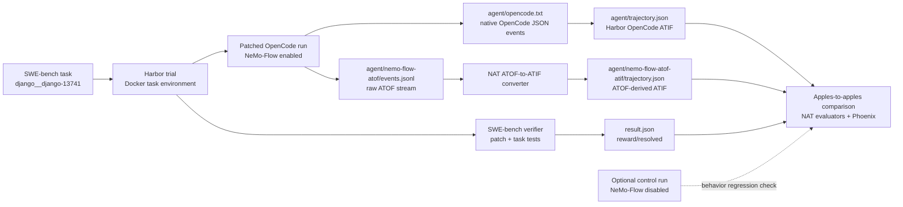

<!--
SPDX-FileCopyrightText: Copyright (c) 2026, NVIDIA CORPORATION & AFFILIATES. All rights reserved.
SPDX-License-Identifier: Apache-2.0

Licensed under the Apache License, Version 2.0 (the "License");
you may not use this file except in compliance with the License.
You may obtain a copy of the License at

http://www.apache.org/licenses/LICENSE-2.0

Unless required by applicable law or agreed to in writing, software
distributed under the License is distributed on an "AS IS" BASIS,
WITHOUT WARRANTIES OR CONDITIONS OF ANY KIND, either express or implied.
See the License for the specific language governing permissions and
limitations under the License.
-->

# OpenCode NeMo-Flow Harbor Smoke

This is a draft developer workflow for comparing OpenCode's native event stream
with NeMo-Flow ATOF for the same Harbor SWE-bench task execution.

Important: this workflow currently depends on branch-local code. The NAT Harbor
wrapper, Harbor-side OpenCode support, and NeMo-Flow OpenCode patch should be
rechecked after the related changes are ready for a PR to the `topic/harbor`
branch.

## Pipeline



One NeMo-Flow-enabled OpenCode run emits both source streams:

- Native path: OpenCode JSON events -> Harbor OpenCode adapter ->
  `agent/trajectory.json`.
- NeMo-Flow path: ATOF JSONL -> NAT ATOF-to-ATIF converter ->
  `agent/nemo-flow-atof-atif/trajectory.json`.
- A no-NeMo-Flow run is optional control coverage for instrumentation side
  effects, not required for the native-vs-ATOF artifact comparison.

## Prerequisites

- Docker is running.
- `external/harbor` is available and installed into the active NAT environment.
- `external/nemo-flow` is checked out to the OpenCode NeMo-Flow branch.
- The SWE-bench smoke task exists at:

```text
external/harbor/datasets/swebench-opencode-smoke/django__django-13741
```

- `NVIDIA_FRONTIER_API_KEY` is exported in the host shell.
- `NVIDIA_FRONTIER_BASE_URL` points at the NVIDIA inference endpoint:

```bash
export NVIDIA_FRONTIER_BASE_URL=https://inference-api.nvidia.com/v1
```

## Run the Smoke

Create a local env file for the Docker task environment. Do not commit this
file.

```bash
mkdir -p .tmp/harbor/secrets
cat > .tmp/harbor/secrets/frontier.env <<EOF
NVIDIA_FRONTIER_API_KEY=${NVIDIA_FRONTIER_API_KEY}
NVIDIA_FRONTIER_BASE_URL=${NVIDIA_FRONTIER_BASE_URL}
EOF
```

Run the NeMo-Flow-enabled OpenCode smoke:

```bash
export HARBOR_JOBS_DIR=.tmp/harbor/opencode-nemoflow-smoke
export SWEBENCH_TASK=external/harbor/datasets/swebench-opencode-smoke/django__django-13741
export NEMO_FLOW_REPO="$PWD/external/nemo-flow"

.venv/bin/harbor run \
  --path "$SWEBENCH_TASK" \
  -l 1 \
  --job-name opencode-nemoflow-atof-convert-smoke-1 \
  --jobs-dir "$HARBOR_JOBS_DIR" \
  --yes -n 1 --max-retries 0 \
  --env-file .tmp/harbor/secrets/frontier.env \
  --agent-import-path nat_harbor.agents.installed.opencode_nemoflow:OpenCodeNeMoFlow \
  --env docker \
  --model nvidia-frontier/opus-frontier \
  --ak nemo_flow_repo="$NEMO_FLOW_REPO" \
  --ak fail_missing_nemoflow_atof=true \
  --ak fail_missing_nemoflow_atif=false
```

Expected artifacts under the trial directory:

```text
agent/opencode.txt
agent/trajectory.json
agent/nemo-flow-atof/events.jsonl
agent/nemo-flow-atof-atif/trajectory.json
result.json
verifier/report.json
```

## Quick Artifact Check

Set `TRIAL` to the completed trial directory:

```bash
TRIAL=.tmp/harbor/opencode-nemoflow-smoke/opencode-nemoflow-atof-convert-smoke-1/django__django-13741__qqy4ngX
```

Check that both ATIF artifacts load:

```bash
.venv/bin/python - <<'PY'
from pathlib import Path

from nat_harbor.verifier.evaluator_adapter import load_atif_samples

root = Path(".tmp/harbor/opencode-nemoflow-smoke/opencode-nemoflow-atof-convert-smoke-1")
trials = [path for path in root.iterdir() if path.is_dir() and path.name.startswith("django__django-13741__")]
if len(trials) != 1:
    raise SystemExit(f"Expected one trial directory, found {len(trials)}")

agent = trials[0] / "agent"
for rel in ("trajectory.json", "nemo-flow-atof-atif/trajectory.json"):
    samples = load_atif_samples(agent / rel)
    trajectory = samples[0].trajectory
    print(rel, trajectory.schema_version, len(trajectory.steps))
PY
```

## Phoenix Inspection

If Phoenix is running locally at `http://localhost:6006`, export the two ATIF
artifacts to separate projects:

```bash
TRIAL=.tmp/harbor/opencode-nemoflow-smoke/opencode-nemoflow-atof-convert-smoke-1/django__django-13741__qqy4ngX
ENDPOINT=http://localhost:6006/v1/traces

.venv/bin/python -m nat.plugins.phoenix.scripts.export_trajectory_to_phoenix.export_atif_trajectory_to_phoenix \
  "$TRIAL/agent/trajectory.json" \
  --endpoint "$ENDPOINT" \
  --project harbor-opencode-native

.venv/bin/python -m nat.plugins.phoenix.scripts.export_trajectory_to_phoenix.export_atif_trajectory_to_phoenix \
  "$TRIAL/agent/nemo-flow-atof-atif/trajectory.json" \
  --endpoint "$ENDPOINT" \
  --project harbor-opencode-nemoflow-atof
```

Observed local result from the first successful smoke:

| Project | Source artifact | Exported spans |
|---|---|---|
| `harbor-opencode-native` | `agent/trajectory.json` | 1 |
| `harbor-opencode-nemoflow-atof` | `agent/nemo-flow-atof-atif/trajectory.json` | 31 |

Open `http://localhost:6006` and switch between the two projects.
